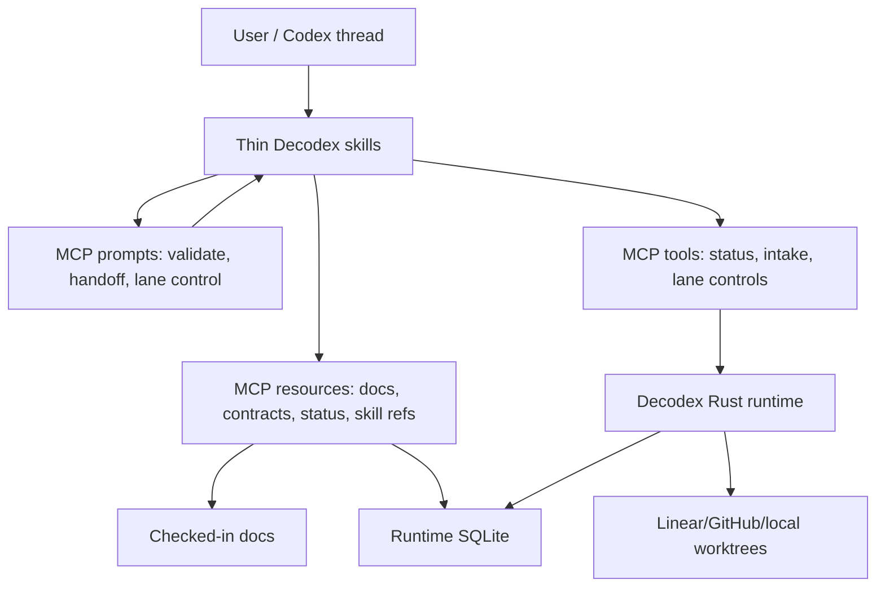

# MCP Capability Gateway And Skill Slimming

Status: decision_ready
Date: 2026-06-16
Question: Should Decodex introduce MCP, and if so how should MCP, skills, docs, and
runtime authority divide responsibilities?
Decision: Build a Decodex MCP capability gateway and slim skills into static routing,
policy, and safety entrypoints. Keep runtime state authoritative in Decodex, expose
docs and runtime state through MCP resources, expose state-changing operations through
schema-bound MCP tools, expose reusable workflows through MCP prompts, and keep skills
small enough to route the agent to the right capability without embedding full docs or
runtime state.
Consequences: Skills lose bulk instructional content and become stable policy
wrappers. Docs stay authoritative and can be fetched as resources. Runtime actions stay
typed, auditable, and authority-checked. Decodex can evolve capability surfaces without
reinstalling large skill text.

## Decision Contract Snapshot

Source intent: Evaluate whether Decodex should introduce MCP, whether MCP enables
skill slimming, and what the strongest architecture should be.

Terminal status: `decision_ready`

Promotion targets:

- `docs/decisions`: this rationale record.
- `docs/spec/loop-runtime.md`: Decision Contract and Program Intake authority rules.
- `plugins/decodex/skills/planning/`, `decodex-ops/`, `commit/`, and `land/`: slim
  Decodex runtime/operator routing.
- Future runtime issue: MCP server implementation, only after explicit acceptance.

Selected option: Hybrid Decodex MCP capability gateway plus thin skills.

Non-goals:

- Do not make MCP the source of Decodex truth.
- Do not replace checked-in docs with generated MCP-only content.
- Do not let MCP tools bypass Decision Contract, Authority Envelope, validation, or
  identity routing.
- Do not keep large method bodies inside every skill when docs/resources can supply
  them on demand.

## Evidence Ledger

| Kind | Evidence | Source |
| --- | --- | --- |
| `external_source` | The latest official MCP spec is `2025-11-25`; it defines MCP as a JSON-RPC protocol where hosts connect through clients to servers that provide context and capabilities. | [MCP specification 2025-11-25](https://modelcontextprotocol.io/specification/2025-11-25) |
| `external_source` | MCP separates server features into resources for context/data, prompts for templated workflows, and tools for executable functions. That maps cleanly to Decodex docs, reusable workflows, and state-changing runtime operations. | [MCP specification 2025-11-25](https://modelcontextprotocol.io/specification/2025-11-25) |
| `external_source` | Resources are application-driven and addressed by URI; servers can list, read, template, subscribe, and notify resource changes. Decodex docs, Decision Contracts, status snapshots, and skill references fit this model better than skill-embedded text. | [MCP resources](https://modelcontextprotocol.io/specification/2025-11-25/server/resources) |
| `external_source` | Tools are model-invoked executable functions and can return structured content with output schemas; MCP guidance expects user consent and visible authorization for tool invocations. Decodex mutating operations belong here, with authority checks. | [MCP tools](https://modelcontextprotocol.io/specification/2025-11-25/server/tools) |
| `external_source` | Prompts are user-controlled templates discoverable from the server. Decodex validation, handoff, planning, and operator workflows can become prompts instead of large skill bodies. | [MCP prompts](https://modelcontextprotocol.io/specification/2025-11-25/server/prompts) |
| `external_source` | MCP standard transports are stdio and Streamable HTTP. Local Decodex should start with stdio for desktop/CLI use and add Streamable HTTP only when the local daemon or app needs multi-client access. | [MCP transports](https://modelcontextprotocol.io/specification/2025-11-25/basic/transports) |
| `external_source` | MCP authorization is optional, but HTTP transports that support authorization should follow the spec; stdio should retrieve credentials from environment rather than the HTTP auth flow. | [MCP authorization](https://modelcontextprotocol.io/specification/2025-11-25/basic/authorization) |
| `repo_source` | Decodex treats runtime-local `decodex.decision_contract/1` payloads as accepted runtime planning authority only after explicit acceptance. | [`docs/spec/loop-runtime.md`](../spec/loop-runtime.md) |
| `repo_source` | The repository documentation policy requires durable Decodex guidance to live in `docs/spec`, `docs/runbook`, `docs/reference`, or `docs/decisions`; generic team knowledge and research workflows live in external installed plugins. | [`docs/policy.md`](../policy.md) |
| `inference` | Because MCP resources can expose docs/current state on demand, skills should not duplicate long reference bodies. Because MCP tools can mutate external state, skills must still carry authority routing and safety triggers. | Derived from MCP resource/tool controls plus Decodex authority model. |

## Options

| Option | Decision | Reason |
| --- | --- | --- |
| Keep skills-only architecture | Rejected | Skills are good at static routing but poor at fresh state, structured readback, typed mutation, and external source freshness. Large skills also increase token load and drift. |
| Replace skills with MCP-only architecture | Rejected | MCP can expose capabilities, but it does not by itself teach the agent when a Decodex authority boundary applies. A small skill layer is still the right installable policy surface. |
| Build a hybrid MCP gateway and slim skills | Selected | MCP owns dynamic resources, prompts, and tools; skills own trigger routing, safety boundaries, and progressive disclosure. This uses each surface for the behavior it is best at. |
| Remote HTTP MCP first | Rejected for the first slice; implemented as follow-up transport | Local stdio was simpler for the core protocol slice. Streamable HTTP is now the remote-control-capable transport, with loopback binding, origin validation, session handling, SSE framing, and an `observe` default profile. |

## Architecture

Layer responsibilities:

- Decodex Rust runtime is the source of truth for state, contracts, queue readiness,
  lane lifecycle, and authority checks.
- MCP gateway is the typed capability facade over runtime and docs.
- Skills are the small policy pack that decides when to read resources, call tools, or
  stop for human authority.
- Docs remain the durable source for contracts, runbooks, reference maps, and design
  rationale.
- Eval/harness gates verify that skill slimming did not remove required routing,
  safety, or evidence behavior.

## MCP Surface Target

This section describes the promoted complete MCP gateway. Decodex serves the same
gateway through local stdio and remote-control-capable Streamable HTTP. Stdio is for
desktop and CLI clients, defaults to the `admin` capability profile, and keeps stdout
valid JSON-RPC only. Streamable HTTP is available at `POST /mcp`, binds to loopback by
default, defaults to `observe`, validates browser origins, issues MCP session headers,
requires a known session after initialization, returns JSON-RPC JSON by default, and
uses SSE framing for progress or notifications when the client accepts
`text/event-stream`. Loopback `observe` is the safe default. MCP sessions are protocol
state rather than authorization, and `--allow-origin` is CORS trust rather than an
authentication boundary. Direct non-loopback operation and elevated Streamable HTTP
profiles require a Decodex bearer boundary with `--bearer-token-env`, or a stronger
operator-owned tunnel, relay, network ACL, reverse proxy, or OAuth-capable protected
resource boundary before they are production-safe. The built-in bearer guard protects
direct Decodex listeners but does not claim OAuth Protected Resource Metadata
interoperability.

The gateway advertises resources, resource templates, prompts, tools, logging
compatibility, progress notifications, active capability-profile metadata, and
structured refusal behavior. Remote control means a permitted MCP client can observe
and request lane-control or project-control actions against this Decodex server through
capability profiles and Decodex authority checks. It does not mean arbitrary public
internet clients can reach the daemon or that MCP tools can bypass Decision Contract,
lane-control, review, landing, tracker, or runtime semantics.

Resources:

- `decodex://docs/index`
- `decodex://docs/spec/{topic}`
- `decodex://docs/runbook/{topic}`
- `decodex://docs/reference/{topic}`
- `decodex://docs/decisions/{topic}`
- `decodex://decision-contracts/{contract_id}`
- `decodex://projects/{service_id}/status`
- `decodex://projects/{service_id}/status_live`
- `decodex://projects/{service_id}/activity_tail`
- `decodex://projects/{service_id}/lane-control`
- `decodex://projects/{service_id}/lane_inspect/{issue}`
- `decodex://projects/{service_id}/runs/{run_id}/events`
- `decodex://projects/{service_id}/runs/{run_id}/protocol_activity`
- `decodex://projects/{service_id}/runs/{run_id}/child_agent_activity`
- `decodex://projects/{service_id}/runs/{run_id}/progress_diagnostics`
- `decodex://projects/{service_id}/pr_review_state`
- `decodex://projects/{service_id}/autonomy`
- `decodex://projects/{service_id}/autonomy/objectives/{objective_id}/current`
- `decodex://projects/{service_id}/autonomy/objectives/{objective_id}/{version}`
- `decodex://projects/{service_id}/autonomy/signals`
- `decodex://projects/{service_id}/autonomy/signals/{signal_id}`
- `decodex://projects/{service_id}/autonomy/proposals`
- `decodex://projects/{service_id}/autonomy/proposals/{proposal_id}`
- `decodex://projects/{service_id}/autonomy/evidence`

Prompts:

- `decodex_arrange_accepted_work`: arranges accepted decisions into planning.
- `decodex_validation_ready`: runs a validation-ready lane to its native gate and
  stops.
- `decodex_handoff`: produces a human-readable handoff after verification.

Tools:

- `decodex_observe(issue, runId, limit)`: performs remote-safe runtime/tracker
  readback without exposing hidden reasoning, private evidence payloads, or local path
  fields.
- `decodex_plan(intent, issue, contractId)`: returns static Decodex workflow routing
  for validation-ready, handoff, lane-control, and accepted-goal-intake intents.
- `intake_goal(mode, contractId, authority)`: `dry_run` previews public-safe
  generated issue rows without tracker or Program Intake mutation; `apply` mutates
  only after accepted contract authority and explicit MCP authority exist.
- `autonomy_draft_objective(mode, projectId, objective, authority)`: validates or
  persists a draft Objective Contract only. It does not accept the objective or grant
  execution authority.
- `autonomy_accept_objective(mode, projectId, objectiveId, objectiveVersion,
  authority)`: inspects or accepts a draft Objective Contract version. Apply requires
  explicit human/operator Objective Contract acceptance authority and still grants no
  execution authority. Runtime-policy acceptance is refused until it can be resolved
  from trusted Decodex authority state instead of caller-supplied fields.
- `autonomy_submit_signal(mode, projectId, kind, signal, authority)`: validates or
  persists proposal-only autonomy signal evidence against an accepted objective.
- `autonomy_compile_proposal(mode, projectId, proposal, signalIds, authority)`:
  compiles or persists non-executable autonomy proposal evidence from accepted
  objective-bound signals.
- `autonomy_challenge_proposal(mode, projectId, proposalId, challenge, authority)`:
  previews or records challenge evidence. Challenge evidence is not acceptance
  authority.
- `autonomy_request_promotion(mode, projectId, proposalId, authority)`: inspects the
  explicit proposal-acceptance surface, or with `apply` creates only a latent Decision
  Contract candidate. Normal Decision Contract promotion and Program Intake are still
  separate authority steps. External-agent self-acceptance is refused unless an
  accepted project policy from trusted Decodex authority state authorizes that actor,
  source, objective lineage, and `autonomy_proposal_acceptance` scope. Caller-supplied
  `acceptedProjectPolicy` payloads are not policy proof and fail closed until a trusted
  policy resolver exists.
- `decodex_lane_control(action, issue, runId, expectedTurnId, authority)`: advertises
  the operate-profile lane-control surface. `inspect` returns public-safe
  preconditions, `steer` and `interrupt` delegate through existing lane-control guards
  only with current inspected run/turn authority, and unsupported shortcut paths
  return structured refusals.
- `decodex_project_control(action, projectId, authority)`: advertises the
  admin-profile project-control surface. `status` reads project enablement,
  `pause`/`resume` affect future dispatch only with explicit authority, and `scan`
  refuses to the operator control loop instead of enqueueing from standalone MCP.

Tool rules:

- Read-only tools may run without promotion when they only expose public-safe state.
- Mutating tools must require explicit authority and return structured results.
- Mutating tools are inspect-first and must require current-lane preconditions such as
  run id, inspected run id, and expected turn id when the requested action depends on
  a live turn.
- Tools must not expose raw private evidence, credentials, transcript text, hidden
  graph ids, or local paths unless the governing Decodex surface allows it.
- Every mutating result should include `status`, `authority_source`, `changed_surfaces`,
  `validation_next_step`, and `public_projection`.

## Skill Slimming Rules

Keep in skills:

- Trigger descriptions and routing order.
- Authority boundaries and refusal conditions.
- Which MCP resources or prompts to load.
- Which MCP tools are allowed for the phase.
- What evidence is required before claiming done, fixed, ready, or decision-ready.

Move out of skills:

- Long method bodies.
- Static docs that already live in `docs/`.
- Current runtime state.
- Large examples that can be exposed as resources.
- Repeated copies of specs, runbooks, and reference maps.

Target shape:

- One router skill for Decodex.
- Thin phase skills for planning, Decodex ops, commit, and land; generic research and
  challenge workflows live in external installed team plugins.
- Shared method references either checked into docs or exposed as MCP resources.
- Eval gate for every slimming pass to catch broken trigger coverage, missing safety
  boundaries, stale links, and token bloat.

## Validation Expectations

- `plugin-eval analyze` on changed Decodex plugin skills should find no critical
  routing, safety, or progressive-disclosure issue.
- `cargo test -p decodex plugin_surface_tests -- --nocapture` should pass after
  packaged-skill changes.
- `git diff --check` should pass.
- The stdio MCP primitive implementation should pass initialize, resources/list,
  resources/templates/list, prompts/list, prompts/get, tools/list, tools/call, progress
  notification, and stdout-cleanliness smoke coverage. Streamable HTTP should pass
  JSON POST, SSE response, origin rejection, session handling, observe-profile access,
  operate/admin profile-refusal coverage, and remote-safe observability template
  coverage for live status, activity tail, current/recent status-window run
  event/protocol/child/progress readback, lane inspect, and PR/review state. The
  Streamable HTTP process smoke should start a real
  `decodex mcp serve --transport streamable-http` child process, initialize a session,
  list observe-profile tools, verify an above-profile refusal, and verify SSE progress
  for an allowed call. Direct non-loopback or elevated HTTP profiles should also pass
  bearer-boundary startup and request tests. Operate and admin tools should pass
  inspect-first authority, current run/turn precondition, explicit-authority refusal,
  and unsupported-shortcut refusal coverage.

## Remaining Boundaries

The promoted implementation has the stdio gateway exposed as
`decodex mcp serve --transport stdio` and the remote-capable Streamable HTTP gateway
exposed as `decodex mcp serve --transport streamable-http`. It advertises resources,
resource templates, prompts, and a schema-bound tool catalog while keeping mutating
planning, operate, and admin behavior behind explicit capability profiles, authority
fields, inspect-first preconditions, transport bearer authorization when required, and
structured refusal states. The current direct-listener auth boundary is static bearer,
not full OAuth Protected Resource Metadata. Further expansion must keep the catalog
deliberately small and route new mutating behavior through Decodex's existing runtime,
tracker, review, landing, and lane-control authority surfaces instead of adding one
tool per CLI command.
