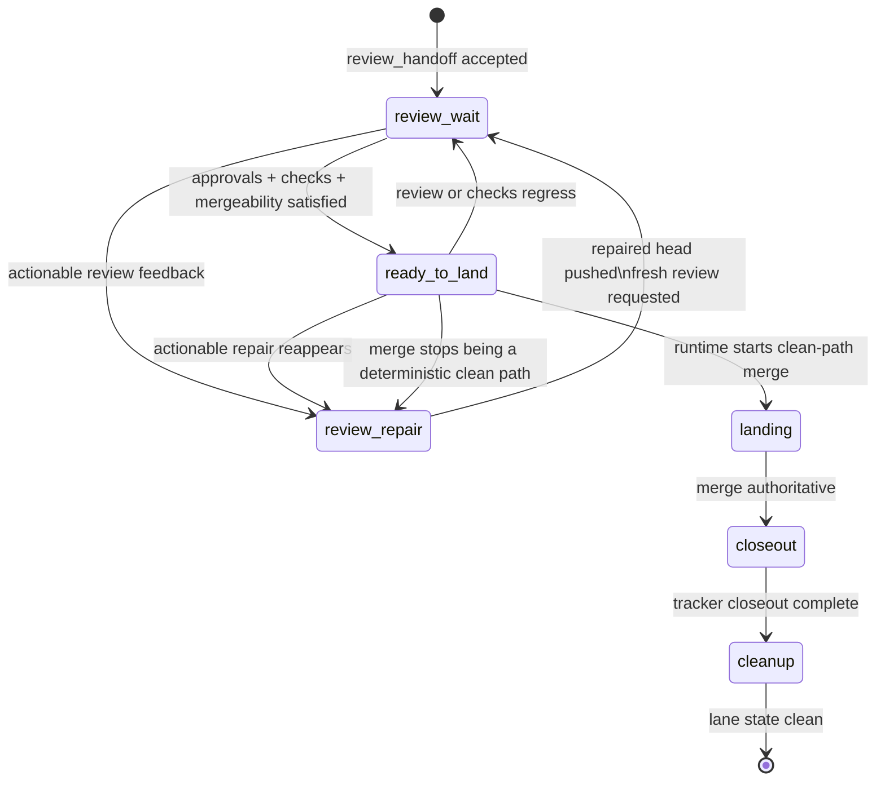

# Post-Review Lifecycle

Purpose: Define the normative lifecycle for a Decodex-owned lane after a PR-backed `In Review` handoff, through review follow-up, landing, closeout, and cleanup.
Status: normative
Read this when: You need the authoritative post-`In Review` state model, transition rules, retry/manual-intervention boundaries, or follow-on implementation split for autonomous review follow-up and landing.
Not this document: The low-level app-server protocol, the pre-review runtime handoff contract, the broader owned-lane fallback matrix, or local skill instructions.
Defines: Post-`In Review` lane phases, phase-to-action-class mapping, authoritative signals, retry and cancellation rules, ownership boundaries, and the minimum follow-on implementation split.

## Design reference

- `openai/symphony` `README.md` and `SPEC.md` are the only external design standard for this lifecycle.
- This lifecycle keeps Symphony's stable boundaries intact:
  - the service is a scheduler and runner, not a general-purpose workflow engine
  - workflow policy stays repository-owned
  - a successful worker run may end at a workflow-defined handoff state rather than `Done`
  - operator-visible observability and explicit trust posture remain runtime concerns
- Decodex-local extensions such as `WORKFLOW.md [context.read_first]` and the checked-in workflow skills are local execution constraints and adapter surfaces. They are not the core domain model of this lifecycle, and they do not replace the primary `WORKFLOW.md` body defined by Symphony.

## Relationship to other specs

- [`runtime.md`](./runtime.md) defines the current success and failure writeback boundary through PR-backed `In Review` handoff.
- [`linear-execution-ledger.md`](./linear-execution-ledger.md) defines the versioned
  Linear comment event-ledger schema used by post-review handoff, repair, landing,
  closeout, and cleanup records.
- [`owned-lane-policy.md`](./owned-lane-policy.md) defines the allowed action classes and the fallback policy for waiting, repair re-entry, landing readiness, automatic recovery, and manual intervention.
- [`review-orchestration.md`](./review-orchestration.md) defines the shared internal/external review loop, the optional service-level external-review toggle, strict external-review request and pass signals when that loop is enabled, round accounting, and the rule that external pass flows into Decodex-directed admin merge instead of a separate manual landing request.
- This document narrows those action classes into the specific post-`In Review` lane phases and transitions that Decodex must honor after review handoff succeeds.

## Core invariants

1. Post-`In Review` work remains part of the same Decodex-owned lane.
2. Post-`In Review` automation must keep using authoritative signals rather than chat memory, branch-name heuristics, or skill-name-specific states.
3. The tracker issue must remain in `In Review` until authoritative closeout transitions it to the workflow-defined `tracker.completed_state`, unless a human explicitly cancels the lane into a terminal tracker state first.
4. A later review-repair attempt must resume the retained lane for the same issue and PR head lineage; it must not silently open a fresh unrelated implementation lane.
5. Landing, closeout, and cleanup are deterministic tail stages of the same owned lane, not separate human-only ceremonies.
6. No phase in this lifecycle may depend on the permanent existence of a particular local helper name such as `review-request`, `review-repair`, `pr-land`, or `closeout`.

## Authoritative signals

Post-`In Review` classification may use only these signal groups:

- Tracker state:
  - issue workflow state
  - labels
  - blocker state
  - authoritative Linear execution ledger comments written during handoff, repair,
    landing, closeout, or cleanup
- Retained-lane state:
  - worktree existence
  - lane markers such as activity and guarded markers
  - current branch, validated head, and retry/churn bookkeeping
- Review state:
  - PR identity and current head
  - whether the PR is still open, closed without merge, or merged
  - review approval or requested-change state
  - unresolved review-thread state
  - required-check state
  - mergeability
- Closeout state:
  - whether merge already happened
  - whether closeout already ran
  - whether deterministic local cleanup remains pending

In the current runtime, the retained lane persists its validated review handoff in the Decodex runtime database and uses that row as the authoritative post-review lineage record for repair, landing, closeout, and cleanup. When that exact database handoff is missing, post-review ownership must block as unresolved instead of rebinding from branch-name, current-head-only heuristics, or Linear comments.

If these signals disagree and the disagreement cannot be resolved without guessing operator intent, the runtime must use `manual_intervention_required`.

## Explicit handoff recovery

`missing_review_handoff_record` is a fail-closed post-review state. The scheduler must
not infer a PR lineage from branch names, current heads, PR titles, or Linear comments,
and `decodex run` must not repair this state automatically.

The supported operator recovery surface is `decodex recover review-handoff`. This is a
break-glass recovery path for orphaned retained review lanes and stale retained marker
heads after explicit manual repair or rebase. It is not part of the normal automation
success path.

- `diagnose` is read-only. It reports the project, issue, branch, worktree, local head,
  active automation label, existing PR URL when present, stored handoff head, stored
  orchestration head, PR base/head when readable, and the missing or mismatched marker
  reason. A diagnostic may report a bound marker, a missing marker, an unverified PR
  read, or a concrete field mismatch that requires explicit rebind.
- `rebind` is mutating and requires an explicit issue identifier plus PR URL. It must
  validate the configured project, tracker issue, success-state compatibility, active
  automation ownership, retained worktree branch, clean worktree, PR repository, PR base,
  PR head branch, PR head SHA, and open non-draft PR state before writing markers.
- If no review handoff marker exists, `rebind` restores the missing handoff and
  orchestration markers from the validated PR and retained worktree. If a marker already
  exists for the same branch and PR but its stored handoff or orchestration head is
  stale, `rebind` may refresh that marker to the validated PR head. It must reject an
  existing marker for a different PR, and it must reject a current same-branch same-PR
  marker as a no-op.
- A successful rebind writes the same runtime DB handoff and orchestration marker shapes
  as normal `issue_review_handoff` needs, and records a `review_handoff_rebind` audit
  event. It does not land the PR, queue follow-up work, or substitute for healthy lanes'
  normal `issue_review_handoff` plus `issue_terminal_finalize(path = "review_handoff")`
  path. If any audit write fails after marker creation, the command must clear the new
  markers and report failure instead of leaving a silently rebound lane.

## Phase model

The post-`In Review` lifecycle is expressed in lane phases. These phases refine, but do not replace, the owned-lane action classes.

At any phase, contradictory state, exhausted repair budget, or a non-self-healing merge failure must stop the lane in `manual_intervention_required` instead of guessing a next step.

| Lane phase | Required action class | Entry conditions | Exit conditions |
| --- | --- | --- | --- |
| `review_wait` | `wait_for_external_signal` | PR-backed `In Review` handoff succeeded for the current owned lane | Actionable review repair appears, landing becomes ready, human intervention becomes required, or cancellation is explicit |
| `review_repair` | `resume_retained_lane` | Actionable review feedback exists and the retained lane still belongs to the same issue and PR lineage | A new repaired head is pushed and review is re-requested for that head, human intervention becomes required, or cancellation is explicit |
| `ready_to_land` | `ready_to_land` | Required approvals are satisfied, blocking review work is absent, checks are green, the branch is up to date with base, and the PR is cleanly mergeable | Clean-path landing begins, signals fall back to wait or repair, or human intervention becomes required |
| `landing` | `continue` | The runtime has committed to executing the clean merge for the current lane | Merge is recorded, landing fails into a resumable deterministic tail step, or human intervention becomes required |
| `closeout` | `continue` | Merge already happened for the lane's authoritative anchor and tracker closeout has not yet completed | Tracker closeout succeeds, the lane blocks on contradictory closeout state, or human intervention becomes required |
| `cleanup` | `continue` | Either (a) merge and closeout are authoritative and only worktree or branch cleanup remains, or (b) explicit pre-merge cancellation is authoritative and only deterministic retained-lane cleanup remains | The retained worktree and lane branch state are clean, or cleanup blocks on conflicting local evidence |

`manual_intervention_required` is not a normal progress phase. It is the mandatory stop outcome whenever the owned-lane policy says automation must stop.

## Phase semantics

### `review_wait`

This is the default healthy state immediately after PR-backed review handoff.

While in `review_wait`:

- the tracker issue remains in `In Review`
- the retained lane remains reserved for the same issue and PR lineage
- missing immediate review activity is not, by itself, a failure
- review-request acknowledgement probing or bounded resend may happen as orchestration behavior without leaving `review_wait`

`review_wait` must not trigger code changes on its own.

### `review_repair`

`review_repair` means the runtime has enough authoritative evidence to re-enter the retained lane and address review feedback.

While in `review_repair`:

- the runtime must reuse the retained lane when it is still valid
- repair work must stay bound to the same issue, branch lineage, and PR
- the runtime must validate each external-review claim against the codebase, tests, and requirements before changing code
- the repaired head must pass the local pre-review gate before being pushed
- when `codex.internal_review_mode = "loop"`, every repaired-head bounded-review result must first be recorded through `issue_review_checkpoint`
- every addressed review thread must receive an in-thread reply for the repaired head
- only threads whose landed fix is verified on that repaired head may be resolved; pushback or clarification threads stay open
- once a new head is pushed and fresh review is requested on the same PR, the lane returns to `review_wait` for that new head

If the issue also uses `execution-state`, that overlay remains only durable execution memory inside the retained repair run. It may record task-local runtime progress for the same issue through `issue_progress_checkpoint`, but it does not decide lane phase transitions such as `review_wait`, `review_repair`, `ready_to_land`, or `closeout`.

In the current XY-174 slice, a retained repair run finishes by recording an explicit
`issue_review_repair_complete` action for the same PR URL, then finalizing the run with
the `review_repair` terminal path. Applying that completion refreshes the local
runtime handoff row to the repaired PR head while keeping the tracker issue
in `In Review`; it does not re-run the original `issue_review_handoff` state transition.
When `codex.internal_review_mode = "loop"`, `issue_review_repair_complete` is valid only
when the latest retained repair checkpoint is `clean` for the current repaired head. If
repeated repair checkpoints stay in `findings` for three consecutive rounds, or the
checkpoint reports `needs_architecture_review` / `blocked`, the runtime must stop for
human intervention instead of patch-on-patch churn. When
`codex.internal_review_mode = "prompt"` or `"off"`, retained repair completion skips that
self-review checkpoint requirement but still requires the repaired head to be pushed and
the configured repository validation gate to pass.
The same completion also requires that the PR still belongs to the retained lane, points
at the repaired lane HEAD, and remains open and ready for fresh review.

If the retained lane is missing or no longer provably belongs to the same issue and PR lineage, the runtime must not invent a fresh lane silently. It must require human intervention or a separately defined recovery path.

### `ready_to_land`

`ready_to_land` is a decision boundary, not a merge event.

The runtime may classify the lane as `ready_to_land` only when the native clean-path merge is
already deterministic:

- the PR still belongs to the owned lane
- required approvals are satisfied
- actionable blocking review work is absent
- required checks are green
- the branch is already up to date with the base branch
- mergeability is affirmative and `mergeStateStatus` is `CLEAN`

If any of those signals becomes false again before landing starts, the lane must return to
`review_wait` or `review_repair` instead of forcing a merge. Cases that are not deterministic
clean tail work, including branch sync, conflict resolution, ambiguous mergeability,
repository-specific recovery, pre-receive-hook ambiguity, or red/unstable check interpretation,
must use the retained agent path before another runtime merge attempt.

### `landing`

`landing` begins only after `ready_to_land` was true and the runtime committed to the merge step.

While in `landing`:

- the runtime executes the repo-approved merge path
- merge policy for retained review landing is the fixed Decodex policy: require green checks, require an up-to-date base branch, preserve commit-level history, use merge commits, and never squash or rebase
- direct runtime execution is limited to the clean path; if the merge would require
  implementation-shaped work, the runtime re-enters the retained lane agent path instead of asking
  the agent to author the merge side effect

If merge succeeds, the lane progresses to `closeout`. If merge does not succeed and the cause is not self-healing, the runtime must require human intervention rather than guessing whether to retry.

### `closeout`

`closeout` begins after merge is authoritative and the tracker issue still needs the final completed-state transition or deterministic retained-lane tail work remains.

While in `closeout`:

- the merge anchor is authoritative
- tracker closeout is Linear-only in this slice
- the tracker issue transitions from `In Review` to the resolved `tracker.completed_state`
- the configured local repo-root default branch fast-forwards to the authoritative landed default-branch head before deterministic tail work is considered complete
- the retained lane may continue even after the issue is already in the resolved `tracker.completed_state` when deterministic closeout tail work or cleanup eligibility still remains pending
- a merged PR remains eligible for deterministic closeout when the local lane HEAD is the exact PR head, the GitHub merge commit, or a later local HEAD that contains the GitHub merge commit; that landed lineage must not be downgraded into generic manual attention while closeout or cleanup is still deterministic
- when deterministic closeout follows the same successful review handoff without any failed or interrupted closeout retry, the closeout record, run summary, and local run ledger reuse the review handoff `run_id` and `attempt_number`; later real closeout retries keep incrementing attempt numbers
- an issue that reaches the resolved `tracker.completed_state` before the PR is actually merged is contradictory state and must block automation instead of being treated as ready-to-land
- for manual land closeout, once merge and tracker closeout are authoritative, cleanup treats already-absent transient Decodex labels (`decodex:active:<service-id>`, `decodex:queued:<service-id>`, and the configured needs-attention label) as idempotent; this does not relax the requirement that active ownership must be present before landing starts
- for explicit `decodex land --manual-authority --pr <URL>` reruns from the repo-root default branch, recovery is allowed only after GitHub reports the PR as `MERGED`, the local default branch is current with `origin/<default>`, that default branch contains the PR merge commit, the landed lane branch/worktree cleanup is already complete, and no merged worktree cleanup debt remains; unmerged PRs still require the normal managed-lane readiness path

Successful post-merge closeout requires a machine-readable resolved `tracker.completed_state`. Repository workflow policy resolves that target either from the explicit `tracker.completed_state` field or, if that field is omitted, from an exact `"Done"` terminal-state default. Because `closeout` now validates this field during retained post-review completion, the runtime must stop for `manual_intervention_required` instead of guessing a post-merge tracker target whenever workflow policy cannot resolve a valid completed state.

If merge is authoritative but closeout fails due to a deterministic infrastructure problem with no contradictory state, the runtime may resume `closeout` later within the same owned lane. A terminal tracker state written during `closeout` does not by itself authorize worktree deletion while deterministic cleanup is still pending. If state is contradictory, the runtime must stop for human intervention.

### `cleanup`

`cleanup` is the final deterministic tail stage. It removes retained worktree and lane branch state only after one of these terminal ownership conditions is authoritative:

- successful landing-and-closeout: merge and closeout are already authoritative
- explicit pre-merge terminal cancellation: the tracker issue already reached a terminal cancellation state before merge, and no contradictory retained-lane evidence remains

`cleanup` must not begin while:

- review work is still pending for a lane whose owned progress has not been explicitly canceled
- neither successful landing-and-closeout nor explicit pre-merge terminal cancellation has ended owned-lane progress
- successful landing-and-closeout is the governing path but merge is not yet authoritative
- successful landing-and-closeout is the governing path and closeout is incomplete
- successful landing-and-closeout is the governing path and the local repo-root default branch is still behind the authoritative landed default-branch head

## Transition rules

1. `review_handoff` success in the runtime spec enters `review_wait`.
2. `review_wait -> review_repair` when authoritative review feedback requires a code change and the retained lane is still reusable.
3. `review_repair -> review_wait` after a repaired head is pushed and review is requested for that exact head.
4. `review_wait -> ready_to_land` when approvals, checks, and mergeability all satisfy repository policy for the current lane head.
5. `ready_to_land -> review_wait` when approvals, checks, or mergeability regress before merge starts and no actionable code change is required.
6. `ready_to_land -> review_repair` when actionable review repair reappears before merge starts.
7. `ready_to_land -> landing` when the runtime begins the merge step.
8. `landing -> closeout` when merge is authoritative for the lane's anchor.
9. `closeout -> cleanup` when the tracker closeout succeeds and only deterministic local cleanup remains.
10. `review_wait`, `review_repair`, or `ready_to_land` may transition directly to `cleanup` when the tracker issue reaches a terminal cancellation state before merge and only deterministic local cleanup remains.
11. `cleanup -> finished` when the retained worktree and lane branch state are clean.

At any phase, contradictory signals or exhausted repair/convergence budgets force `manual_intervention_required`.

## Failure, retry, and cancellation rules

### Review-request lag

- A missing immediate review response is not a failure by itself.
- The runtime may perform bounded resend for the same verified head if the implementation-defined acknowledgement window expires without reliable review-request evidence.
- Exhausting bounded resend without reliable request evidence forces `manual_intervention_required`.

### Review-repair failures

- Transport or runtime interruptions during `review_repair` may resume the same retained lane when the owned-lane policy still permits `resume_retained_lane`.
- Watch-level child failures in `review_repair` and deterministic post-review tail stages consume the same `execution.max_attempts` retry budget as normal issue execution. Once that budget is exhausted, the runtime must write the human-attention failure state, remove active automation ownership, and block the lane from further post-review redispatch.
- Operator status must report an exhausted retained post-review lane as `blocked` with a retry-budget reason instead of continuing to classify it as `needs_review_repair` or `ready_to_land`.
- If the lane's PR is already merged, exhausted local closeout, default-branch sync, or cleanup retries must be reported as `closeout_blocked` or `cleanup_blocked` with the retained PR URL from the runtime handoff row.
- Structural churn is not a generic retry case. If repair rounds exceed the configured convergence budget, the runtime must stop for human intervention or architecture rethink rather than patching indefinitely.
- A repair batch that changes the head must return to `review_wait` for that new head instead of continuing downstream on stale review state.

### Landing and closeout failures

- `landing`, `closeout`, and `cleanup` are deterministic tail stages.
- If their authoritative preconditions are still satisfied, the runtime may resume the same stage later without reopening implementation.
- If merge, tracker state, or worktree ownership becomes contradictory, the runtime must stop for human intervention.

### Cancellation

Cancellation is not a separate owned-lane action class. It is an authoritative external outcome.

Examples:

- the issue is moved to `Canceled` or `Duplicate`
- the PR is closed without merge and the tracker issue is moved to `Canceled` or `Duplicate`

When cancellation is authoritative:

- the runtime must stop autonomous review follow-up and landing
- `review_wait`, `review_repair`, and `ready_to_land` may transition directly to `cleanup` only if the tracker issue is already terminal and no contradictory retained-lane evidence remains
- if the PR closes without merge but the tracker issue remains non-terminal or is redirected back to active workflow, the runtime must retain the worktree and stop rather than deleting recovery state
- `landing` and `closeout` must not reinterpret an already-authoritative merge as cancellation; contradictory post-merge cancellation signals require `manual_intervention_required`
- the runtime must not reopen or reinterpret the lane automatically

## Ownership boundaries

### Orchestrator owns

- phase classification for the current lane
- review-request acknowledgement budgets and resend thresholds
- repair convergence budgets
- deciding when a lane is `ready_to_land`
- deciding when contradictory state requires `manual_intervention_required`
- deciding whether a deterministic tail stage may resume automatically

### Local workflow adapters own

- emitting the concrete review-request side effect
- executing the retained review-repair side effects inside the lane, including in-thread replies, conditional thread resolution, and fresh review request emission
- executing the repo-approved land step
- executing Linear tracker closeout and deterministic cleanup eligibility checks
- executing worktree and branch cleanup

### Tracker and GitHub own

- tracker issue workflow state and labels
- PR review state
- required-check state
- mergeability and merge result

The runtime must record the resulting evidence and current phase, but must not elevate current helper names into stable domain states.

## Minimum follow-on implementation split

The accepted post-`In Review` lifecycle mapped onto the follow-on implementation issues like this:

- `XY-173`: detect owned PR review state and classify `review_wait`, `review_repair`, or `ready_to_land`
- `XY-174`: re-enter retained lanes for `review_repair`
- `XY-175`: implement `landing`, `closeout`, and `cleanup`
- `XY-177`: align checked-in workflow skills with the accepted lifecycle once the runtime model is stable

`XY-173` through `XY-175` now exist to explain the implementation history for the current runtime; `XY-177` remains the follow-on skill-alignment task. This document remains the authoritative lifecycle contract.
