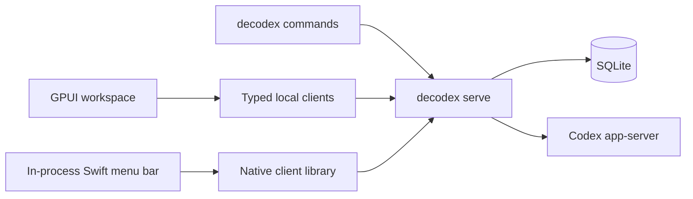

# Runtime Architecture

## Process and state ownership

The current service entrypoint is **`decodex serve`**, from `apps/decodex-cli`. There is no active `apps/decodexd` workspace member or packaged `decodexd` helper. The same executable supplies short-lived CLI commands.

The service owns the local protocol listener, SQLite product state, credentials, account routing and observations, process generations, provider attempts, conversation bindings, Chief coordination, and explicit external effects. The fixed database is `~/.decodex/server/decodex.sqlite3`. Clients do not open the database or auth files as a fallback.



## Application and bundle

`Decodex.app` is the macOS GUI. It contains `decodex-gpui`, signed `Contents/Helpers/decodex`, a native-client FFI library, and `libDecodexMenuBar.dylib`. The menu bar and attached glass controls belong to the same app process. They are not extra apps or state owners.

For local profiles, the app starts the helper with `serve --parent-fd` when no service is available. It reuses an exact-version service and reports a mismatch instead of silently using an incompatible one. Closing the main window differs from quitting: the former preserves the running app; quitting retires only its owned service.

The GUI installer links the user CLI to the bundled helper. The standalone service installer supplies a regular executable instead. These are alternative installation modes.

## Native runtime and coordination

Codex app-server owns provider threads and execution. Decodex adds durable work relationships and protocol projections. Chief shares a retained account-bound process across its related work; ordinary conversation sessions keep their own runtime/account bindings. Native child approvals resolve through verified ancestry. Account routing, subscription usage, Reset Card redemption, and weekly activation stay service-owned.

Retired repository/GitHub effect orchestration does not return through a wiki update. Historical records remain readable; a historical operation shape is not live execution authority.

## Protocol and safety

Clients use same-UID local transport and exact protocol/artifact compatibility. Credentials do not enter normal product projections. Revisions and stable command identities guard mutations. An unknown outcome requires authoritative readback, not blind retry.

The Settings menu-bar preference is durable SQLite state. macOS launch-at-login registration is a distinct platform preference. Window material, focus, animation and local panel visibility remain presentation responsibilities.

## Packaging and verification

Select full Xcode with `xcode-select`; scripts honor an explicit `DEVELOPER_DIR` override. They do not require a fixed Beta path. Rust compilation uses stable. Run:

```sh
cargo +stable test -p decodex-runtime -p decodex-database -p decodex-codex --lib
cargo +stable test -p decodex-gpui --bin decodex-gpui
scripts/macos/test_decodex_app_stage.sh
```

The stage test verifies signed bundle shape, metadata, native ABI compatibility, and a deliberately incompatible fixture. It does not prove microphone permissions, visual quality, or live provider acceptance. See [Commands and validation](../operations/commands-and-validation.md), [Chief coordination](chief-coordination.md), and [Desktop workspace](desktop-workspace.md).
