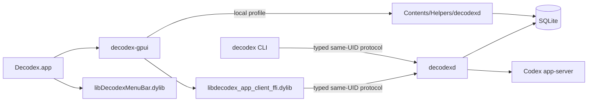

# Runtime Architecture

Decodex has one background service, one product-state authority, and one macOS GUI
application.



This flow shows the single app bundle, its embedded local payloads, and the daemon authority boundary.

The app embeds presentation and local-service payloads, while `decodexd` remains the product-state owner.

## Process and state ownership

`decodexd` is the only background product service. It owns:

- the owner-only local protocol listener;
- the bundled SQLite product database;
- account credentials, routing, quota observations, and login installation;
- conversations, history, runtime sessions, process generations, and provider attempts;
- Program state and domain projections;
- Codex app-server child lifecycles; and
- every product effect and persistent product setting.

The fixed database is `~/.decodex/server/decodex.sqlite3`. Normal clients never open it.
There is no client-side database fallback, duplicated store, UI-side credential engine,
or second product daemon.

`Decodex.app` is the only macOS GUI application. Its executable is the
`decodex-gpui` Rust binary and its bundle identity is `box.acg.decodex`. GPUI owns visual
rendering, focus, accessibility, navigation, and transient presentation state. It does
not own product decisions or durable product state.

The optional menu-bar item remains part of the same `Decodex.app` process, but its
implementation is an embedded signed Swift dynamic library, `libDecodexMenuBar.dylib`,
loaded by the GPUI native menu-bar bridge. The Settings destination exposes **Show Decodex
in the menu bar**. GPUI reads and changes that setting through the protocol; `decodexd`
persists the singleton preference in SQLite. The embedded host creates or removes one
`NSStatusItem` on the main thread. There is no nested `.app`, login-item bundle, secondary GUI
executable, or UI-to-UI protocol.

The launch lifecycle distinguishes ordinary activation from login-item startup. When
`Shell::was_launched_as_login_item` is true, the macOS path calls `order_out_native_windows`
and orders out every native application window, keeping a background login launch quiet. A
normal reopen still calls `activate_main_window`, which activates both the GPUI window and
`NSApplication`. This is presentation-only behavior; it does not change daemon ownership or
menu-bar state.

## Executable and bundle inventory

| Surface | Classification | Product authority | Distribution |
| --- | --- | --- | --- |
| `decodexd` | Background executable/service | Sole core, effect, and persistent-state owner | Installed as one signed bare executable by the local service installer, and embedded as `Contents/Helpers/decodexd` when `Decodex.app` launches a local profile. |
| `decodex-gpui` | macOS GUI | Presentation-only protocol client | The only GUI bundle: `Decodex.app`; it loads the embedded native client and menu-bar libraries. |
| `libDecodexMenuBar.dylib` | Embedded Swift menu-bar host | Presentation-only status item and login-item bridge | Signed dynamic library inside `Decodex.app/Contents/Frameworks`; it is not a nested app or independent UI process. |
| GPUI visual-capture binaries | Test harnesses | None | Test-only Cargo targets; never staged or installed as app bundles. |
| `decodex` from `apps/decodex-cli` | CLI | Presentation and explicit command client only | Supported same-UID protocol client. |
| `decodex-publisher` | Operational content tool | Its own bounded publication artifacts only | Preserved auxiliary CLI, not product runtime. |
| `radar` | Operational evidence tool | Its own bounded evidence artifacts only | Preserved auxiliary CLI, not product runtime. |
| `decodex-database-transfer` | One-shot upgrade tool | Read-only source import under database ownership | Not a normal service or UI. |

Library crates are not independent application processes. In particular,
`decodex-account-login` is private runtime mechanism used only by `decodex-runtime`.
GPUI reaches the daemon-owned login manager through `AccountLoginClient`.

## Retired companion workflow disposition

The desktop consolidation classifies each former companion-only presentation workflow
against current product authority:

| Workflow | Disposition | Current proof |
| --- | --- | --- |
| Account enrollment and login refresh | Migrated to GPUI | `account_login.rs` and the Accounts presentation use daemon-owned Start/Status/Cancel requests. GPUI opens only the returned URL or copies the returned device code. |
| Enable and disable | Retained in GPUI | `AccountsController::set_enabled` sends one revision-guarded protocol command. |
| Fixed and balanced Route | Retained in GPUI | `AccountsController` sends daemon-owned Route or balanced-selection commands. |
| Account reorder | Migrated to GPUI | Move controls send one complete revision-guarded `SetAccountOrder` command. |
| Logout | Migrated to GPUI | A two-step GPUI confirmation sends `LogoutAccount`; the daemon deletes credentials and records the tombstone. |
| Quota | Retained in GPUI | Account rows render only current daemon-projected 5-hour and 7-day observations. |
| Profile | Migrated to GPUI | One selected-account controller sends `GetAccountProfile` and renders the bounded result. |
| Reset Cards | Intentionally retired from the GUI | The daemon and explicit CLI protocol remain supported, but the current protocol can recover an operation only by a caller-retained idempotency key. Recreating the removed UI-side persistent journal would violate the single persistent-state owner. A future GPUI surface requires daemon-owned pending-operation discovery and restart readback first. |

The Reset Card decision removes stale claims that the GUI supports a restart-safe consume
workflow. It does not remove the daemon service or the explicit CLI commands.

## Protocol boundary

The protocol is the only product seam available to UI and CLI processes. Its typed
queries, commands, events, and transient login exchange preserve these rules:

- clients receive credential-negative bounded projections;
- optimistic revisions guard product-setting and domain mutations;
- retained sessions route results to one presentation controller without creating a
  second owner;
- uncertain command acceptance requires authoritative readback; and
- adding a presentation does not grant database, provider, process, or filesystem
  authority.

The desktop-settings path is one vertical slice:

```text
Settings toggle
-> SetDesktopSettings command
-> decodexd revision guard
-> SQLite desktop_settings row
-> DesktopSettingsChanged result/event
-> GPUI applies NSStatusItem visibility
```

## Packaging boundary

`scripts/macos/stage_decodex_app.sh` builds and signs exactly one GUI application at
`target/decodex-app/Decodex.app`. The bundle contains the GPUI executable, signed `decodexd` helper, signed native-client
FFI library, signed `libDecodexMenuBar.dylib`, `Info.plist`, and application assets. It
contains exactly one `.app` and no nested login-item app or helper UI. The embedded daemon
is a local-profile convenience: `bundled_daemon.rs` resolves `Contents/Helpers/decodexd`,
passes a close-on-exec lifetime descriptor to it, and retains the parent end until GPUI
quits. Remote profiles do not launch the helper.

`scripts/macos/stage_decodex_app.sh` is the canonical signed bundle builder. It requires
`DECODEX_APP_SIGN_IDENTITY`, builds `decodex-gpui`, `decodexd`, the native client FFI, and
the Swift menu-bar package, then signs and verifies all payloads. The independently installed
service path remains available through `scripts/macos/stage_decodex_local_service.sh` and
`scripts/macos/install_decodex_local_service.py`; that installer does not install or launch
the GUI. `apps/decodex-gpui/packaging/Info.plist` is the active application-bundle plist.

## Primary validation

```sh
python3 scripts/vnext/local_database_gate.py
python3 -m unittest tests/scripts/test_vnext_architecture.py
python3 -m unittest tests/scripts/test_account_login_architecture.py
DEVELOPER_DIR=/Applications/Xcode-beta.app/Contents/Developer \
  cargo +stable test -p decodex-gpui --all-targets --features visual-capture
scripts/macos/test_decodex_app_stage.sh
cargo +stable test --workspace --all-targets --all-features
```

The app-stage test proves the single-bundle shape. Runtime or visual acceptance must
also launch the staged application, confirm its main window, toggle the setting, and
observe the status item in the same application process. Login-item acceptance must additionally
verify that startup leaves native windows ordered out, while a later ordinary reopen activates
the main window.
