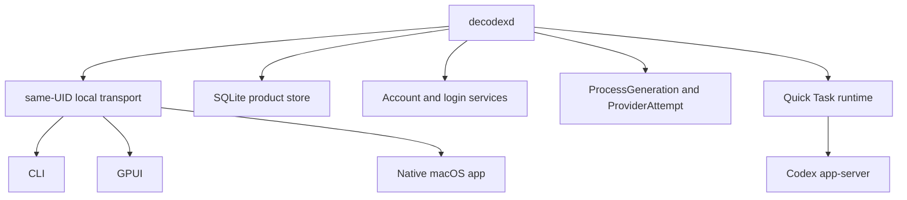
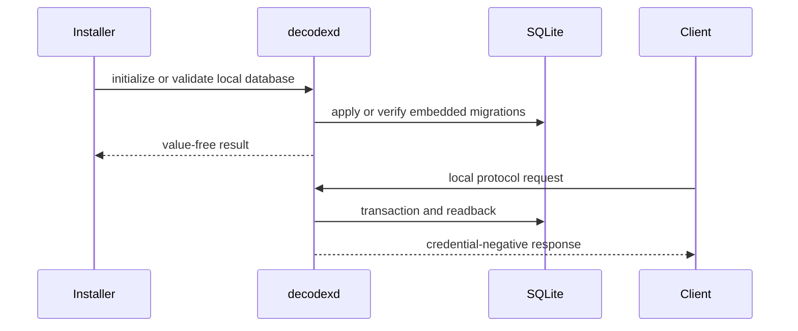

# Runtime Architecture

Consult this page when changing daemon composition, local transport, storage ownership, account services, Quick Task execution, process supervision, provider attempts, or startup/shutdown behavior. The current product is a single-host local daemon; the former Postgres/server-store architecture is not part of the runtime.

## Ownership and process topology

`apps/decodexd/src/main.rs` is the composition root. `crates/decodex-runtime/src/bootstrap.rs` builds `ServiceBootstrap`, which retains the daemon transport authority and independently records readiness for the SQLite product store, ManagedRepository, ProcessGeneration, ProviderAttempt, account services, observations, and Quick Task. `ServiceBootstrap::bind` transfers the listener and assembled services into the daemon lifecycle.

`decodexd` is the only normal product-state owner. It owns the owner-private SQLite database at `~/.decodex/server/decodex.sqlite3`, the credential adapter, account login and observation services, Codex app-server children, process fencing, provider-attempt reconciliation, and bounded shutdown. `apps/decodex-cli`, `apps/decodex-gpui`, and `apps/decodex-app` are protocol clients; they do not open SQLite, credential files, or Codex authentication files.

This diagram shows the ownership boundary: clients request work through the daemon, while the daemon composes persistence and provider-side effects.

The local endpoint is `~/.decodex/server/decodex.sock`. Transport setup proves owner-only directory and socket identity, one-link publication, and peer UID before accepting a client. Remote and cross-UID control are not supported.

## SQLite and startup lifecycle

The `database/` crate is the schema and persistence owner. `SqliteStore` opens the fixed database, applies the embedded ordered migrations, validates the application/schema identity and integrity checks, and exposes bounded domain adapters for accounts, credentials, conversations, runtime sessions, process generations, provider attempts, command receipts, and Program cycles. `database/transfer/` is a separate one-shot read-only redb import tool; normal startup does not link or open redb.

The explicit daemon commands `initialize-local-database --root ROOT` and `validate-local-database --root ROOT` are implemented in `apps/decodexd/src/main.rs`. Normal `serve` startup opens and validates SQLite before retaining product availability; an unsafe, unavailable, or incompatible database produces typed unavailable state rather than a fallback store. Startup also releases interrupted Route claims and performs bounded recovery before accepting protocol commands.

The sequence separates explicit database administration from normal daemon serving; credentials and private provider values never cross the client response boundary.

## Quick Task runtime

`QuickTaskRuntime` and `crates/decodex-runtime/src/quick_task.rs` coordinate one user turn without replacing Codex's execution kernel. The durable path is Conversation and Turn history -> account route -> RuntimeSession and Codex thread -> ProcessGeneration fence -> one ProviderAttempt -> positive terminal evidence -> process retirement. A later turn rehydrates the same Codex thread with a fresh admitted process generation. The selected account is conversation-scoped and is not silently replaced when global routing changes.

`ProcessGenerationControl` and `ProviderAttemptControl` are separate readiness and recovery seams. A process generation must be fenced before spawn; a provider attempt must have one dispatch authorization and positive-only terminal evidence. Unknown or interrupted outcomes are not treated as success and are not replayed blindly. These invariants are covered by the focused authority specs and `database/tests/quick_task_restart.rs`.

The built-in Adaptive Program loop uses the same Quick Task path. `database/src/program_cycles.rs` owns the atomic Program aggregate and Review/continuation rules; `crates/decodex-runtime/src/domain_packs.rs` owns the two exact built-in Pack manifests and projections. Packs add vocabulary and capability checks, not a second scheduler or execution engine.

## Change navigation and validation

- **Storage or migration:** change `database/src/` and `database/migrations/` together; add focused persistence/restart coverage. Do not hand-edit the SQLite file or add a runtime fallback. Run `cargo test -p decodex-database --all-targets` and `python3 scripts/vnext/local_database_gate.py`.
- **Daemon composition or lifecycle:** start at `ServiceBootstrap`, `ServiceApplication`, and `apps/decodexd/src/main.rs`; update readiness, shutdown, and websocket tests. Run `cargo test -p decodex-runtime` and `cargo test -p decodexd`.
- **Quick Task/process/provider behavior:** change `quick_task.rs`, `process_supervisor.rs`, or `provider_attempt_service.rs` with the corresponding authority tests. Escalate to workspace checks when protocol exports or app-server contracts change.
- **Public protocol:** update `crates/decodex-protocol/src/` and all protocol clients; verify the consumer-facing import path and artifact cohort, not only an internal module.

The broad `cargo make check` is conditional for changes crossing workspace, GPUI, packaging, or release boundaries. Narrow checks are preferred for isolated Rust or database changes.

## Scope boundary

ManagedRepository, remote workers, multi-machine deployment, a graph database, arbitrary executable Packs, and automated Program continuation remain deferred. The legacy Postgres store, its migrations, and its server bootstrap are removed rather than compatibility paths.

See [Local product V1 contract](../specs/local-product-v1.md) for supported behavior, [Local database operations](../operations/local-database.md) for installation and transfer, and [Account login authority](../specs/account-login-authority.md) for the private login lifecycle.
