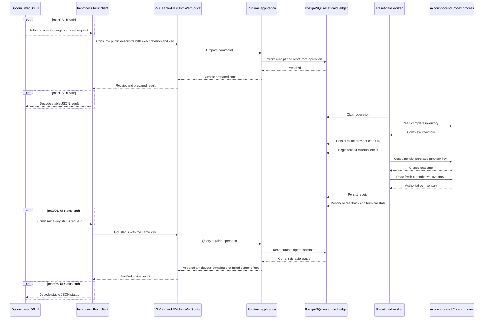

# Runtime Architecture

This page explains the active vNext ownership skeleton and preserves a map of the
excluded v0.2 source for provenance. Checked-in manifests, source, tests, and the vNext
authority documents remain authoritative. The XY-1403 private-artifact retirement
takes effect only at the exact
[repository effective point](../specs/private-artifact/decision.md#repository-effective-point).

## Workspace shape

The root manifest enumerates the active members explicitly. Five library owners form the
vNext runtime boundary:

- `decodex-core`: domain/application contracts and ports, including logical
  Conversation/RuntimeSession/history and deterministic Context Pack compilation, plus the XY-1306 typed
  `~/.decodex` path, configuration, stable-identity, blob, and disposable-cache
  foundation. Its external dependency set is architecture-tested and limited to
  bounded TOML/Serde parsing, SHA-256, OS randomness/no-follow filesystem support, and
  test-only temporary storage.
- `decodex-protocol`: exact-current V2.0 typed wire contracts and
  the owner-only same-UID Unix transport authority. It depends only on core, structured
  serialization, Tokio/Tungstenite, and the libc calls required for descriptor-relative
  namespace ownership and kernel peer facts.
- `decodex-postgres`: the PostgreSQL 18 product-state adapter; depends on core plus the
  accepted tokio-postgres/deadpool/refinery stack and owns embedded migrations,
  optimistic transactions, leases, append-only activity, outbox delivery, inert
  account/window metadata, normalized history, immutable session snapshots, blob metadata,
  Context Pack revisions, and inert transition proposals.
- `decodex-codex`: typed app-server contracts, schema/live capability negotiation, and
  redacted event normalization. It depends only on core, performs no SQL, owns no database
  connection, and exposes no child-launch surface. Current live turn dispatch is
  unavailable. Slice 1 can enable its fenced initial-selection path; XY-1304 governs only
  later automatic fallback and wake.
- `decodex-runtime`: service lifecycle, connection/session execution, resumable event
  publication, idempotency receipts, private immutable-account process supervision, and the
  sole PostgreSQL/Codex adapter composition; depends on the other four owners plus the
  maintained Tokio/Tungstenite transport stack. Runtime source and tests have no Axum or
  product TCP listener.

`apps/decodexd` depends only on runtime. The `apps/decodex-cli` and
`apps/decodex-gpui` client roots depend only on protocol, so they cannot reach stores,
Codex, repositories, or orchestration directly. Radar and Publisher remain independent
auxiliary workspace members. `tests/scripts/test_vnext_architecture.py` checks the exact
dependency graph and exclusion of the legacy package through Cargo metadata.

`decodex-protocol` owns the reusable bounded WebSocket client alongside the shared wire
contract. It reads only the client projection of typed configuration: profile data is
validated, while server-host repositories, PostgreSQL data, and cache policy are consumed
as opaque TOML and never represented by the client profile. A local profile uses its
explicit identity pin or the shared-host stable identity file. It also carries only the
closed `same_uid` or `disabled` policy and an optional service-owner UID whose presence is
fixed by that policy. A remote profile requires its explicit pin and carries only inert
host and port data. Each local connect captures the current fixed Unix endpoint, validates
its directory and socket identities, connects that path, verifies the kernel server-peer
UID, and validates the path again. The client then sends a pinned V2.0 hello,
verifies welcome and snapshot version/identity, issues `get_doctor_status`, and re-verifies
the result, embedded report, and exact complete current component set before returning status.
Report ordering is not authority. Reads, writes, frames, messages,
interleaved events, and deadlines are bounded; socket, parser, HTTP, and server-provided
text collapse into closed redacted failure classes.

`apps/decodex-cli` exposes the canonical `status` and `doctor` commands with active or
`--profile NAME` selection and human or `--output json` rendering. Both commands cross the
same V2.0 query; `status` is compact and `doctor` is line-oriented, while each retains every
typed check. JSON uses `decodex/cli-diagnostics/1`. Exit code 0 means every check is ready,
1 means a complete report contains unavailable or unknown checks, and 2 means a closed
client/configuration/protocol failure. The `reset-card` command family is a thin protocol
client for the shared daemon service and uses `decodex/reset-card-cli/1` JSON. The CLI has
no credential, Codex-process, provider-ID, PostgreSQL, or effect authority.

`decodexd` is the only V2.0 server composition root. It reads the bounded active-profile
configuration, acquires and publishes the non-cloneable local listener, and retains its
one namespace lock before it creates the stable server identity, opens product storage,
connects to PostgreSQL, projects supervisor loss, or starts any daemon-local mutation
service. A process that cannot acquire the listener returns the typed transport refusal
without a PostgreSQL connection or product-state mutation. The bootstrap owner moves that
same listener into the lifecycle task without another bind or lock acquisition.

The daemon derives
`~/.decodex/server/decodex.sock` from the typed root. The server directory must have the
configured owner and exact mode 0700. A persistent regular `decodex.lock` must have that
owner, exact mode 0600, and one link. The daemon takes one nonblocking exclusive `flock`
before it inspects either socket name and retains it through cleanup. It recovers only an
unchanged, securely owned, single-link `decodex.sock.stage` or `decodex.sock` that returns exact
connection refusal. Success, timeout, another error, changed identity, wrong type, wrong
owner, wrong mode, or extra link preserves the entry and refuses startup.
The authority states are `Configured -> Locked -> Staged -> Published -> Stopping ->
Quiescent -> Cleaned -> Released`.

Publication binds the fixed `decodex.sock.stage`, sets mode 0600, captures its
device/inode/owner/mode/link-count identity,
validates the retained directory, lock, staging socket, and absent canonical name, and
uses same-directory descriptor-relative `renameat` to publish `decodex.sock`. It then
requires the staging name to be absent and the canonical name to have the captured
identity. There is no self-connect challenge. Pending accept has no 250-millisecond
watchdog. Validation is point-in-time at publication, each accepted connection, each
client reconnect, and cleanup.

The local stream uses WebSocket route `/v1/ws`. The literal `ws://localhost/v1/ws` in
each client is handshake metadata passed with an already admitted Unix stream. It cannot
resolve or dial TCP. The WebSocket uses structured JSON and typed
hello, command, receipt, result, snapshot, event, and refusal envelopes. Major versions
must match exactly; this build accepts only V2.0. V1.x and V2.1 receive typed refusals
before application payload handling. Events carry server ID, monotonic
cursor, entity revision, correlation, and causation. The stable server-host ID supports
operator pinning, while each daemon process creates a distinct bounded publication-epoch
ID. A reconnect resumes retained ordered deltas only when both IDs match; an absent or
changed epoch, stale cursor, or changed server ID receives a bounded snapshot fallback.
Only a snapshot or event cursor fully applied by the client is a resume checkpoint; the
Welcome cursor is an informational server high-water mark and must not advance client
progress before following replay deltas are applied.

Kernel credentials are mandatory on both sides. The daemon admits only a client whose
kernel effective UID equals the exact configured service-owner UID. The client accepts
only a daemon with that same kernel UID. Directory permissions, the stable server ID,
PostgreSQL roles, environment credential references, and database identities cannot
replace that principal. Remote and cross-UID transport remain inert. This boundary does
not claim confinement against hostile code that already has the same UID.
An established stream retains the kernel peer fact that admission proved. A later pathname
change does not revoke that stream. A new connection or reconnect performs fresh endpoint
and peer checks and fails closed.

One top-level runtime task owns the listener and namespace lock. It also directly polls
the ProcessGeneration and ProviderAttempt background reconciliation futures. Those
futures are not detached tasks and cannot outlive the lifecycle. One `JoinSet` owns every
session and command task. The owner assigns a monotonic stable spawn ID and a closed
session/command kind before each spawn and maps it to the Tokio task ID. Requested
shutdown, listener-invalidating refusal, child panic, unexpected child failure, or early
service-future completion starts one stopping phase and creates one absolute,
non-extendable deadline. Sessions receive a cooperative stop signal. The owner closes
command ingress and receives through `None`, so a buffered submission or outstanding
pre-close permit cannot escape task accounting. Commands received before the deadline
enter the same task set. A submission that crosses an outstanding permit after the
deadline receives a stable task identity but its command future is never polled. The
owner harvests `join_next_with_id`; it calls `abort_all` once only if the deadline
expires, and it continues harvesting through `None`.

The same top-level task also owns daemon service futures. This includes the Reset Card
worker and the account-observation scheduler. The scheduler starts all independent ready
accounts concurrently, publishes each completion independently, and retains no more than
one active observation owner for one Account UUID. Reset Card has no detached worker or
heartbeat task. At the start of stopping, the application synchronously closes provider
work registration and receives a cooperative service-stop signal. Queued blocking closures
cannot start after that gate closes. An already registered provider operation uses its
existing bounded process deadline and remains included in service settlement even if its
command task is cancelled. Service settlement is intentionally outside the shorter
session/command shutdown deadline because cancelling a Tokio wrapper cannot stop an
already-running blocking process. The namespace listener and lock remain held until every
service future and registered provider operation has settled.

The bounded `TerminationReceipt` records session and command spawn counts, harvested and
expected counts, panic, failure, forced-cancellation, and owner-integrity counts, the
lowest stable identity in each abnormal task class, and endpoint and cleanup refusals.
Its deterministic rank is cleanup refusal, endpoint refusal, owner integrity, child
panic, unexpected child failure, forced deadline, then requested shutdown. Stable task
ties use the lowest spawn ID. After all owned command and session tasks are harvested,
the lifecycle signals each daemon-local service future and polls it to completion. An
in-flight reconciliation pass completes while the namespace lock remains held. The
lifecycle then drops the application and its services. It removes only the retained
canonical socket identity, closes the listener, and releases the namespace lock as the
final authority operation. A mismatch preserves the observed entry and returns a
cleanup refusal.

Runtime receipt lookup is keyed by exact-current V2.0 and the command idempotency key;
the stored request fingerprint additionally covers that version, typed payload, and optional
expected revision. A duplicate returns the original command identity and stored result without
a second application execution. Conflicting reuse is rejected. The one exact-current namespace
has a fixed lifetime receipt capacity. Accepted keys are never evicted, duplicates remain
readable at capacity, and new keys are refused before
application execution once full. Replay buffers, snapshot item counts, human-readable
wire scalars, inbound and outbound message sizes, writes, and per-client outbound queues
are bounded. Queue overflow disconnects that client with WebSocket close code 1013;
an oversized outbound frame closes with code 1009. A successful application publication
is retained even if its initiating client overflows, so cursor resume cannot lose the
mutation. Once accepted, command execution is shielded from connection-task cancellation;
a disconnect can suppress delivery but cannot cancel receipt/event recording. Snapshot
types contain only small state and cannot carry artifact bytes.

This slice deliberately keeps its replay/idempotency ledger in memory. A daemon restart
loses that transient ledger; the stable server-host identity remains persisted, while a
fresh publication-epoch ID makes every old cursor fall back even when restarted cursor
values are equal or overlap. Durable PostgreSQL product-state and transaction primitives
live in `decodex-postgres`.
`decodexd` loads only the typed `~/.decodex/config.toml` and passes its explicit Unix-socket
directory, port, database, operator-pinned expected PostgreSQL peer UID, and distinct
migration/runtime identities with independently resolved optional credentials to that adapter.
For the macOS source-install path, a separate `decodexd supervise-local` process owns one
foreground PostgreSQL child and one service child. It starts the service child only after
PostgreSQL is ready. PostgreSQL exit or any pinned process, directory, or socket generation
change stops the service child before the supervisor exits. Launchd then starts one new
coherent generation. Swift does not participate in this lifecycle.

The source installer provisions only the latest credential-negative service. It writes
the typed config and LaunchAgent, initializes a fresh PostgreSQL 18 database, and starts
one `supervise-local` generation. It does not read or retire old account sources.
Normal startup has no watcher, mapping input, helper or `:8192` dependency, credential
environment projection, migration state, or fallback. Existing local credentials enter
the new authority only through ordinary account import after installation.
The adapter opens each directory component relative to a retained descriptor, pins the directory
and socket device/inode identities, requires the final directory and socket to be owned by the
configured UID with no group/other directory write access, and verifies the connected kernel peer
UID before PostgreSQL authentication starts. It repeats path binding and peer verification for
every migration and runtime-pool connection, so a pre-planted endpoint cannot select its own trust
root and later ancestor or endpoint replacement cannot redirect credentials. A single-use migration pool performs only
forward migration and migration verification and is closed before the runtime pool is built.
The adapter reports available only after PostgreSQL 18, checksum, pgcrypto, immutable migration,
two-connection pool checks, and an exact steady-state authority audit pass. The audit starts from
the original `session_user` and evaluates both its immediately effective authority and every role
reachable through `SET ROLE`, including NOINHERIT/SET-only chains; membership admin option is
itself unsafe because it could create a new SET path. Effective ownership is one closed PostgreSQL
18 inventory covering the Decodex schema, relations, functions, types, collations, conversions,
operators, operator classes/families, extended statistics, and text-search
configurations/dictionaries. Extension control is audited separately from extension schema:
`pg_depend` extension-membership edges for every Decodex object and dependent execution object,
plus extension members referenced by those objects, are unsafe whenever the extension owner is
runtime-effective, regardless of `pg_extension.extnamespace`.
Superuser/BYPASSRLS/role/database administration, database/schema CREATE,
TRUNCATE/TRIGGER/REFERENCES/MAINTAIN, excess table DML or grant options,
`session_replication_role` SET/ALTER SYSTEM, and any effective non-`origin` login value are unsafe
in any reachable authority state. At the V14 boundary, the audit verifies all 110 shipped
non-internal trigger bindings, including regular and deferred constraint triggers, by table, event
mask, row/statement level, constraint and deferral state, origin-enabled mode, and function binding,
then compares
each bound function's exact metadata and `pg_proc.prosrc` bytes with the canonical body embedded in
the immutable forward migration ledger through V23. It additionally closes the entire runtime-callable `decodex` function
namespace over exact signatures and overloads, argument/result shape, language, volatility,
parallel/strict/set behavior, planner metadata, exact security-invoker/definer state and exact per-function settings,
and canonical source. Unexpected functions, overloads, owner-executed functions, or unsafe settings
are unsafe; missing functions or noncanonical source are incompatible. Disabled or misbound triggers
are unsafe; a replaced same-signature safety-function body is incompatible.
Every non-internal trigger on a Decodex runtime relation must be one of those 110 exact V14 bindings.
The same closed execution-path audit permits no user rule, row-security policy, or enabled/forced RLS
on those relations and rejects non-`pg_catalog` function/operator dependencies from defaults,
generated expressions, constraints, indexes, rules, or policies unless they resolve to one of the
119 canonical V14 functions. Every canonical function has the exact function-local
`pg_catalog, decodex` search path, so runtime-selected callable or operator shadows cannot redirect
trigger or constraint execution. A trigger cannot therefore invoke an adjacent public owner-executed
function merely because runtime DML fires it.
One version-specific canonical PostgreSQL 18 manifest additionally closes all Decodex relations,
columns, defaults, constraints, indexes, enum labels, and internally generated constraint triggers.
Defaults, constraints, indexes, and internal triggers include their exact stable catalog dependency
identities rather than raw OIDs. The manifest emits one row per stable semantic dependency edge,
normalizing exact physical catalog duplicates before semantic mapping while preserving distinct
dependency types and endpoints. Reverse dependency edges from constraints to user constraint
triggers resolve through a stable relation-and-trigger-name key without promoting those user
triggers into dependency targets or internal-trigger rows.
Constraint inventory covers both `conrelid` in Decodex and external constraints whose `confrelid`
references Decodex. Internal trigger identity is tied to the exact canonical constraint, relation
side, trigger function, event semantics, deferral state, and referenced relation/index rather than
generated trigger names or OIDs.
`public.refinery_schema_history` is always schema-qualified and must have
exactly table SELECT. Ownership, SET-reachable authority, table or column grant option, writes,
TRUNCATE, REFERENCES, TRIGGER, and MAINTAIN are unsafe; missing SELECT is incompatible before the
history row query runs. The ordered ledger must exactly match every embedded migration version,
name, and checksum; missing, extra, duplicate, reordered, or tampered identity is incompatible.
V14–V19 historically bind intended runtime enum and command privileges through the exact
migration-owned V12 ManagedRun-safety procedure ACL. V26 retires that procedure and derives the
same runtime principal from the accepted V24 ProviderAttempt preparation procedure before it
revokes V12 authority. The binding accepts zero runtime grantees for
migrate-before-provision and exactly one direct, non-grantable runtime grantee for an already
provisioned database; ambiguous owners, grantors, overloads, or grantees fail closed. Production authority failures
remain generic. Authority digest changes use two explicit phases. Phase A's capture-only PostgreSQL
18 mode migrates and provisions a non-default runtime principal, captures normalized manifests at
source S0, first restore R1, and second restore R2 without constructing `PostgresStore`, and
uses the same finalized semantic-authority contract as production readiness at every checkpoint.
One shared restore-target prerequisite now owns the future Phase A R1 and R2 boundary and the
separate one-shot R1 prerequisite gate. Before target creation, a closed PostgreSQL 18
`pg_restore` list parser privately proves that the custom archive has exactly one active
`pgcrypto` extension declaration. It rejects absent, duplicate, disabled, malformed, or ambiguous
declarations without retaining or publishing raw TOC data. After the guard, the helper creates a
fresh `template0` target, proves that `pgcrypto` is absent, and connects as the migration role to
execute exactly
`CREATE EXTENSION IF NOT EXISTS pgcrypto WITH SCHEMA public VERSION '1.4';`. The ordinary restore
keeps `--exit-on-error` under the bootstrap identity and adds no owner, ACL, role, or session
authorization override. No migration or runtime provisioning follows a restore.

The replacement `--capture-authority-restore-prerequisite-v2` gate binds one clean HEAD and tree,
the selected PostgreSQL 18 toolchain, the v2 pass and diagnostic schemas, and definition fingerprint
`53bb20b8e43a6199c3aa578269cee8b941ed549fd8f10db0dce361a03016524a`. One sequential state owner
covers CLI selection, preflight, private work, cluster initialization and start, role setup, S0,
archive creation, the restore helper, semantic checks, cleanup, receipt validation, final source
binding, and publication. Completed execution checkpoints can be only a validated prefix. The first
fixed checkpoint and reason are immutable. Actual lifecycle state derives one exact cleanup-owner
sequence: empty before private work exists, `private_work_cleanup` after private work exists, or
`cluster_stop` followed by `private_work_cleanup` after cluster stop becomes applicable. Each
required owner moves from pending to active to completed. `cleanup_finalization` is a separate
fail-closed owner. Cleanup can be `passed` only when the required sequence is complete and
finalization is complete. The receipt carries both sequences and the finalization proof.

An interruption before an action, after an action but before its transition, between actions, or
during finalization belongs to the active or pending cleanup owner. Expected cleanup operation
failure is `cleanup_failed`; an interruption is `interrupted`; and unexpected cleanup state is
`harness_corruption`. A cleanup failure is secondary when an execution primary exists. Otherwise,
the exact cleanup owner becomes primary. Receipt validation, source binding, and publication also
have separate owners and cannot replace an earlier primary failure.

The gate creates, migrates, provisions, populates, and semantically verifies S0 once. It dumps once,
guards and restores fresh R1 once, and runs the same full semantic owner once at R1. Explicit
in-process counters reject a duplicate prerequisite or restore. The gate stops before R2, digest
derivation, candidate publication, Phase B, and the aggregate. Pass and failure receipts are
canonical, create-only, mode 0600, file-fsynced, and directory-fsynced. A failure receipt contains
only the fixed v2 projection. It contains no raw exception, command, child output, environment,
path, selected tool name, database, role, owner, ACL, OID, SQL, connection, TOC content, catalog
row, count, or discovered identity. The same canonical failure diagnostic goes to standard error
for publication-failure recovery. The raw-error `StageOrchestrator` remains outside this privacy
boundary. Failure-document construction and repair stay under `receipt_validation`. Incomplete or
corrupt cleanup proof produces one fixed `failure_document_repaired=true` diagnostic. It preserves
a valid earlier primary, uses only fixed lifecycle values, and never emits exception text. The
fixed `receipt_validation/harness_corruption` diagnostic remains available on standard error if
normal construction or durable publication cannot complete.

The v1 gate ran once and returned ownerless `gate/stage_failed` evidence. It did not prove that the
archive guard, prerequisite, restore, or R1 semantic authority ran. The v1 spelling and schemas are
retired and have no alias. Candidate 3 remains frozen and unadjudicated. A source-bound v2 result
must exercise and reject candidate 3 before the three-rejected-candidate threshold is crossed. The
Manager owns cross-process one-shot authorization. A v2 pass has `acceptance=false` and permits only
a later decision about revised Phase A. This v2 source is unexecuted and does not establish
acceptance.
Rust is the sole owner of this closed, ordered, typed contract. It preserves the prior 39
predicate descriptors and appends one unsafe identity for unexpected runtime-executable
security-definer authority. Finalization rejects a missing, duplicate, unknown, reordered, or
misclassified observation before production verification or fixture serialization can consume it.
The immutable artifact contains the versioned ordered definition, its observations, and a SHA-256
fingerprint. The fingerprint input starts with a domain string and then uses big-endian
32-bit byte lengths for both schema strings and every UTF-8 descriptor field.
Python independently applies this encoding. It requires the emitted fingerprint and the one
supported fingerprint to match, binds each Boolean observation to the definition in order, and
requires identical complete artifacts at S0, R1, and R2. Python does not contain a predicate list
and does not inspect Rust source for semantic authority.
The runtime verifier examines the login identity and each inherited or `SET ROLE`-reachable
identity. Effective privileges include `PUBLIC` and column grants. Non-system relation-like entry
objects are closed to the exact Decodex and migration-ledger allowlist. Every runtime-executable
non-system `SECURITY DEFINER` normal function, procedure, or window function must be an expected
runtime entry. Aggregate rows are excluded because PostgreSQL `CREATE AGGREGATE` has no
`SECURITY DEFINER` capability. The required `public.digest(bytea,text)` dependency is bound to the
exact `pgcrypto` 1.4 extension membership, namespace, owner relationship, function metadata, and
default ACL.
Phase A atomically publishes a versioned summary receipt only when the mismatch array is the
exact ordered subset of the post-V21 schema-contract digest followed by the configured-authority digest:
zero, either singleton, or both in canonical order. Unrelated, duplicate, or reordered mismatches
fail closed. Semantic predicates, ledger, binding, identity, and both S0=R1 and R1=R2 restore edges
remain intact. Raw manifests
and temporary cluster state are not retained in the receipt. A separate V13 upgrade database binds
only the exact
ManagedRun-safety anchor, then proves the migration-owned 15-function/five-type runtime delta and
V19 internal sealing from raw catalogs. The receipt is derivation evidence, never acceptance.
Forward-only V20 leaves the exact schema observer unchanged and recreates only nine named CHECK
constraints whose leading `BETWEEN` expressions were not a dump/restore textual fixed point. Their
equivalent explicit lower/upper predicates preserve behavior and dependencies; the two-restore
capture proves the resulting authoritative definitions are stable across repeated restoration.
Phase A finishes capture, PostgreSQL shutdown and workspace removal, and final source-tree
revalidation before preparing a mode-0600 receipt in the operator-selected private external
directory. After the complete bytes are flushed and fsynced, a create-only hard link publishes the
final path. That link is the commit and linearization point: pre-link failure leaves no new final
path, while post-link temporary cleanup, directory-fsync, signal, crash, or status failure never
rolls the immutable receipt back. Directory fsync is still required for a normal-success durability
claim; failure after the link creates an ambiguous producer outcome resolved only by receipt
readback. Phase A exit status and output are not evidence.
Phase B is the sole consumer and acceptance boundary. It ignores producer exit and output, never
overwrites an existing path, and may consume only an extant exact-schema receipt whose immutable
bytes and hash attest the exact Phase A HEAD/tree, `capture_only=true`, `acceptance=false`, the
canonical zero/one/two mismatch set and order, exact
database/principal/migration-ledger evidence, and complete
source/restore and semantic-authority parity. For one or two mismatches it requires a clean direct
single-parent child that changes exactly the reported digest array or arrays and no other source;
for zero mismatches it requires the same clean Phase A HEAD and tree. It repeats the full S0→R1→R2
capture and publishes `acceptance=true` only for zero digest
mismatches and complete semantic evidence, bound to both trees and the Phase A receipt hash.
Malformed, substituted, duplicate, or lineage-mismatched receipts fail
closed. This bounded contract assumes one clean committed writer and an operator-owned private
external directory; it creates no persistent PostgreSQL authority or producer/consumer protocol.
Phase B may change only the digest arrays reported by Phase A, must record both Phase A and Phase B
trees, and is invalidated by an unreported array or any other source delta. An unchanged-tree Phase
B still emits a fresh acceptance receipt explicitly bound to Phase A. Older receipts are immutable
provenance only and cannot attest source changes outside their binding. Normal
acceptance has no expected-mismatch branch: manifest readiness must pass before behavioral or
restart stages run.

The PostgreSQL harness has one top-level stage authority for the normal aggregate. Fatal preflight
owns argument/mode validation, clean source binding, PostgreSQL tool and temporary-root discovery,
cluster initialization/start, and base-role creation. Phase A/B private-output and receipt-lineage
validation remains on those direct entrypoints rather than entering the aggregate graph. After
preflight, meaningful semantic suites form explicit prerequisite edges and produce only `passed`,
`failed`, or `blocked`: an ordinary expected failure blocks its consumers while independent
branches continue.
One `managed_run_v26_suite` stage owns the ManagedRun V26 database, migration, runtime
provisioning, baseline capture, source behavior, post-behavior capture, dump, restore, restored
capture, and restored behavior. The focused ManagedRun mode and the normal aggregate call this same
stage owner. Its exact test selectors use nextest's zero-selection failure mode. Final aggregate
evidence depends on this stage.
Required nested restore results are promoted to their owning suite, so a capture, restore, parity,
or production-check failure cannot be reported as owner success. One private live-doctor mutation
SQL executor owns every ordinary, role-as, and secret-bearing mutation child, SQL delivery state,
command completion, output handling, and cleanup; the live-doctor coordinator owns only probe
readiness and its own child. Both child kinds receive bounded terminate, kill-fallback, and reap
attempts on every exit, and failure to establish a reaped state is harness corruption. Mutation
probes and fixture restorations remain distinct stages. Ordinary mutation delivery remains blocked
when `Popen` fails; once successful `Popen` returns with the SQL payload owned in argv, delivery is
possible and every later failure remains restoration-eligible. A secret mutation remains blocked
through its completed fail-closed logging prelude, becomes may-have-dispatched immediately before
the first mutation-frame payload write, and remains restoration-eligible after any later write,
flush, timeout, protocol, exit, or cleanup failure. Successful exit records only command
acknowledgement, never exact server receipt or non-vacuous mutation application; an optional
postcondition probe is separate evidence. The scheduler consumes one restoration claim from the
attempt record exactly once. Pre-dispatch failure blocks restoration, eligible probe failure still
attempts it, and later probes on the shared fixture require restoration to pass. Unexpected
assertion/key/type failures, corrupt report state, source-binding or redaction failure, and other
unexpected exceptions stop new scheduling as harness corruption. Before cluster start the same
outer owner attempts direct removal of a created private work directory without reporting cluster
teardown. Once the cluster has started, teardown and final report emission always remain eligible.
The process-visible primary is selected before aggregate output/report emission; cleanup or
emission corruption remains secondary when an earlier semantic failure exists. The normal
aggregate emits `decodex/postgres-aggregate-stage-report/1`. The focused ManagedRun mode emits
`decodex/postgres-managed-run-v26-stage-report/1` from the same stage owner. Other focused suites
and Phase A/B receipt modes retain their direct output or capture behavior.

The three bound identity sequences must be exact. Runtime receives USAGE only on the activity and
outbox sequences; the migration-owned history-version sequence remains inaccessible. SELECT,
UPDATE/`setval`, ownership, grant options, and SET-reachable surplus authority are unsafe. Every
string-to-system-catalog identity explicitly qualifies `pg_catalog`; the
authority audit and schema-qualified migration-ledger verification remain correct under a hostile
runtime `search_path` that shadows both ledger and system-catalog names. Missing required schema,
table, sequence, function, or ledger-read authority is incompatible.
At the V14 boundary, twenty-seven canonical `SECURITY DEFINER` functions comprise the three V3
cursor/history functions, eleven V5-V7 Project/Policy/Program/Objective command entrypoints, and two
V9 RoleProfile command entrypoints, two V10 RuntimeSession command entrypoints, and four V11 exact
WorkItem commands, the inert future running/resume guard, the one V12 ManagedRun safety
consumer, and the three V14 routing-authority commands. The cursor issuer derives Conversation,
snapshot version, parent, page size, position, item identity, and expiry under serialized
Conversation authority; the bounded pruner is callable by runtime, while the capture function is
trigger-only and runtime cannot execute it directly. Runtime has no cursor-table INSERT authority.
The other ninety-two canonical V14 functions are security invokers. The additional-function adversarial fixture creates a fixture-only migration-owned,
runtime-executable `SECURITY DEFINER` function with an unsafe per-function setting and migration-owner
trigger authority, proves runtime direct trigger DDL is denied, executes the owner-authority effect,
and restores the trigger before the independent doctor rejection. A separate public-function trigger
fixture proves runtime DML can execute an owner effect without direct function `EXECUTE`, protected
table `UPDATE`, or `TRIGGER`; the closed V14 trigger inventory rejects that path. A public,
runtime-owned extension fixture attaches a migration-owned Decodex collation as an extension member,
proves the runtime can transactionally drop it, and is rejected through the dependency audit. The
closed 119-function V14 inventory remains independent of the distinct same-signature canonical-source
substitution fixture. Missing, malformed, unsafe, unreachable,
authentication-failed, or incompatible bootstrap retains a typed unavailable adapter;
there is no ambient/default database or alternate state authority. Repository and
PostgreSQL socket validation rejects a symbolic link or non-directory at every descriptor-opened
component, a non-socket endpoint, untrusted directory permissions/ownership, an endpoint owner or
kernel peer that differs from the operator UID pin, and any directory/socket identity replacement.

Protocol V2.0 defines `get_doctor_status` as a read-only query/result with a client query
identity and no mutation receipt, deduplication, replay, receipt-capacity use, event
publication, or entity revision. Reusing a query identity performs a new ordered
observation. V2.0 is exact-current: V1.x receives `major_mismatch`, and another V2 minor
receives `unsupported_minor`, before application payload handling. `ClientHello` may pin the stable
server identity before snapshot, query, or command access. The doctor report is mechanically
capped at 32 unique typed checks and has no free-form external text. Server repository
paths are an aggregate typed check only, so
remote clients receive neither host paths nor repository names and cannot reinterpret
them locally. App-server capabilities are closed enum values; current unprobed capability,
plugin, vault, and blob-content observations remain honestly `unknown` rather than ready.
Each accepted V2.0 doctor read revalidates the retained socket binding, obtains a
runtime connection through the verified connector, performs a live query, reruns the
complete runtime-authority and immutable migration checks—including the exact embedded
ledger and required `pgcrypto` extension—and reports any failure as typed unavailable.
It never reconnects migration
credentials, runs migration, or repins an endpoint. A stale but securely bound listener refusal is
database-unreachable; directory/socket replacement or peer-identity drift is unsafe-host-path.
PostgreSQL socket recreation after restart therefore requires a daemon restart under the explicit
operator authority instead of silently adopting the replacement.

The XY-1273 account foundation keeps a canonical Decodex account UUID and a closed readiness
observation in core. PostgreSQL persists only display metadata, that observation, ordinary
credential-negative JSON, and revision evidence; the forward-only V4 migration adds the honest
`unavailable` observation without adding any credential, vault-reference, selector, or routing
column. The repository exposes only exact-ID reads and inert mutations.

Codex child creation has one dormant runtime-owned explicit manual composition path. Runtime first
observes the exact manually selected PostgreSQL account ID/revision in the `available` state, then
releases the result row and pooled client before reserving process capacity or invoking a vault. It
repeats the same exact observation after process-group cleanup or quarantine transfer and constructs
only a non-live post-cleanup result. Readiness may change while mechanics run; a stale, non-ready, or
unavailable final observation suppresses the result. No transaction, row lock, client checkout, or
caller callback spans vault or process work. A synchronously blocked host vault can still retain its
local task and mechanical capacity indefinitely, outside PostgreSQL.

The manual launcher, request, result, capacity counter, permit, vault port, wire DTOs, stdout pump,
and process supervisor are private to non-reexported runtime modules. The Codex adapter does not
depend on PostgreSQL and exposes no child-launch operation.
Cargo-metadata architecture guards enumerate every workspace library and binary target and prove the
current normal-dependency graph: only runtime directly owns both sibling adapters, while `decodexd`
reaches them only through runtime; production edges do not enable synthetic fixture features.
Compile-fail contracts prove that the private launcher, capacity, command, probe, and vault types are
absent from current crate APIs. Metadata does not prove the absence of future source changes or
wrappers. The private account binding and host vault project into the not-yet-bound child exactly
once, after which repeated `account/read` observations compare the exact identity in zeroizing,
redacted process memory and attest the exact process ID. No account-identity digest is returned.
A mismatch synchronously terminates the process group or transfers cleanup to the bounded quarantine;
uncertain cleanup never returns a runner. The default vault is unavailable. Children retain the
single normal shared `~/.codex` for configuration and plugins, receive only `HOME` and a fixed
`PATH` from the parent, mark all other inherited descriptors close-on-exec, use a fixed app-server
argv, and discard stderr. Outbound JSON serialization writes directly into fixed 8 KiB
zeroizing blocks; the pointer-only block index may grow, but no growing ordinary allocation ever
owns credential bytes. Serialization failure, frame overflow, transport failure, and normal
teardown drop the same wiping owners. Inbound reads,
partial frames, queued frames, overflow/disconnect values, and unread teardown state remain in
fixed-allocation zeroizing blocks; the exact-size contiguous parse copy is zeroizing. A lexical gate
rejects every escaped inbound JSON string before locked serde_json 1.0.150 can copy it into ordinary
scratch; this intentionally closed subset fails unusual escaped paths/messages closed. Every completed
owned string field under the typed RPC DTOs deserializes directly into a per-field zeroizing owner,
so a later missing, malformed, nested, or wrong-type field cannot ordinarily free it. This guarantee
does not claim that all opaque Serde structural/number scratch is zeroizing, only that inbound string
bytes cannot enter its escaped-string scratch. No `CODEX_HOME`,
credential file, global configuration mutation, ambient-account production probe, or live credential
switch is exposed.

Runner capacity is fixed at 64 and in-memory under one daemon-owned runtime authority. Reserving a
private non-clone permit also reserves one of 64 fixed cleanup slots before spawn. The permit enters
every version/schema preflight `ProcessGroupOwner` immediately after successful
`spawn`, before any fallible post-spawn step. It returns to the launch attempt only after confirmed
process-group absence and successful child reaping, then moves sequentially into the next preflight and
final app-server. Confirmed final shutdown releases it only after the same proof; uncertain cleanup
moves it into a hard-capped quarantine before control returns. The one capacity-lifecycle janitor must
be successfully created before capacity authority exists; failure makes capacity construction fail
closed, so no child can require later launch-triggered recovery. No caller or `Drop` path enters the
background retry loop. A weak daemon registry reuses exactly one live capacity authority but does not
make it process-immortal. A finite join coordinator stops and joins the janitor when the last capacity,
permit, or quarantined job releases that authority; if the last release occurs on the janitor itself,
the coordinator performs the join without self-wait. Construction failure after worker start shuts
down and joins that worker before returning. The janitor scans the fixed slots
round-robin and performs one nonblocking cleanup attempt per job per round, so one stuck group cannot
starve later groups. Atomic slot states keep each job discoverable while reserved, ready, or in
flight; an in-flight guard restores the same slot after unwind and a per-iteration unwind boundary
keeps the persistent owner alive. Poison is recovered, and timed predicate rechecks prevent lost
wakeup. There is no queue-full or
contended-admission leak: the 65th permit is rejected before spawn. The failed attempt cannot launch
another group. PostgreSQL's
exact revision/state predicate excludes stale, unavailable, unknown, depleted,
authentication-failed, plugin-unready, and a current conflated disabled observation. That
disabled shape is source evidence, not target authority; Slice 1 uses the independent
versioned `enabled` boolean. A fresh daemon starts with no
persisted capacity or assignment authority. This feature-gated manual path remains nonproduction
and does not construct a V23 ProcessGeneration or create restart authority. There is no account
inventory, automatic selector, weighting, stickiness, fallback, quota wake, or live routing API;
it is current source evidence only. Slice 1 adds limited initial fixed/balanced selection
through the owning V14/V16 and account authorities. XY-1304 remains the later automatic
fallback/wake gate.

### Durable ProcessGeneration supervision

V23 adds the durable ProcessGeneration owner described in
[the XY-1400 authority specification](../specs/process-generation-authority.md). PostgreSQL
commits one account-exclusive `starting` intent before `ProcessSupervisor` can receive a fresh
spawn fence. Replay is readback only. One private `AttestedAppServerLaunch` retains the protected
executable reference snapshot and canonical macOS execution identity, then derives the intent's
account and launch-manifest hash. That hash binds the exact image and BuildId, canonical-suspended
execution policy, command, fixed `app-server --stdio` arguments, working directory, clear-then-set
environment, account, initial account revision, canonical credential version/fingerprint, provider
binding, and exact-build startup/lifetime/account-callback capability. The same non-secret facts
are part of the existing V23 intent, prepare fence, ready transition, and strict readback. No new
ledger is added. The supervisor accepts no independent runner digest or raw `Command`. The
immutable snapshot supplies preflight bytes and the static code-identity reference. The final
macOS app-server executes the canonical image while suspended and resumes only after exact dynamic
code, path, session, and process-group verification. After spawn, the supervisor persists the exact
boot, PID, process-start, process-group, and session identities.

The current launch profile accepts only the source-attested macOS
`codex-cli 0.146.0-alpha.9.2` image and forces
`CODEX_INTERNAL_APP_SERVER_REMOTE_CONTROL_DISABLED=1`. This is exact-build startup-state
evidence: it selects disabled-ephemeral remote-control mode, but it is not a permanent denial
policy. The supervisor retains child stdin and stdout privately for lifetime ownership.
`FencedProcess` and every returned ProcessGeneration capability expose no raw channel or generic
protocol writer. Every other build, including the current unrecorded Linux image, fails closed
before profile-dependent version or schema preflight spawn.

That accepted lifetime profile is not by itself an AccountLifecycle readiness receipt. The
exact `codex-cli 0.146.0-alpha.9.2` profile recognizes the root
`account/chatgptAuthTokens/refresh` request and response schemas and services that callback
through the Account Service. Readiness is issued only after the exact executable, generated
schema, and live callback preflights pass. The callback path rechecks the account revision,
credential version/fingerprint, provider binding, and enabled state immediately before the
ProcessGeneration fence. Unsupported callback profiles fail closed before account launch.

The supported-OS adapter owns boot and process identity, generic session/descriptor setup, exact
owned signaling, group observation, and positive exit witnesses. Linux uses `/proc` start ticks
and pidfd. macOS uses a versioned stable `kern.bootsessionuuid`, `proc_pidinfo`, and a one-shot
kqueue `NOTE_EXIT` filter. A persisted boot identity from another format is incomparable and
cannot prove that a prior boot ended.
Both use a new session. Generic retained-title and preflight setup grants no ProcessGeneration
lifetime capability and does not install Linux `PR_SET_PDEATHSIG`. No exact Linux lifetime profile
is accepted. A future parent-death primitive must be reachable only through such a profile. On
macOS, stdio EOF is only a best-effort request and is not death evidence. Only the original
unreaped child can authorize a group signal. A restored same-boot process can receive only a
read-only exact witness; it is not adopted, reacquired, proxied, terminated, or signaled.

Daemon startup projects present `starting`, `ready`, and `stopping` rows to
`death_unknown` and runs one positive-only pass. The server lifecycle then owns and polls
bounded background reconciliation until shutdown. An old boot is positive prior-boot death proof.
Same-boot absence, mismatch, an unbound identity, timeout, and group absence alone remain
uncertain. The partial unique account index derives account-local quarantine without another
writer. One item failure does not disable the store, managed repositories, or reconciliation for
other accounts.

On macOS, a restored generation becomes `dead` only after the attached exact kqueue witness returns
`EVFILT_PROC/NOTE_EXIT` and the process group is quiescent, or after boot change. If the process
exits before witness attachment, the event cannot be reconstructed and the account stays
quarantined for the rest of the boot. ProcessGeneration makes no claim about credential revocation
or provider-effect outcome; XY-1401 retains that ambiguity in ProviderAttempt.

### Durable ProviderAttempt authority

V24 adds the generic ProviderAttempt owner described in
[the XY-1401 authority specification](../specs/provider-attempt-authority.md).
One PostgreSQL preparation transaction binds exactly one reserved Conversation Turn identity or
ManagedRun execution to its accepted V17 plan, V16 decision, RuntimeSession, selected account,
live ready ProcessGeneration revision and epoch, request identity and digest, and provider
idempotency or correlation keys. The Conversation owner can materialize the reserved Turn later;
an existing Turn must match the same Conversation and accepted RuntimeSession.
The fixed-search-path reservation trigger runs as the migration owner because runtime has Turn
DML but no ProviderAttempt relation access; runtime and PUBLIC cannot execute the helper directly.
Unreserved Turn writes pass, and conflicting reserved materialization fails closed.
ProviderAttemptService selects no account and creates no RuntimeSession or Turn.

The ordinary machine is `prepared -> canceled | dispatch_authorized`,
`dispatch_authorized -> succeeded | failed_definitive | not_submitted | unknown`, and
`unknown -> succeeded | failed_definitive | not_submitted` only from positive evidence.
Restore projects present prepared and dispatch-authorized rows to `unknown` under the shared
execution restore gate. A late positive result stays bound to the original attempt after process
death. A replacement reconciles but cannot recreate a fresh dispatch fence.

Daemon bootstrap completes restore projection and one bounded positive-only reconciliation pass
before it reports ProviderAttempt readiness. The server lifecycle then owns and polls bounded
background passes until shutdown. Diagnostics omit provider keys and request digests. The current
composition has no provider evidence adapter that can dispatch, no public consumer for the fresh
fence, and an unavailable `CodexAdapter`.
V26 removes the drained V12 ManagedRun submitted-turn, effect, safety-input, and effect-barrier
authority. No compatibility or fallback V12 writer remains.

`ServiceBootstrap` exposes independent ProcessGeneration and ProviderAttempt readiness and
authority-bound borrowed runtime ports. Neither port is cloneable or can escape its bootstrap
owner. The ProcessGeneration port provides bounded or exact diagnostics, exact positive-only
reconciliation, and exact owned-child termination. The ProviderAttempt port provides bounded
redacted diagnostics, exact positive-only reconciliation, and an exact positive receipt
operation. ProcessGeneration spawn and ready remain crate-private and have no caller.
`CodexAdapter::unavailable()` remains in the daemon composition.
No protocol, CLI, scheduler, routing, RuntimeSession, ProviderAttempt, credential, remote-auth, or
UI path reaches ProcessGeneration spawn. Production dispatch remains structurally disabled.
A future live-dispatch protocol gateway must be a separate typed authority that source-rejects
`remoteControl/enable` and all alternate-control RPCs before dispatch can be enabled. This slice
does not implement that gateway.

### Stateless execution coordination

V25 adds the closed enum vocabulary in one transaction. V26 and the zero-sized
`ExecutionCoordinator` implement the
[XY-1402 source projection](../specs/execution-coordinator-authority.md). V14, V16, and V17 now
preserve one closed consumer union. The ordinary variant binds a Conversation and reserved Turn to
its exact source RuntimeSession. The managed variant binds one ManagedRun revision and one distinct
managed execution. Ordinary work does not acquire ManagedRun state.

V16 remains the sole account eligibility and selection writer. It loads the complete persisted V14
universe. It preserves each 300-minute and 10,080-minute fact independently and applies sticky
affinity only after eligibility. It classifies both quota facts at its own decision instant, so a
fact that ages after V14 retains the exact stale or reset-elapsed cause. Pure current positive quota
depletion produces `waiting_usage`. Pure unresolved ProcessGeneration or ProviderAttempt authority produces
`waiting_reconciliation`. Any mixed set remains `no_route` with every exact cause and no wake or
task failure. Selection and both pure waits inspect only included members. A `no_route` uses the
complete persisted policy-member universe, retains `excluded_by_policy` for every excluded member,
and cannot be cause-free.

V17 remains the sole RuntimeSession continuation writer. An ordinary Conversation can reuse its
thread only from positive exact-thread evidence on the original ProviderAttempt. A ManagedRun can
use the accepted V15/V22 causal experiment. Every other case uses the atomic Context Pack and
fallback RuntimeSession transaction. V17 never writes ProviderAttempt state, and ProviderAttempt
never creates or rewrites RuntimeSession state.

The coordinator consumes one persisted V16 decision, one V17 plan, one ProcessSupervisor-owned
live `FencedProcess`, and ProviderAttemptService preparation. It consumes the fresh prepared
capability and returns only an inert attempt projection. It retains no service, lifecycle, retry,
receipt, process, attempt, or ambiguity state. Its method and the process fence are crate-private.
The read-only V2.0 execution-decision query exposes no mutation capability. No production
composition root can start coordination or authorize provider dispatch.

The accepted XY-1355 target adds no live execution path here. V14 makes PostgreSQL the sole owner
of a revisioned complete routing-policy snapshot over the entire account inventory, canonical
user order, explicit per-member disposition, sticky affinity plus source RuntimeSession revision,
account/profile/build compatibility, exact evidence revisions, and required-capability
applicability. Runtime and callers cannot supply that universe. V14 exposes only exact policy
replacement, ordinary compatibility-evidence publication, and immutable snapshot-resolution
commands; resolution classifies facts and blockers but cannot select, wait, wake, continue, or
dispatch. The core routing component will be
a pure kernel over the database-produced snapshot; V16 will atomically persist its decision and
complete evidence linkage. Codex remains a positive-evidence adapter. An unknown required
capability blocks, while an empty required-capability set makes unknown plugin inventory non-
applicable rather than positive readiness evidence.

V2.0 also carries `get_conversation_history`. Its request contains a logical Conversation UUID,
an optional opaque PostgreSQL-issued Conversation-bound snapshot cursor, and a page size capped at
eight on the wire (the repository's internal cap is 100). PostgreSQL assigns append-only
per-Conversation positions and derives the next position and snapshot high-water from indexed
history while holding the Conversation lock; there is no runtime-writable stored counter. The first
page also pins the current append-only history-version sequence. Later pages fetch only `limit + 1`
immutable item versions at or before that sequence and through the high-water position. Concurrent
appends are neither duplicated nor silently skipped, and later streaming updates cannot change an
issued page or its replay.

Every continuation is a random identifier resolved only through an immutable persisted issuance row
that binds Conversation, positive high-water, immutable version sequence, fixed page size, positive
item position, exact item identity, and optional issued parent. The canonical issuer derives and
extends the chain under serialized authority; ordinary runtime DML cannot mint one. A page exposes
at most one continuation. Chains expire after one hour and are capped at 512 rows per Conversation
and 4,096 globally; canonical retries reuse an existing row, while new issuance at capacity returns
typed `resource_exhausted`. Bounded pruning removes expired chains and obsolete history versions but
retains current versions, active-cursor versions, and versions required for exact command replay.
Never-issued, expired, cross-Conversation, edited, zero-position, changed-page-size, and forged
truncation tokens fail closed.

Each command first commits an immutable pending receipt containing protocol version, operation,
project and scope identity, entity identity, idempotency key, canonical request digest, expected
revision, and every payload hash and length. The receipt owns a fenced claim token and finite expiry.
Conflicting reuse fails before filesystem or metadata effects; exact completed replay returns the
stored original response bytes, and the first successful caller decodes that same stored response
rather than rereading mutable current state after commit. An expired claim can be reassigned, but a stale token cannot complete
it. Blob-backed writers then acquire sorted session-level hash locks in namespace 1273 on dedicated
non-pooled connections, followed by sorted per-shard capacity locks in namespace 1274. After byte
publication, transaction B acquires hierarchy key 1271 and required parent/child rows, registers
metadata/references/activity/outbox, persists the exact response, and completes the fenced receipt
atomically. Database triggers never acquire hash or shard locks. Cancellation or uncertain unlock
closes the dedicated session and releases its locks.

Cursor paths use hierarchy 1271, cursor key 1272, then rows; they never acquire hash locks in that
transaction. Garbage collection uses hash then shard coordination, rechecks every live-reference
table and grace age in a short transaction, commits metadata deletion, and unlinks afterward.
Filesystem publication, verification, scans, and unlinking occur outside hierarchy, cursor, and
database transactions. `decodexd`, its daemon-private runtime identity, and BlobStore access are one
trusted service boundary; arbitrary/manual use of that credential is unsupported and equivalent to
daemon compromise. PostgreSQL owns committed metadata/domain/receipt authority but does not itself
attest external bytes.

Inline text is capped at 16 KiB. Larger payloads are published create-only and atomically, fully
hash/length verified, and synchronized with their containing directory before transaction B. Direct
and transitive bytes are reverified on every successful read. Bounded grace-aged inventory
reclamation is deterministic and resumable and removes only hashes absent from live history,
immutable replay versions, Artifact revisions, and Context Packs. A crash can leave only
inventory-visible unreferenced bytes; metadata deletion commits before orphan unlink. Missing,
length-mismatched, or tampered content fails closed.

The typed history projection carries one canonical media type for both inline and offloaded payloads
plus a flat credential-negative metadata map. It accepts at most 32 fields, 64 UTF-8 bytes per key,
and only booleans or strings of at most 256 UTF-8 bytes; nested or credential-shaped forms fail
before persistence or wire decode. Core owns both opaque types and their serde validation.
Credential-bearing normalized key suffixes and concrete authorization/token/assignment/key patterns
fail closed, while benign prose such as `secret sauce`, `token budget`, and `session summary` remains
valid. PostgreSQL's closed projection predicate mirrors that classification, so store-created rows
cannot become unreadable at the protocol boundary. This is normalized provenance, not raw app-server
JSON.

V3 state triggers author creation/update timestamps at persistence. Starting or active
RuntimeSessions always begin with `ended_at = NULL`, active Turns always begin with
`completed_at = NULL`, and terminal RuntimeSession or Turn states cannot be inserted. Immutable
snapshot, blob-verification, Artifact-revision, Context-Pack, and transition-proposal creation times
are database-authored rather than caller-authored.

Logical Conversation identity has no Codex-thread or account component. One Conversation can have
multiple explicitly manual or synthetic RuntimeSessions, each bound to immutable non-secret account
and profile snapshots. A RuntimeSession's Codex-thread and last-known-turn correlations are also
immutable across every lifecycle transition. Composite foreign keys prevent sessions, Context Packs, transition proposals,
history items, and typed Artifact revisions from crossing that boundary. History-item Artifact
identity/revision correlation is immutable after insertion and an update carrying a different valid
reference fails rather than reporting an ignored mutation. Each Artifact parent revision is tied by
a deferred composite foreign key to an exact immutable revision row. Before every parent advance,
the state guard requires the exact old revision row; every new revision requires revision 1 or the
exact immutable predecessor plus a legal predecessor-state transition. Typed and direct-SQL
transactions therefore cannot skip history, commit a parent advance without its matching revision,
or manufacture a revision the parent has not selected.
Database triggers take
conflicting parent row locks in child-write and terminal-transition directions, enforcing parent
eligibility and terminal immutability under concurrent runtime SQL. History-item create/update,
activity, outbox evidence, exact response, and fenced receipt completion are one transaction B after
the pending receipt and any blob publication. Context Packs separate the mandatory
pinned revision, use canonical length-delimited binary encoding, bind policy/Conversation/side
effects/complete provenance/bytes/digests in one opaque verified value, and reconstruct that complete
immutable value on read. Source rows are staged before the parent under a transaction advisory lock;
the parent seals their exact contiguous count, and database triggers reject subsequent source or pack
insert/update/delete poisoning while the deferred parent reference prevents orphan commits. Persisted
rollover/fallback rows are proposals only: their schema
forces dispatch disabled. This slice exposes no account selection, live turn start/resume/steer,
automatic rollover, Context-Pack dispatch, ambiguous replay, or scheduler wake in current source.
Slice 1 later enables only eligible quota-aware fixed/balanced initial selection and manual
recovery. XY-1304 remains the separate later automatic fallback/wake gate and does not block
Quick Task, Project/Lead, ManagedRun, GPUI, or first Mac dogfood. XY-1358/V15 owns experiment creation and positive-only observation
authority; XY-1360 owns continuation and atomic Context-Pack fallback; XY-1362 owns scheduler wake;
XY-1276 owns production Quick Task creation. XY-1272 owns only PostgreSQL
configured-principal and ACL authority closure against V8. XY-1345 owns accepted exact-command
authority/prototype evidence, XY-1346 owns expected V9 exact receipts plus RoleProfiles, and
re-bounded XY-1337 owns expected V10 RuntimeSession snapshots and transitions.

V15 is a persistence protocol, not an execution composition root. V22 is its forward-only
retained-title bridge. PostgreSQL first records immutable intent. It then commits a one-way
`creation_possible` fence before one `thread/start`. The V22 binding stores the exact request and
raw response identities and SHA-256 digests. It also stores the exact thread ID, cwd, marker,
non-ephemeral state, and nullable returned name. The pinned build requires that name to be null.
A replayed creation fence never authorizes another start. Recovery can read only the exact durable
binding for the same experiment and attempt. If that binding is absent, the start outcome is
terminally ambiguous. Recovery never retries, searches, or adopts a thread.

After a durable start binding, PostgreSQL commits one separate title-set fence. Only a fresh fence
authorizes one `thread/name/set`. Fence replay or a lost set response authorizes one bounded
`thread/read` for the exact bound ID. It never authorizes another set. PostgreSQL creates a
retained-title attestation only when that read returns the prepared title, marker, cwd, and thread
ID. Title-qualified positive observations require this attestation. V17 same-thread plans require
an observation linked to it. Historical V15 rows and receipts remain immutable. Runtime cannot
execute the obsolete title-in-start binder or unattested observation command.

The V22 completeness trigger rejects a same-thread plan that cites historical unattested evidence.
It does not reinterpret that evidence as retained-title authority.

The feature-gated manual composition fixes request IDs 3, 4, and 5 for start, title set, and read.
It derives database idempotency keys from the experiment ID and operation. No external RPC has a
transport retry.

List omission, pagination exhaustion, missing events, lossy history, and stale caches have no
persisted representation and authorize nothing. The
immutable V14 snapshot is the run-revision provenance authority for V15 experiments; V16 decisions
retain that same composite snapshot lineage, and V17 plans retain the composite V16 decision
lineage. The snapshot likewise retains its source RuntimeSession revision as immutable provenance
after checking the locked current session. Later legitimate ManagedRun and RuntimeSession advances
therefore neither rewrite historical evidence nor invalidate its foreign keys, while creation still
rejects a revision that is not current under the command's hierarchy, ManagedRun, experiment,
snapshot, and RuntimeSession lock boundary before committing `creation_possible`.

The composition also reports conversation execution unavailable. Authentication, TLS,
remote binding, HTTP artifact transfer, MCP, scheduling, live Codex execution, mutating
CLI operations, and GPUI behavior remain disabled and belong to later issues.

The synchronous product-state availability port reflects verified configuration and local
pool lifecycle: closing the pool makes it unavailable. Live PostgreSQL failures remain
authoritative at each asynchronous store operation; availability does not claim a synchronous
network-liveness probe.

Pure database commands do not use that split-phase flow. They execute through an
operation-specific, command-complete migration-owner `SECURITY DEFINER` function. PostgreSQL builds
the complete JSONB request from the typed values it consumes, inserts or waits on
`exact_command_receipts(protocol_version, idempotency_key)`, and completes the receipt, domain
mutation, canonical activity, outbox, and stored response in one transaction. Runtime has only the
operation-function `EXECUTE` grant: it has no exact-receipt table privilege, private-helper access,
or canonical activity/outbox mutation authority. A deferred constraint trigger rejects any commit
with an executing row; completed rows and authoritative response bytes are immutable and
undeletable. Stable domain rejection completes and replays, while cancellation, connection,
serialization, deadlock, and unexpected database failures roll back.

Normal exact-command execution is one command per top-level `READ COMMITTED` transaction. A
separate read/lock follows `ON CONFLICT DO NOTHING`; `40001` and `40P01` retry the complete
identical transaction. JSONB identity uses equality, explicit null keys, typed enum/numeric values,
and exact PostgreSQL text semantics. Effects use actual `RETURNING` rows and canonical audit
identities. Operation is part of the envelope, so cross-operation key reuse conflicts. The accepted
proof and vertical ownership are in
[the XY-1345 evidence](../evidence/xy-1345-exact-command-authority.md). V9 implements this boundary
for immutable global RoleProfiles through `bootstrap_role_profiles_exact` and
`update_role_profile_exact`; V10 extends it through `create_runtime_session_exact` and
`transition_runtime_session_exact` without changing the V9 receipt or RoleProfile authority.

The V9 RoleProfile model contains only advisor, lead, task, and reviewer. Bootstrap receives four
role-implied scalar configuration groups and commits the complete set or nothing. Updates append an
immutable revision under an expected-revision row lock and atomically advance the selected role's
single current pointer. Runtime neither selects nor mutates the RoleProfile or exact-receipt
relations directly; it parses the response bytes returned by the two command-complete entrypoints
and retries a complete top-level transaction only after a classified infrastructure SQLSTATE.

V10 is a forward-only zero-state cutover over the retained V3 snapshot and RuntimeSession table
identities. One access-exclusive fence rejects every legacy RuntimeSession receipt, snapshot,
session, Turn, or structurally classified activity/outbox row before altering the empty tables.
Classification closes aggregate, event, effect, link, and payload representations recursively,
including legacy `runtime_session_recorded` events under another aggregate and nested aggregate
markers. Forward-only V21 replaces only the steady-state function behind the existing trigger
bindings: scalar `runtime_session_id`, `profile_snapshot_id`, and `account_snapshot_id` values are
foreign provenance references and do not claim event ownership by themselves. RuntimeSession
aggregate/event/kind markers, complete `runtime_session`/`runtime_session_snapshot`,
`profile_snapshot`, or `account_snapshot` objects, structurally complete canonical session or
snapshot field sets under any other key, and outbox links to activity carrying any of those
ownership shapes remain reserved. Runtime callers may therefore publish canonical
cross-domain activity such as HistoryItem provenance, but cannot forge RuntimeSession activity or
outbox authority; delivery-only updates to an already reserved outbox row remain permitted while
its immutable authority fields are unchanged.
Creation accepts only the RuntimeSession and Conversation identities, one role, the complete
non-secret account snapshot identity/facts, nullable Codex thread identity, and initial state.
PostgreSQL acquires hierarchy coordinator 1271 before selecting or locking an open Conversation or
RuntimeSession tuple, then resolves exactly one current immutable RoleProfile
revision, inserts or equality-validates the account snapshot, writes the complete profile snapshot,
creates revision 1 with a null last-known-turn identity, appends canonical activity/outbox rows,
and stores the exact response bytes in one transaction. Transition identity is only RuntimeSession
identity, expected revision, and target state; success returns prior/new state and revision plus the
unchanged full profile/account/session facts and canonical audit identities. Missing, duplicate,
stale, illegal, invalid-account, and account-snapshot-conflict outcomes are committed stable
rejections. Runtime retains SELECT-only snapshot/session readback and can execute only the two
public command owners; direct DML, private helpers, and forged RuntimeSession activity/outbox
namespaces are closed.

V12 rolls the V3 invoker-rights Turn and HistoryItem state guards forward after V10 made
RuntimeSessions SELECT-only for runtime. Their statement-level `BEFORE` guards acquire hierarchy
coordinator 1271 before row-trigger reads; the Turn guard retains only its Conversation row lock,
and the HistoryItem guard retains only its Conversation and Turn row locks while reading the exact
RuntimeSession without locking it. Both direct hierarchy paths require `READ COMMITTED` and fail
retryably with `40001` under any other isolation level. The ManagedRun safety owner follows the
same global order: reserve the exact receipt, validate the request, acquire 1271, acquire the
run-scoped `(1338, hash(run))` lock, and only then read or lock hierarchy, run, session, barrier,
receipt, or Turn state. This prevents an unknown-turn absence decision from crossing a concurrent
same-session Turn insertion without granting runtime `UPDATE` on RuntimeSessions.

### Managed repository stage-two authority

PostgreSQL is the durable managed-repository authority. It owns the current projection,
monotonic generation/tip, globally immutable complete-descriptor operation assignments,
append-only authority transitions and operation evidence, exact generation/tip compare-and-swap,
atomic command completeness, and state loaded after restart. The pure values, facts, descriptors,
and deciders in `decodex-core` are mechanism-neutral and non-authoritative; a caller projection,
snapshot, operation view, or generic observation cannot substitute for a transaction-internal
PostgreSQL load.

One repository operation ID spans every repository and operation kind. Complete canonical
descriptor equality returns `ExistingExact(OperationView, NoDispatch)`; any difference is
permanent `OperationIdConflict`. For a new assignment, one top-level transaction loads and locks
current authority, evaluates the pure decision, inserts the immutable assignment, appends
`PossiblyEffected`, fences the allocation or head, appends the authority transition, and advances
the projection by exact generation/tip compare-and-swap. Commit-time completeness prevents a
partial durable command.

The PostgreSQL adapter may retain a private non-executable preparation seed until COMMIT. Only a
successful COMMIT acknowledgement returning on that same live control path can turn the seed into
one fresh affine receipt. The receipt cannot be persisted, queried, cloned, publicly constructed,
or reconstructed. Persistence, readback, exact repeat, restart, terminal state, and unknown COMMIT
outcome never grant dispatch. If the COMMIT outcome is unknown, the invocation produces no receipt
and performs no external execution.

Allocate is PostgreSQL-only; all admission, path-reacquisition, stat, Git, and target-availability
evidence used before it is strictly read-only. `Register`, `WorktreeReady`, and `Commit` are distinct
durably fenced `PossiblyEffected` external operations. `Register` uses the accepted pinned Git
2.54 worktree-add mechanism and completes only on exact reciprocal registration with unchanged
head. `WorktreeReady` completes only with its exact head unchanged. `Commit` consumes exact head `H`
and completes only after positive readback of one exact advance to canonical `H-prime`. Restart can
issue only operation-specific readback; it cannot retry, replay, adopt, repair, import, or
reconstruct execution authority.

Accepted XY-1354 supplies descriptor-assisted, symlink-free persisted absolute-path reacquisition
and pinned Git 2.54 unchanged. `decodexd` remains the sole repository-effect owner inside the
trusted single-daemon/same-UID V1 boundary. Authorized whole-cluster restore is inside the trusted
PostgreSQL-administrator boundary and may redefine authority; V1 has no automatic full-cluster
rollback detection. XY-1349 solely owns V13 persistence, XY-1350 owns only read-only acquisition
and executor/readback mechanics against this contract, and XY-1351 owns the first shared saga path.

V13 is accepted. The routing migration order is XY-1356/V14 complete policy and candidate-set
authority, XY-1358/V15 causal experiment authority, XY-1359/V16 atomic routing decisions, then
XY-1360/V17 continuation authority after source inspection proved durable atomic fallback state was
required. XY-1361 first composed these boundaries with production dispatch disabled. V25/V26 then
makes V14, V16, and V17 consumer-generic and retires the drained V12 ManagedRun barrier and
submitted-turn authority. Repository, worktree, Git, and artifact reconciliation owners remain
unchanged. Routing never reclassifies or replays their effects.

V16 is the sole routing-decision authority. It uses a pure routing kernel and one
operation-specific PostgreSQL exact command. The command selects and locks the immutable V14
snapshot and its current policy, exact Conversation or ManagedRun consumer, account,
compatibility, capability, blocker, process, attempt, and quota
sources; callers provide no candidate array or evidence. It persists one inert `selected`,
`waiting_usage`, `waiting_reconciliation`, or `no_route` row together with complete member, quota,
capability, blocker, and
normalized exact-depletion references in the same transaction. Five-hour and seven-day facts,
raw timestamp text, source identity, exact microsecond precision, and evidence revision remain
separate. Missing or inexact provenance cannot establish eligibility. The adapter strictly reads
the database result back through the pure kernel. The XY-1402 coordinator may invoke exactly one
V16 command per request, but its method is crate-private and no daemon, application, protocol
command, scheduler, Codex, credential, or UI composition root can call it. Digest regeneration plus
executable validation remain deferred to the integrated freeze.

V17 consumes only one persisted selected V16 decision identity plus its exact consumer revision.
PostgreSQL derives the selected account, V14 snapshot, source RuntimeSession,
Conversation, RoleProfile snapshot, and evidence universe; callers cannot provide candidates,
policy, exclusions, compatibility, or selection. A qualifying ManagedRun same-thread path requires
one canonical V22-bridged experiment lineage and exact positive thread attestation. A qualifying
ordinary Conversation same-thread path requires positive exact-thread evidence from the original
ProviderAttempt. Each path must bind the source RuntimeSession, thread, selected account, and
consumer. Unknown, stale, negative, mismatched, incomplete, or ambiguous evidence selects the
fallback path rather than inferring compatibility.

The fallback path validates the complete deterministic Context-Pack encoding and manifest, stages
any content-addressed bytes under the existing blob coordination, then inserts its Context Pack,
selected-account snapshot, starting RuntimeSession, continuation plan, audit rows, outbox rows, and
exact receipt in one PostgreSQL transaction. A unique decision link makes both paths mutually
exclusive and exactly once across keys and replay. `replay_permitted` and `dispatch_enabled` are
structurally false. No ManagedRun identity or Conversation identity changes, and no Turn is
submitted or replayed. The XY-1402 coordinator consumes one exact V17 plan only for a selected V16
decision. No production root can call that method. Schema and configured-authority digest regeneration and all
executable acceptance remain deferred to the single integrated post-freeze gate, so ordinary
runtime readiness continues to fail closed on this moving-core tree.

V18 consumes only the exact persisted V16 `waiting_usage` decision identity and expected
ManagedRun revision. PostgreSQL derives the exact earliest-ready instant, policy lineage, run
lineage, and database clock; the caller supplies no timestamp, candidate, quota evidence,
eligibility, exclusion, account, or replacement decision. One append-only transition relation is
the lifecycle, domain-operation result, historical-readback, and cross-key replay authority. Every
accepted registration, claim, reclaim, fire, cancellation, or supersession operation has one
globally unique operation identity, canonical request, exact predecessor revision/tip, complete
resultant state, immutable effect/response bytes, and transaction-bound activity/outbox identities.
The mutable wake head is only a due-order index and current-tip fence; deferred equality and chain
checks require it to point to the exact newly appended transition. No command success or historical
readback is constructed from the head.

Unique registration-decision and run-revision links make registration converge to one durable
wake, while a different operation identity targeting an existing decision rejects instead of
aliasing it. V9 exact receipts replay byte-identically by protocol key; the same domain operation
under a new key can return only its immutable transition result after canonical request equality.
Due acquisition orders independent waits by exact earliest-ready instant, registration time, and
wake identity and never pools account quotas. A fixed sixty-second database-authored lease is
recorded on a claim or reclaim transition after global scheduler serialization. Lease expiry and
restart append a new reclaim transition rather than rewriting history. Registration, claim, fire,
and cancellation retain V16's hierarchy/run lock order, so replacement decisions cannot cross a
stale-lineage check.

Pending or leased heads advance to terminal immutable transitions when explicit cancellation,
ManagedRun revision/lifecycle/wait reason, divergence, policy revision, V16 decision kind, or
ambiguous replacement lineage is stale. A valid leased wake fires exactly once into one immutable
transition containing one `routing_resolution_request_id` whose only authority is fresh routing resolution;
`fresh_routing_resolution_only=true`, `prior_decision_reusable=false`, and
`production_enabled=false` are structural. The fired record carries no old universe or evidence,
and no runtime, protocol, daemon, CLI, scheduler composition root, Codex adapter, credential owner,
or UI imports V18. Executable timing, crash, replay, concurrency, restart, ACL, hostile-input, and
isolation acceptance remains deferred to the single integrated post-freeze gate.

V19 is an acceptance-enabling authority repair, not a scheduler feature. V18 and its checksum are
immutable history. Four new command-complete `SECURITY INVOKER` internals retain the exact V18
register, claim/reclaim, fire, and cancel transaction paths and add one nullable authority instant.
Each unchanged public `SECURITY DEFINER` command calls its schema-qualified internal with typed
`NULL`, so production still samples `clock_timestamp()` only at the original post-lock point; the
existing Rust/domain/adapter signatures and 51-function runtime execute allowlist do not change.
Only the migration owner can execute an internal with explicit time. PUBLIC and runtime execution
are revoked, the internals have no overloads or defaults, and startup closes their exact source,
metadata, ACL, dependencies, ownership, and role reachability with the canonical function and
configured-authority inventories.

An explicit instant must be finite and exactly representable in the nonnegative Unix-microsecond
domain, at most `253402300739999999`, leaving the literal 60-second lease inside the canonical
application ceiling. Registration cannot precede either the locked V16 decision time or locked
ManagedRun update time; every later explicit transition cannot precede the locked head timestamp.
These checks do not change the typed-`NULL` production path. The repair is forward-only: rollback
means restoring a pre-V19 cluster where the four internals are absent, never editing or reversing
V18. Schema and configured-authority digest regeneration remains deferred to the refrozen unified
acceptance boundary.

No production crate or application imports or constructs a V15/V22 experiment execution root.
The V22 manual Rust runner requires its explicit Cargo feature and binary target. `decodexd`,
protocol handlers, routing orchestration, and schedulers do not enable or import it. The runner has
no turn, list, search, archive, retry, adoption, routing, or dispatch API. XY-1402 replaces the
disabled stateful routing wrapper with a zero-sized coordinator over V16, V17, a live
ProcessGeneration fence, and ProviderAttempt preparation. The coordinator does not import V18 or
provide scheduler registration, claiming, firing, cancellation, supersession, credentials, Codex
mutation, dispatch, replay, or production enablement. The V2.0 protocol adds only a read-only
immutable decision projection. It exposes none of the authority commands. Production dispatch
remains disabled until the separate aggregate gate and enablement amendment.
The production runtime composes the already accepted repository owners exactly once during daemon bootstrap.
When PostgreSQL is available, it opens the pinned executor, constructs the repository saga over the
same `PostgresStore`, and performs bounded readback-only restart reconciliation before the protocol
listener can serve. Executor-open or restart-reconciliation failure leaves the repository runtime
and product-state composition unavailable and projects `ServerRepositories` unavailable in doctor;
the typed bootstrap readiness distinguishes executor, reconciliation, and residual-backlog failure.
Startup observes at most 256 eligible operations plus one residual probe and refuses repository
readiness if any eligible work remains. It does not create a second store, dispatch path, retry, or
fallback. Foreground admission, allocation, Register, WorktreeReady, and Commit enter through this
same retained runtime composition. The protocol still exposes no managed-repository mutation route
in this gate.

GitHub pull-request and check effects are a separate sealed provider boundary in
`crates/decodex-runtime/src/github_effects.rs`. It requires explicit provider/repository/revision
authority, complete pagination, durable markers, and positive readback, but XY-1353 does not invent
a live credentialed provider or persistence owner. The later Reviewer/landing owner must connect
that boundary to PostgreSQL effect lineage and an explicitly authorized provider; until then there
is no live GitHub mutation route.

Legacy `command_receipts` retain the receipt-first fenced-claim protocol only for unrelated blob,
filesystem, external, or long-running sagas whose point of no return cannot fit in one PostgreSQL
transaction; managed-repository operations do not use this protocol. Such a flow commits an
immutable pending receipt before effects; a fenced claim then
applies the expected revision, appends activity, enqueues outbox, stores exact response bytes, and
completes transaction B. Durable exact history replay retains its immutable version and referenced
blob while the legacy receipt exists. Outbox claims are bounded and
fenced by a token rotated on every claim or reclaim. Any effect that may have begun must be
reconciled through a meaningful receipt and authoritative readback after claim expiry or
restart. Lease, retry, and retention durations are exact positive whole milliseconds capped
at 365 days; stored lease functions enforce the same fixed-millisecond boundary, lease rows
cannot exceed it relative to their update time, and in-flight outbox leases carry a persisted
claim-or-renewal timestamp anchor. Delivered outbox retention is finite, positive,
whole-millisecond, chronological, and capped at 365 days. Delivered rows are terminal and
immutable until retention pruning is due; no other outbox state is deletable, and table
truncation is forbidden. Direct SQL therefore cannot delete and recreate a completed external
effect as replayable work.
Operation-time triggers reject caller-shifted anchors and
deadlines beyond the same 365-day horizon; relative-duration `CHECK` constraints remain
wall-clock independent. Quota mutation responses and command receipts use already validated exact
UTC Unix-microsecond values, persisted losslessly with no rounding or truncation, rather than caller
timestamp text. Account and quota-window rows are
inert observations with recursive credential-material rejection across normalized keys and
recognizable secret-bearing value encodings. PostgreSQL explicitly normalizes Rust's full
Unicode `White_Space` set, applies an explicit ASCII case fold, and evaluates the remaining
case-sensitive regular expressions under the built-in `C` collation. The integration gate
repeats credential vectors in a Turkish ICU database so database-default case rules cannot
weaken the direct-SQL boundary; this crate exposes no
eligibility, account selection, fallback, wake scheduling, or credential storage.

Provider ingress must additionally retain the exact raw timestamp representation until exact UTC
Unix-microsecond construction succeeds. V14 through V16 do not assume a provider precision and
fail closed on any value that would require rounding or truncation. Natural characterization and
retained-title Desktop discovery remain post-freeze evidence owned by XY-1357 and XY-1363,
respectively; neither is a runtime authority path.

## Retired private-artifact runtime projection

At and after the repository effective point, vNext has no private-artifact runtime,
API, controller, status surface, command composition, PostgreSQL authority, executor,
platform layer, or garbage collector. The archived
[foundations](../specs/private-artifact/foundations.md),
[persistence and GC](../specs/private-artifact/persistence-gc.md),
[executor contract](../specs/private-artifact/executor-platform.md), and
[operations design](../specs/private-artifact/operations-delivery.md) are historical
and non-executable. Their rules, inventories, delivery edges, CORE-FREEZE, ACC,
preparation, and unified validation terms cannot authorize current or future work.

Existing text below about the general Decodex root, BlobStore, repositories, Artifact
revisions, and filesystem helpers describes accepted non-private-artifact surfaces.
XY-1403 does not change them. The retained-title evidence path uses bounded canonical
privacy-safe Git receipts and creates no new runtime route, platform layer, storage
system, schema, compatibility path, or product Artifact.

## Owned vNext paths, configuration, blobs, and cache

`crates/decodex-core/src/paths.rs` owns one absolute, lexically normalized Decodex root
and the typed private-filesystem contract. On Unix, `path_unix.rs` implements that
contract by opening every component relative to an already validated directory
descriptor; reads, listing, removal, temporary-file publication, and synchronization
therefore cannot be redirected by an ancestor rename or symlink swap. `identity.rs`,
`blob.rs`, and `cache.rs` own their independent persistence/integrity/bounding policies;
`storage.rs` owns only their shared redacted error contract.
The platform default is `~/.decodex`; configured roots are bounded to 4 KiB and roots
below any `.codex` component are rejected before I/O. Existing root ancestors, the root,
and every owned descendant reject
symlinks and unexpected file kinds. On Unix, every owned directory and file must belong
to the effective OS user; directories must be private mode 0700 and files must deny
group/other and executable access. Owned writes use same-directory
private temporary files, file and directory synchronization, and atomic rename or
create-only hard-link publication. Root layout is fixed:

- `config.toml`: at most 64 KiB, UTF-8 TOML, owner-readable and non-executable with
  no group/other access (normally mode 0600; mode 0400 is also accepted);
- `logs/`: Decodex log ownership only; no logging runtime is added by XY-1306;
- `blobs/sha256/<prefix>/<digest>`: at most 64 MiB per in-memory write, atomically
  published and fully SHA-256-verified on existing writes and reads;
- `cache/`: disposable hashed entries bounded simultaneously by configured per-entry,
  aggregate-byte, and entry-count caps under hard ceilings; recovery removes only exact
  private `.tmp-<32 lowercase hex>` artifacts left by interrupted atomic writes; and
- `server/identity`: one canonical RFC 9562 UUID version 4 generated from OS randomness,
  persisted create-only, and stable across concurrent initialization;
- `server/decodex.lock`: persistent regular one-link namespace lock with exact mode
  0600; it is never unlinked during normal lifecycle;
- `server/decodex.sock.stage`: fixed unpublished bind and crash-recovery name, absent
  after successful publication; and
- `server/decodex.sock`: fixed published same-UID Unix endpoint with exact mode 0600.

`crates/decodex-core/src/config.rs` denies unknown fields and discards parser details and
input excerpts from typed errors. Debug implementations redact operator-provided profile,
host, repository, database, role, and credential-reference strings. Profiles are a closed
`local`/`remote` enum. A local profile is valid only as `disabled` with no owner UID or
`same_uid` with one exact owner UID. It contains no address. Remote profiles carry only a
bounded host, port, and required expected server identity as inert data. Repository roots exist only in
`ServerHostConfig` as absolute, normalized, at-most-4-KiB `ServerRepositoryPath` values,
so a remote profile has no client-local repository-path field. PostgreSQL configuration
is one explicit bounded Unix-socket directory/port/database, an expected server peer UID, plus
distinct migration/runtime users and optional, distinct credential environment-variable references.
`decodex.example.toml` is the redacted canonical shape.
XY-1307 consumes that data at the runtime composition boundary; core itself still opens
no database. No CLI, remote listener/security, or credential-vault implementation is part
of the core foundation.

## Account lifecycle and credential authority

The Mac dogfood and final runtime follow the
[Account Lifecycle Authority](../specs/account-lifecycle-authority.md). PostgreSQL owns
credential-negative account state, independent versioned enablement, routing controls,
and finite operation receipts. One versioned
HostCredentialStore owns secret bundles. The `decodexd` Account Service owns enrollment,
import, stable alias derivation, list, enable/disable, logout, refresh/rotation, app-server refresh
callbacks, runner projection, account observations, and recovery.

The macOS HostCredentialStore uses non-synchronizing Keychain generic-password items. The
Account Service is its only reader and writer. Exact create, read, compare-and-swap rotate,
and delete operations remain inside that single-write boundary. MacDogfoodReady also
requires the complete Account Service, exact-build refresh callback, provider adapter,
PostgreSQL lifecycle state, startup reconciliation, and clean-start package proof.
Final AccountLifecycleReady additionally requires the Linux store, explicit Codex auth,
full bounded account presentation, and later automatic fallback/wake acceptance.

Runner processes use the shared normal `~/.codex`. Initial credentials enter only the
private app-server process protocol, not process arguments or a long-lived environment.
The Account UUID and provider binding never change in a live process. Same-account token
refresh does not create account rebinding.

For new work, `fixed` considers one configured account and `balanced` selects the first
fully eligible account in versioned canonical order. Both check separate 300-minute and
10080-minute quota facts. Manual recovery uses versioned enable/disable, mode, or order
commands and then submits a new task. Automatic cross-account same-thread fallback and
all-depleted wake remain later XY-1304 obligations.

## Manual reset-card service

Protocol V2.0 exposes bounded account discovery, reset-card observations, manual consume,
and durable operation-status reads. An observation carries the provider-reported available
count when present, an explicit detail-completeness flag, and public descriptors only for a
complete unique inventory. The public identity is one canonical vNext account UUID, its
optimistic revision, and a card descriptor made only from grant and expiry timestamps. No
protocol or client type carries the provider credit ID.

The shared Rust service and CLI contain no macOS-only reset-card implementation. They
run on the supported macOS and Linux runtime hosts. Only the native SwiftUI client is
macOS-specific.
Reset-card clients currently accept only a local profile. They reject a remote profile
before connection because the repository has no authenticated remote reset-card
transport. The stable JSON account and inventory projections include the selected
profile name and verified server UUID. A caller can retain that authority on later
calls with `--profile NAME --expected-server-id UUID`.

`decodexd` is the sole account-operation, app-server process, exact-ID, mutation, and
effect coordinator. In Mac dogfood and the final runtime, Reset Card obtains one exact versioned bundle
through the Account Service and HostCredentialStore. PostgreSQL stores only the UUID,
revision, provider binding evidence, and non-secret account state. New admission requires
`enabled=true`, AccountLifecycle readiness, no unsettled account operation, an admitted
observed state, and exact Registry/HostCredentialStore agreement on account revision,
credential version/fingerprint, and provider binding. The final pre-effect transaction
repeats every check. The current environment-variable references are pre-cutover
projection only.

Before any reset-card read or consume, the Codex adapter requires the generated schema to
advertise both `account/rateLimits/read` and
`account/rateLimitResetCredit/consume`. It attests the configured account in an isolated
app-server process. A read accepts the upstream count-only, capped, unknown-extension, or
otherwise partial detail forms without discarding valid quota facts. A zero reported count
is a definitive empty inventory even when the optional detail array is null. Only a complete,
bounded, unique descriptor set can enter exact-credit resolution or effect reconciliation.
Quota decoding selects the upstream `codex` limit-ID snapshot, or the required default
snapshot when that map entry is absent. It never merges unrelated limit-ID buckets. A null
quota window or reset timestamp becomes an independent unsupported-duration result and does
not invalidate another duration. Before the read, the Account Service refreshes only an
expired access token or one that cannot cover the bounded process deadline. It serializes
that refresh under the existing per-account lock and reuses the existing journal and
credential compare-and-swap. A client selects a public descriptor. The daemon resolves its
one current opaque provider credit ID.

The consume path commits the logical command, account UUID and revision, public
descriptor, provider idempotency key, and then the exact provider credit ID before it
begins the external effect. The provider receipt stores the closed outcome separately
from the fresh authoritative inventory reconciliation record. `reset`, `no_credit`, and
`already_redeemed` become terminal only when that exact credit is absent; `nothing_to_reset`
requires the credit to remain present or its public descriptor to have expired. If the
process, provider, or daemon stops after the effect can have happened, the durable
operation becomes `effect_ambiguous`. Restart recovery uses only the persisted exact
credit ID and the same idempotency key. It never rematches the public descriptor or
generates a new key. The CLI `status` operation observes this durable state without
resending the consume command.

Enrollment stores a credential-negative, domain-separated SHA-256 binding fingerprint
over the account UUID, provider account ID, expected email, and plan type. Restart
rejects binding drift. A preexisting account can initialize a missing fingerprint only
when it has no unsettled reset-card operation. Generic account mutation cannot replace
or remove an established binding.

The reset-card ledger is not part of generic outbox pruning. A durable terminal same-key
receipt replays unconditionally before current enabled, readiness, store, provider,
account-state, operation, and revision gates. New work alone reaches the admission and
effect-start checks above, including the oldest matching public descriptor. After
terminal authoritative readback proves the effect
present, PostgreSQL removes the private exact credit ID and provider-key projection
atomically while it retains the public receipt, reconciliation result, status, and
same-key replay. A terminal pre-effect rejection or exhausted `not_started` claim also
removes that private projection.

An active pending command receipt remains `AcceptanceUnknown`; a client must retain its
key. After the finite claim expires, the same exact key and request can enter the
receipt's row-locked reclaim path. That path waits for an older transaction to become
visible, replays an exact committed result if one exists, or installs a new fenced claim
after rollback. A deterministic pre-effect business rejection completes the claimed
receipt with a closed rejection and replays that result for the same key. A mechanical
preparation failure leaves the receipt pending; it remains `AcceptanceUnknown` until the
same exact request can reclaim it after expiry.

The macOS UI calls an in-process Rust protocol client and decodes the stable JSON
projection returned across that private ABI. The Rust bridge may start one finite official
Codex device-login child in an owner-private temporary home when the user explicitly chooses
`Refresh login`; it never starts the Decodex CLI, a helper, or app-server. The bridge exposes
only the official URL, one-time code, and closed session state to Swift. It gives the resulting
private auth-file descriptor to the daemon, which verifies the exact provider, account revision,
and credential binding before a host-store CAS, then removes the temporary home after success,
failure, cancellation, or client destruction. Its five-second Reset Card second-click
confirmation is presentation state only.
Swift does not stage or read credentials, create a temporary Codex home, launch a process,
resolve an opaque credit ID, or call the provider method. It persists only a credential-negative
pending Reset Card operation handle so it can read durable daemon status after an app restart.
Provider observation, provider-effect retry, and authoritative reconciliation remain
daemon-only. The UI starts all independent daemon value reads concurrently. It keeps one
bounded `WaitForAccountObservation` query open instead of owning a second 15-second clock.
Each daemon publication advances an opaque generation and wakes one coalesced cached-value
reload; a 30-second daemon heartbeat and bounded reconnect backoff cover missed delivery and
restart. Panel-open and manual triggers also reload cached values only; none of these reads
start OpenAI or app-server work. `Refresh login` is the app's only credential-replacement
surface; the native app ABI has no separate direct refresh command. After successful login
replacement, bounded local readback waits for the daemon's new revision-scoped observation
instead of treating an old unauthorized value as the result of the new login.

After the caller creates and durably records an idempotency key for `use`, every CLI
result repeats that key and one closed `dispatch_state`: `definitely_not_dispatched`,
`potentially_dispatched`, `durably_accepted`, or `rejected_before_acceptance`. The CLI
does not generate the key. The Swift client removes a pending handle only for a durable
terminal result or a rejection before acceptance. It retains the same handle and key for
the two nonterminal dispatch states. The Swift journal binds each handle to the profile
name and server UUID. Its atomic write/readback, private modes, intent lock, and journal
dispatch lock make journal classification and terminal removal one cross-process
critical section. Corrupt journal data is preserved and blocks new use instead of being
discarded.

The current observable flow prepares work synchronously, performs the provider effect in
the daemon worker, and exposes terminal progress through durable status polling.

This service implements the reset-card portion of the [vNext authority contract](../specs/vnext-authority.md)
and its operator commands and focused tests are listed in [Commands and validation](../operations/commands-and-validation.md).

## Active Codex adapter foundation

`crates/decodex-codex/` structurally extracts request/notification methods from generated
schema, validates native-collaboration object variants, required fields, field types, and
referenced enums from `ThreadReadResponse`, and compares canonical JSON digests with the
accepted XY-1262 receipt before spawning an app server.
Marker presence is only schema evidence: live method outcomes become explicit `supported`,
`unsupported`, `unavailable`, or `degraded` states. Every successful probe must enter its
profile into the exact-build cache, which rejects conflicting replacement and has no
nearest-build or stale fallback.

Each `SupervisedProcess` owns one immutable shared-home account authority. Credential
environment variables are removed from the child, initialize must report the normal
`$HOME/.codex`, no credential-switch operation exists, and read-only `account/read` must
establish an exact redacted, zeroizing in-memory account identity before a successful probe. On Unix the child starts in a new session;
bounded shutdown checks the entire process group independently of the leader and escalates
from termination to kill. Raw JSON-RPC, stderr, account details, and free-form model deltas
stay inside the adapter. Callers receive typed probe results, stable errors, correlation-
only message events, and run-local collaboration actors identified by validated UUIDs or
digests rather than optional nickname/role fields. Build identity is an exact opaque
fingerprint; statuses, activity kinds, tools, capability reasons, and read-only methods
are closed enums, so protocol text is not exported through debug or serialization paths.

The Codex app-server JSONL transport uses its native bare envelope. Outbound requests,
notifications, and request-error replies omit a `jsonrpc` member. Inbound responses can
omit the member or include the legacy string `"2.0"`; another value, an explicit null, or
a non-string value fails closed. Credential projection also requires the exact typed
`chatgptAuthTokens` success result. Exact request digests cover these native wire bytes,
so a retained-title experiment prepared with the former envelope cannot be resumed as the
same request and remains safely ambiguous.

The production command opens the canonical `codex` executable and first rejects interpreter-driven
files. On macOS, only current native 64-bit thin Mach-O images and native 32/64-bit universal Mach-O
containers cross this boundary. On Linux, only native ELF images cross it, and account-bound launch
additionally requires executable sealed-memfd support (`MFD_EXEC`, `F_SEAL_EXEC`, and the write,
grow, shrink, and seal seals) plus procfs descriptor execution. A host missing any required Linux
primitive returns executable-unavailable during command construction, before vault projection.
Shebang wrappers and other formats therefore fail before vault projection on both platforms.
The platform loader remains responsible for validating the complete image and selecting an
architecture slice or ELF interpreter; dynamic-loader and shared-library integrity remain part of
the host OS trust boundary rather than the build digest.

The runtime copies the accepted source descriptor into a bounded protected object and hashes that
object for the opaque build identity. On macOS this is a private fsynced mode-0500 file protected by
`UF_IMMUTABLE`. On Linux it is an fsynced mode-0500 memfd whose contents, size, executable mode, and
seal set are irreversibly sealed; the runtime verifies every required seal and that
`/proc/self/fd/<owned-fd>` resolves to the same object. Linux version, schema, and app-server spawns
execute the sealed memfd. The descriptor is close-on-exec: it remains open while the kernel resolves
the native ELF image and is closed atomically on successful exec.

macOS version and schema preflights execute the immutable snapshot. The final macOS app-server must
use the canonical executable path because process-aware network extensions assign traffic policy to
the loaded canonical image. The runtime uses `posix_spawn` to create that image in a new session and
keeps it suspended before user code starts. Daemon bootstrap has already hashed and statically
validated the canonical image and immutable snapshot. Each account launch rechecks the canonical
path, device, and inode, then requires the suspended kernel dynamic-code object to match the
snapshot's exact CDHash, canonical path, session, and process group. Only a complete match receives
`SIGCONT`.
The parent protocol endpoints use private, validated FIFOs opened with atomic close-on-exec flags;
the FIFO names are removed while the child is still suspended. The child restores the default
`SIGPIPE` disposition and receives only the fixed `HOME`, system `PATH`, and
`CODEX_INTERNAL_APP_SERVER_REMOTE_CONTROL_DISABLED=1` projection.

Startup original-path identity and digest checks establish the exact build. Per-launch metadata
checks detect path-object drift. On macOS, suspended dynamic-code attestation closes the final
check-to-exec interval; on Linux, sealed memfd execution is that primitive. A source replacement
cannot run or receive credentials after the final check. Failure to create, seal, resolve, attest,
or execute the selected object fails closed. This protection assumes the daemon process and its uid
are not already compromised. Only tests can inject a fake executable.
Preflight output/files, generated-schema file count/per-file/aggregate
bytes/depth, inbound and outbound app-server frames, the stdout queue, collaboration
receiver count, and thread-list/search results are mechanically bounded; schema traversal
rejects symlinks and special files. Both preflight commands use bounded process-group
supervision and descendant cleanup. Failed bounded cleanup transfers the still-owned child, process
group, and lifetime guard to the hard-capped fair quarantine rather than relinquishing process
authority. Transfer is bounded; background retries are isolated per round and may intentionally
retain capacity indefinitely when group death cannot be confirmed.

The probe sends `initialize`, `initialized`, read-only `account/read`, and bounded
`thread/list(useStateDbOnly=true)` with a fixed nonmatching search term. It sends exact-ID
`thread/read(includeTurns=false)` only if that filtered list unexpectedly returns a thread.
The exact `alpha.9.2` image advertises `thread/search`, but the method did not return during the
bounded live check. The probe does not call it and records it as `not_probed`; it does not claim
global title discovery. Account identity is pseudonymized and re-attested after every authority read;
an identity change discards the in-progress negotiation, and restart retains the expected
identity for re-attestation. Search, archive, paginated persisted history, and native collaboration
remain explicitly `not_probed` while their method or side-effect/event gates are closed. Paginated
history schema evidence comes from the structural `ThreadStartParams.historyMode` /
`ThreadHistoryMode` contract, never from a list cursor.
Current `DispatchGate` has no enabled state and denies thread start/resume, turn
start/steer/interrupt, and approval responses. The composition root therefore reports
conversation execution unavailable even though schema validation, read-only probing,
normalization, and supervision are implemented. Slice 1 must replace that current-source
posture only for its fenced initial-selection/Quick Task flow. XY-1304 is required later
for automatic fallback and wake, not for this limited enablement.

## Frozen v0.2 runtime provenance

Everything below this heading maps the preserved `apps/decodex/` source. That package
is excluded from the active Cargo workspace and is not a runtime, fallback, compatibility
facade, or implementation authority for vNext.

`apps/decodex/src/main.rs` calls `decodex::run()`. `run()` does four things (`apps/decodex/src/lib.rs`):

1. Install `color_eyre` error reporting.
2. Initialize daily rolling tracing files in `~/.codex/decodex/logs`.
3. Install a panic hook that aborts after the default panic output.
4. Parse and run the Clap CLI.

The crate has a compile-time Unix-only guard: macOS and Linux are supported; Windows is rejected (`apps/decodex/src/lib.rs`).

`apps/decodex/src/cli.rs` owns the command surface. Current top-level commands include:

- `run`, `serve`, `status`, `project`, `lane`, `diagnose`, `evidence`, `recover`, `intake`, `mcp`, `probe`, `verify`
- `commit`, `land`, `git-hook` for Decodex-owned Git lifecycle policy
- `account`, `app`, `archive-linear`, `maintenance`
- hidden `_attempt` for daemon-planned child attempts

## Runtime state layout

All local runtime state is under `~/.codex/decodex` (`apps/decodex/src/runtime/paths.rs`):

- `config.toml`: global operator config.
- `accounts.jsonl`: shared ChatGPT/Codex account pool.
- `projects/`: registered project contract directories.
- `logs/`: Decodex tracing logs.
- `agent-evidence/`: derived repair-agent evidence views.
- `runtime.sqlite3`: single-machine runtime database.

`StateStore` opens the runtime DB and bootstraps schema with WAL enabled (`apps/decodex/src/state/sqlite_store/schema.rs`). Base tables include projects, leases, run attempts, protocol events and summaries, run activity summaries, worktrees, and Linear execution events. Bootstrap then adds worktree, review, evidence artifact, run-control, connector backoff, private execution event, Decision Contract, autonomy, Execution Program, Program Intake, loop guardrail, and migration schemas.

## Project contracts

A project is not discovered from a checkout. It is explicitly registered from a project directory containing `project.toml` and `WORKFLOW.md` (`apps/decodex/src/config/service.rs`, `apps/decodex/src/cli/control_commands/project.rs`). `project.toml` fields are parsed by `ServiceConfigDocument` (`apps/decodex/src/config/document.rs`):

- `service_id`
- `[tracker]`
- `[github]`
- optional `[codex]`
- optional `[autonomy]`
- optional `[privacy_classifier]`
- `[paths]`

At the v0.2 freeze, `decodex.example.toml` was the safe project-config model. The current
checked-in file now owns the vNext global config shape above and is not an input or
compatibility template for the frozen package.

## One-shot run flow

`decodex run` is implemented by `apps/decodex/src/cli/control_commands/run.rs` and `apps/decodex/src/orchestrator/entrypoints/run.rs`.

The high-level flow is:

1. Open the global runtime store.
2. Resolve a project config from `--config`, current checkout registry mapping, or the registered project table.
3. Register or refresh the project config in runtime state.
4. Load the project `WORKFLOW.md`.
5. Respect stored tracker connector backoff.
6. Optionally explain the queue for `--dry-run --explain`.
7. Call `run_configured_cycle`.

`run_configured_cycle` loads `ServiceConfig`, workflow, and a Linear client. If an issue id is supplied, it runs that target issue with inferred or explicit dispatch mode; otherwise it runs project selection (`apps/decodex/src/orchestrator/run_cycle.rs`). Preparation validates workflow read-first files, plans worktree state, resolves run identity, acquires leases, and materializes the lane through the run-cycle modules.

Recent source adds a baseline guard before ordinary, Program, and retry dispatch. `ensure_clean_baseline_before_dispatch` checks workflow canonicalization commands, records private events, serializes normalization with `.decodex-baseline-normalization.lock`, may create/land a baseline normalization PR, and blocks if canonicalization still rewrites tracked files (`apps/decodex/src/orchestrator/baseline_guard.rs`). This came from recent commits titled "Guard baseline canonicalization before dispatch" and should be considered part of current dispatch safety.

## Long-running control plane

The excluded frozen v0.2 `decodex serve` source calls
`orchestrator::run_control_plane` through
`apps/decodex/src/cli/control_commands/serve.rs`. Its historical operator listener
default is `127.0.0.1:8192`. The active workspace, local service, and macOS App do not
build, package, start, or connect to that listener.

Each daemon tick (`apps/decodex/src/orchestrator/daemon.rs`):

- reconciles active child process state and retry queue entries
- recovers and reconciles idle project state when no active children exist
- reconciles post-review orchestration
- reconciles terminal thread archive backlog
- spawns due child attempts until no more can start

`openwiki/workflows/runtime-operator-workflows.md` records the current cadence: operator snapshots publish every 15 seconds, and Linear-backed queue/status scans run at most every 5 minutes per project unless `POST /api/linear-scan` requests a scan.

## Frozen app-server execution

The excluded v0.2 `apps/decodex/src/agent/app_server/run.rs` owned direct live
`codex app-server` execution. It is provenance only and must not be used by vNext. One
legacy attempt:

1. Records run attempt status as `starting`.
2. Writes activity markers when configured.
3. Publishes a run-control channel for lane control.
4. Spawns `codex app-server` through the JSON-RPC client.
5. Initializes the client and records user-agent/capability evidence.
6. Runs capability preflight and optional `command/exec` health check.
7. Logs into a selected Codex account when account-pool routing is configured.
8. Starts or resumes a thread session.
9. Records `running`, executes the turn loop, then records `succeeded`.
10. Retires the run-control channel as completed or failed.

`openwiki/specs/contracts-and-data.md` summarizes protocol requirements: Decodex uses `stdio://`, expects generated-schema compatibility, requires phase-goal methods, exposes issue-scoped dynamic tools, and treats `decodex probe stdio://` with `PROBE_OK` as a live compatibility check.

## Tracker bridge and completion

The issue-scoped tracker bridge in `apps/decodex/src/agent/tracker_tool_bridge.rs` binds the agent to one leased issue. It exposes dynamic tool names such as `issue_transition`, `issue_comment`, `issue_label_add`, `issue_progress_checkpoint`, `issue_review_checkpoint`, `issue_review_handoff`, `issue_review_repair_complete`, `issue_closeout_complete`, and `issue_terminal_finalize`.

The important architecture boundary is not the tool list itself; it is who owns what:

- The agent may perform bounded issue-scoped tracker writes through dynamic tools.
- The runtime still owns leases, worktrees, retries, recovery, crash fallback, post-review lifecycle, and cleanup.
- Private evidence goes into runtime SQLite before any public Linear projection when a tool has both private and public effects.
- Terminal completion must be explicit; the runtime should not guess whether a lane meant review handoff, manual attention, repair completion, or closeout.

## Operator HTTP and dashboard

`apps/decodex/src/orchestrator/operator_http.rs` owns the local HTTP endpoint, dashboard support constants, API routes, and WebSocket/control traffic. Routes are parsed in `apps/decodex/src/orchestrator/operator_http/routes.rs` and dispatched by `apps/decodex/src/orchestrator/operator_http/server.rs`: `/livez`, `/api/operator-snapshot`, `/dashboard/control`, `/api/accounts`, `/api/linear-scan`, `/api/lane/inspect`, `/api/lane/interrupt`, and `/api/lane/steer`/`/api/lane-steer`. `apps/decodex/src/orchestrator/operator_http/assets.rs` defines the dashboard/client limits, HTTP read timeout, and volatile run-activity fingerprint fields.

The published dashboard snapshot is a cached JSON serialization of `OperatorStatusSnapshot` protected by the `OperatorStateEndpoint` mutex; `publish_snapshot` is the only writer and broadcasts a `snapshot` WebSocket event after updating it (`apps/decodex/src/orchestrator/types/operator_endpoint.rs`). `/api/operator-snapshot` and the dashboard WebSocket read from that cache, inject live global account-control state, and add presentation fields (`apps/decodex/src/orchestrator/operator_http/snapshot.rs`). Runtime lifecycle state still belongs to SQLite, leases, worktrees, tracker ledgers, and daemon/recovery code; HTTP and WebSocket paths are readback/control projections, not new ownership stores.

Dashboard streaming has two readback paths. `snapshot` events follow control-plane publication, normally once per 15-second tick; `runActivity` events are a lighter 1-second stream that rebuilds current-lane projections without live external observers, strips volatile timing fields from its fingerprint, suppresses duplicate broadcasts, and can be filtered by project, issue, or run subscription (`apps/decodex/src/orchestrator/constants.rs`, `apps/decodex/src/orchestrator/operator_http/dashboard/run_activity.rs`, `apps/decodex/src/orchestrator/operator_http/dashboard/subscription.rs`). Dashboard control messages are intentionally narrow: focus/subscription changes are session-local, acknowledgements are session-local, and account selection only changes the global Codex account selector through the accounts module (`apps/decodex/src/orchestrator/operator_http/dashboard/control_actions.rs`).

Account HTTP APIs delegate to account-domain commands: list with optional usage refresh, select, clear, logout, import, use, and reroll name (`apps/decodex/src/orchestrator/operator_http/api/account.rs`). Lane inspect, interrupt, and steer delegate to `lane_control` with registered-project resolution and keep audit/control effects in runtime state (`apps/decodex/src/orchestrator/operator_http/api/lane.rs`). Private execution evidence is read back through `decodex evidence`, where `build_private_evidence_readback` loads local SQLite private events, summarizes payloads by default, and emits stable `private-evidence:<project>/<issue>/<run>/<attempt>` references (`apps/decodex/src/orchestrator/agent_evidence/private_readback.rs`); dashboard/operator status may show the reference and read command, but raw private payloads are not a public dashboard contract.

Linear-facing updates stay sparse. The progress checkpoint tool first records the full execution-state checkpoint as private runtime evidence, then publishes only a low-frequency public Linear projection when the public lifecycle signal/idempotency key changes (`apps/decodex/src/agent/tracker_tool_bridge/tools/progress_checkpoint/handler.rs`, `apps/decodex/src/agent/tracker_tool_bridge/tools/progress_checkpoint/projection.rs`). Control-plane Linear scans run at most every 5 minutes per project unless `/api/linear-scan` queues an all-project or project-scoped scan for the next tick; that request still waits behind active tracker connector backoff (`apps/decodex/src/orchestrator/entrypoints_control_plane.rs`, `apps/decodex/src/orchestrator/entrypoints_control_plane/project_tick.rs`, `apps/decodex/src/orchestrator/operator_http/api/linear_scan.rs`). Rate-limit and timeout detection are modeled as connector backoff warnings (`tracker_rate_limited`, `tracker_transient_timeout`), persisted in runtime state, included in snapshots, and used to skip external observer reads until retry is safe (`apps/decodex/src/orchestrator/entrypoints_tracker_backoff.rs`, `apps/decodex/src/orchestrator/status/snapshot/observers/backoff.rs`).

Current non-goals are important boundaries: the operator HTTP server is loopback-local by default, not a durable workflow engine; dashboard focus/ack messages are not lifecycle events; account controls affect future account selection but do not rewrite existing lane authority; `/api/linear-scan` requests observation rather than dispatch; and lane steering/interrupt APIs must continue to honor lane-control preconditions, leases, private audit evidence, and tracker/public-text privacy boundaries.

## MCP gateway

`apps/decodex/src/mcp.rs` serves MCP over stdio or Streamable HTTP:

- Stdio defaults to `admin` capability profile.
- Streamable HTTP defaults to `observe`, binds to `127.0.0.1:8193`, serves `POST /mcp`, validates origins, manages `Mcp-Session-Id`, and requires bearer auth for non-loopback or profiles above observe (`apps/decodex/src/mcp.rs`, `openwiki/workflows/runtime-operator-workflows.md`).
- Tool profiles are `observe`, `plan`, `operate`, and `admin`.
- Tools include `decodex_observe`, `decodex_plan`, goal/autonomy planning tools, `decodex_lane_control`, and `decodex_project_control` (`apps/decodex/src/mcp.rs`).

MCP is a typed facade over existing runtime and operator controls. It is not a bypass around Decision Contract acceptance, lane-control preconditions, tracker boundaries, review policy, or project enablement. The design rationale for keeping MCP typed and skills slim lives in [Design rationale](../decisions/design-rationale.md); the current remote-control drift audit lives in [Drift audits](../evidence/drift-audits.md).

## Change guidance

- CLI changes: start in `apps/decodex/src/cli.rs` and the owning submodule under `apps/decodex/src/cli/`; add parser tests under `apps/decodex/src/cli/tests/`.
- Runtime scheduling changes: start in `apps/decodex/src/orchestrator/run_cycle.rs`, `apps/decodex/src/orchestrator/daemon.rs`, and the lifecycle-specific orchestrator submodule; expect dense tests under `apps/decodex/src/orchestrator/tests/`.
- State changes: start in `apps/decodex/src/state/sqlite_store/schema.rs`, migrations, row parsers, and `StateStore`; protect replay/idempotency with state tests.
- vNext app-server foundation changes: start in `crates/decodex-codex/`; run its schema,
  fake-process, supervision, redaction, and dispatch-guard tests. The excluded
  `apps/decodex/src/agent/app_server/` is provenance only.
- Operator/MCP changes: update HTTP/MCP tests and check public/private projection boundaries before exposing new fields.
