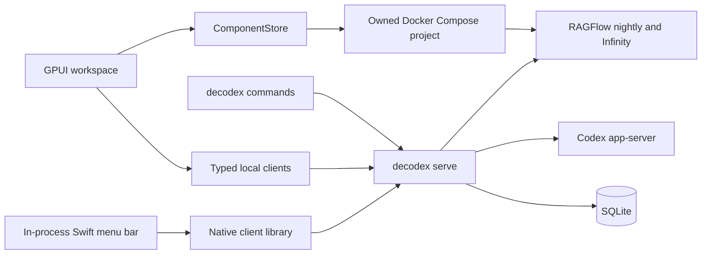

# Runtime Architecture

## Process and state ownership

The current service entrypoint is **`decodex serve`**, from `apps/decodex-cli`. There is no active `apps/decodexd` workspace member or packaged `decodexd` helper. The same executable supplies short-lived CLI commands.

The service owns the local protocol listener, SQLite product state, credentials, account routing and observations, process generations, provider attempts, conversation bindings, Agent coordination, and explicit external effects. The fixed database is `~/.decodex/server/decodex.sqlite3`. Clients do not open the database or auth files as a fallback.


```mermaid
flowchart LR
    UI[GPUI workspace] --> Client[Typed local clients]
    Menu[In-process Swift menu bar] --> FFI[Native client library]
    CLI[decodex commands] --> Service[decodex serve]
    Client --> Service
    FFI --> Service
    Service --> DB[(SQLite)]
    Service --> Codex[Codex app-server]
    UI --> Components[ComponentStore]
    Components --> Docker[Owned Docker Compose project]
    Docker --> RAG[RAGFlow nightly and Infinity]
    Service --> RAG
```

## Application and bundle

`Decodex.app` is the macOS GUI. It contains `decodex-gpui`, signed `Contents/Helpers/decodex`, a native-client FFI library, and `libDecodexMenuBar.dylib`. The menu bar and attached glass controls belong to the same app process. They are not extra apps or state owners.

For local profiles, the app supervises its bundled helper with `serve --parent-fd`. The local service boundary prevents a second owner from replacing an existing service. Typed clients reject incompatible protocol versions instead of opening product storage directly. Closing the main window differs from quitting: the former preserves the running app; quitting retires only its owned service.

The GUI installer links the user CLI to the bundled helper. The standalone service installer supplies a regular executable instead. These are alternative installation modes.

## Native runtime and coordination

Codex app-server owns provider threads and execution. Decodex adds durable work relationships and protocol projections. Agent shares a retained account-bound process across its related work; ordinary conversation sessions keep their own runtime/account bindings. Native child approvals resolve through verified ancestry. Account routing, subscription usage, Reset Card redemption, and weekly activation stay service-owned.

Decodex resolves child requests through the verified native parent chain. The integration does not maintain a second child-admission lifecycle.

Native worker completion messages (`FINAL_ANSWER`) that have not reached an ordinary inference request survive bounded compaction and cold continuation. The summary precedes pending mail and later caller input. Compactor output does not acknowledge delivery. Codex owns the sampling checkpoint and retention policy. The repository completion-mail fixture covers repeated manual compaction in both history modes and both compaction routes with loopback providers. Read the current qualification for executed cases and limits.

Retired repository/GitHub effect orchestration does not return through a wiki update. Historical records remain readable; a historical operation shape is not live execution authority.

## Project, Agent and Work boundary

The accepted [Assistant lifecycle design](../decisions/assistant-lifecycle.md) keeps this ownership split. Delegated persistent Agents, multiple durable wakeups, optional RAGFlow Memory and fresh native-context renewal extend the existing service. The selected Assistant exposes typed management tools, and its settings, team membership, independent wakes and native creation/import receipts use the existing immutable Inbox journal. No schema or second executor is added. Renewal keeps the stable Agent, Inbox and Work, then unsubscribes the old native context without Agent archive cleanup. RAGFlow HTTP work uses one bounded background import job on the existing host tick.

Project and Work are durable business records. A persistent Agent owns one current native conversation and can own several Works. Assistant and Project Lead select responsibilities of existing Agents. `work_read` and `work_manage` expose scoped evidence and atomic decisions. They do not create an execution engine. Native helpers use native spawn, messages, waits and continuation; independent Agents exchange scoped Collaboration Requests through the existing inbox.

The first actual user input can initialize an independent Agent without an Assistant. Native thread metadata is materialized before Project reconciliation. Every independent conversation must attach to the exact process that created or resumed its native thread; a shared account process does not make one Agent the parent of another.

The overview contains Work headers. `work_portfolio` serves selected evidence in digest-checked 8 KiB pages with a 32 MiB ceiling. SQL applies Agent and granted Material scope before the per-category record limit. Guardian observes optional native review records without overriding conversation permissions or business assessment. Private records exclude raw reasoning and preserve explicit missing action associations.

The service initializes the current schema directly. New conversations advertise the canonical tool revision. Ordinary input resumes its retained context. The selected Assistant can renew through a fresh native thread at a safe input boundary using exact creation and binding receipts. Unknown external effects require authoritative readback. Previous history supplies evidence, not input authority. See [coordination](chief-coordination.md) and [local database](../operations/local-database.md).

The current schema retains immutable native child-input receipts. Direct-call attribution remains available. For nested V2 dispatch permitted by native configuration, the receipt joins exact child input with one parent activity and permits recovery without replay. Missing or ambiguous native evidence stays Unknown. V1 nested execution retains its existing native attribution path.

Multiple immutable Agent bindings can share one admitted native process while preserving account and generation fences. Assignment receipts distinguish plaintext proof from native task-name proof. Prepared task names let the runtime recover encrypted assignments through exact native parent metadata, root turns and unique activity. They do not prove the private prompt text or authorize another spawn.

Before sending input to a retained conversation, the runtime reconciles its registered native Project after exact hydration. It assigns only an unassigned conversation and checks the returned identities. Conflicts park the affected Agent while independent input can continue. This keeps the execution directory and permissions; it does not establish official desktop sidebar synchronization. See the [native acceptance boundary](../testing/upstream-acceptance-boundaries.md#project-agent-work-and-global-guardian).

After a completed Guardian review, optional history recovery can read up to 32 same-directory private candidates and five turns per candidate. It verifies the native parent before retaining exposed assistant output. This supports cold resume, where the selected native protocol has no raw-event subscription. Missing records and missing action Review associations remain explicit.

Native memory inspection and retained usage use read-only local queries. The memory adapter reads the already-loaded native thread and preserves native version selection. Collaboration history and usage derive from existing exact source records; they add no executor, acceptance policy or monetary estimate. See [read-only evidence](chief-coordination.md#read-only-collaboration-evidence-and-usage).

Side chats use the existing prompt-fork journal and persistent Agent records. Native `thread/fork` attaches a completed-turn prefix to the exact source. Decodex retains that source Agent as the local parent and preserves Project, role and provider identity. It does not copy the native Goal or send input during creation. Unknown creation outcomes retain the original receipt for recovery without replay. Attached children expose only their own turns. Source turn IDs retain the reviewed boundary, and native inference still receives the parent context. The retained public workflow requires paginated source history.

The read-only `GetAttachedBranches` query returns the newest 100 retained Decodex receipts for one exact source. It does not adopt external native branches. Native archive observation checks hidden attached conversations through `attachedToThreadId` and verifies the source binding before reporting membership. Incomplete metadata or catalog reads remain unknown. [Retained attached-fork evidence](../../automations/upstream/retained-contracts.json) records the exact artifact and executed regressions separately from historical acceptance.

## Conversation topic ownership

The Agent host schedules automatic title reviews from accepted successful turn completions. The title owner checks for delivered user input and an idle, currently bound conversation. It does not scan saved chats or run inference from snapshot reads. The first eligible exchange gets a title. Later reviews wait for seven more completed user exchanges.

The owner sends a bounded excerpt of recent public user and final assistant messages through the existing isolated ephemeral structured-request adapter. It uses GPT-5.6-Luna at low effort only when the current OpenAI catalog advertises that choice; otherwise it uses the source model and provider. The adapter requests disabled tools, extensions, hooks and skills, rejects unexpected tool requests, then detaches the temporary thread. Native model catalogs can still contain required tool entries; the request policy does not prove that every tool name is absent. Private event routing belongs to the native connection and is shared with recap requests. It retains temporary thread settings and cleanup observations without changing foreground question, review or timing state. It does not add turns to the source conversation.

Native `thread/name/set` owns the conversation name. The service rechecks the originating account, process, binding, settings and native name before a guarded write, then reads back the result. An observed manual rename stops automatic replacement. Failed or cancelled reviews keep the current title and can retry on a later user completion. Only a successful review advances its durable checkpoint.

Native name revisions have a separate guard. A manual rename invalidates an outstanding title write. An automatic title update does not invalidate task permissions, model settings or an existing Recap.

SQLite keeps title provenance and the review checkpoint as resolved `conversation_title` observations in the existing indexed inbox journal. They do not wake an Agent or enter transcript pages. The work snapshot reads topics and current bindings in one transaction; local protocol 4.7 supplies the resulting thread-keyed map. No new schema or startup migration is required. Agent identity and Work titles remain separate. See [the title workflow](../workflows/conversations-and-recovery.md#automatic-conversation-titles).

## Native history and resource lookup

The read-only local `GetItemContext` query uses the existing native history source for an exact Work, thread, turn and item. It reads a bounded same-turn window and native directional continuations. The source is checked before and after the read; a changed source discards the result. The desktop locates an already loaded exact item without this query. For an unloaded item, it presents the bounded result in the main transcript through the existing message and tool renderers. Native item pages have no canonical timeline ordinals and remain separate from the cached ordinary page. A fixed return action restores the prior reading position. This adds no history store or executor.

`GetResourceOwners` checks that the selected exact resource belongs to the current conversation, then calls native `thread/attachmentOwner/list`. Native Codex owns the association store, archive filter and cursors. The current account processes use the same native home, so one admitted catalog read covers that store. Local retained bindings supply account labels. Only an exact current local thread can open directly; other owners remain references; lookup creates no new local conversation or file association.

The conversation header and Menu Bar expose the existing source-bound provider usage estimate. Menu Bar uses the native-client FFI and at most eight recent locally managed conversations. It checks the runtime and thread bindings again before publishing the result. Estimates preserve unknown values and do not supply an account total, billing service or local model price table. See [estimate presentation](../workflows/models-and-settings.md#conversation-cost-estimates).

## Native launch policy

Decodex constructs and attests one fixed app-server argument list. It requests native subagent context defaults, Agent message wakeups, and full-fork prefix preservation. The retained `code_mode_tool_description_first` argument is accepted but is now a removed native feature; current ordering is native-owned. The dotted prefix option preserves the existing `multi_agent_v2` selection; it does not enable multi-agent execution by itself. Code Mode hosting transport stays under native configuration.

The embedded runtime requirement selects the exact component. Development uses a reviewed upstream commit; production selects a qualified official Release. Check the actual component and its generated protocol schema before claiming that an API is available. See [upstream maintenance](../operations/codex-upstream-autopilot.md).

## Startup preflight cleanup

Version and schema preflights reserve one slot in the daemon's bounded cleanup quarantine before the first child starts. `ProcessGuard::Preflight` retains the shared capacity owner and that slot through both preflights. It does not grant account authority or return a `RunnerPermit`. Account-bound processes keep their existing permit.

If immediate cleanup cannot finish, `ProcessGroupOwner` transfers the child, its output pump and the guard to the reaper. The guard remains owned until cleanup completes. Existing queue limits, preflight deadlines and process-group signaling rules still apply. The two-phase profile regression covers cleanup handoff during either version or schema preflight.

## Context defaults

Settings > Agents > Context defaults and Agent preferences > Context defaults expose the same two context features and per-server MCP startup choices. The panel reads the saved user value and the effective project default through the current account-bound app-server. It writes one boolean with the native file path and version from that observation, then reads the result again. It does not store a second preference in SQLite or add a launch argument that forces either setting on.

The same values can be edited in native `config.toml`:

```toml
[features]
async_compaction = true
retain_client_tool_outputs = true
```

`false` explicitly disables a setting. When effective project configuration omits a feature, the adapter reads `defaultEnabled` from native `experimentalFeature/list`. It does not use the catalog's `enabled` value, which can refer to another working directory. Explicit project or managed configuration takes priority over that default and can override a saved user preference. The panel reports the saved and effective values separately. A changed file or source requires a fresh review; an unconfirmed save is not retried automatically.

To set the native async threshold, replace its boolean with the table form:

```toml
[features.async_compaction]
enabled = true
model_async_compact_threshold_percent = 65
```

Changing the On or Off choice preserves an existing threshold table. Defaults apply to new conversations. Loaded conversations keep their configuration; the service does not restart or resume them to apply a preference.

Background compaction prepares a native summary before context fills. Native runtime eligibility and thresholds decide whether work starts. An enabled configuration value does not prove that a running conversation is using background compaction, or that hosted latency or cost improved.

Compatibility tool-output retention selects only Decodex delegation instructions. The producer sends `retain: true` for `work_instruction` while preserving its tool authority. Codex decides whether to keep it under `retain_client_tool_outputs` and its retention budget. Ordinary results, wakes and retries do not all become permanent context. See [Agent coordination](chief-coordination.md#native-contributions-and-independent-collaboration).

The per-server cached-catalog switch saves `mcp_servers.<quoted-server>.startup_readiness` as `catalog` or `connection`. It uses the same file/version write and readback path. Only existing servers in the writable user layer appear; project-only and plugin servers remain managed in Codex. The panel transfers server names and readiness values, without transport credentials. Codex owns cache validation, discovery and live tool execution. The desktop adds no cache, retry policy or global enablement.

## Components and app updates

`decodex-components` owns one per-user component store, package verification and cache repair. The GUI and service embed the same runtime requirement. App startup prepares that component before launching the owned service; preparation does not consume connection retry attempts. Settings > Components shows the selected component, progress, errors and Retry. Optional EGM installation, update and removal use the native Codex plugin lifecycle. Sparkle owns the Decodex application update flow. The app version and Check for updates action are in Settings > General; component updates remain in Components.

Assistant is built in and always available from the sidebar. Its first use publishes an idle Agent and its role in one SQLite transaction. Components has no Assistant Enable control. The optional RAGFlow component shares lifecycle buttons, version metadata, collapsed details and inline feedback with the other components. It exposes Install, Update and Uninstall. Service connection is automatic; model settings use the component details.

`decodex-components::ragflow` owns a per-user Docker Compose project. Docker must be running. The project contains RAGFlow nightly, compatible Infinity 0.7.4, MySQL, MinIO, Kvrocks and NATS. Only the RAGFlow API is published, on loopback. Install prepares the private account and reads the actual server version and owned image identity. The private receipt retains the project, endpoint and setup state so a retry uses the same installation.

Extraction and embedding each have their own OpenAI-compatible Base URL, optional API key and model ID. Save asks RAGFlow to verify both choices before updating either provider instance and the defaults. Extraction uses its own instance; embedding retains the existing instance identity so saved indexes remain valid. It then creates or recovers a dedicated Memory by its stable name. The component does not install a model runtime, download models or create a model data volume. A loopback model URL is translated to `host.docker.internal` for the container; the saved and displayed URL stays as entered. Existing indexed Memory keeps its embedding model and endpoint, because a changed vector space would invalidate the saved index.

On ARM64, the component packages the official Infinity 0.7.4 binary and analyzer resources with an Ubuntu 24.04 runtime. The published ARM64 image has an older glibc than its binary requires. The build context contains only the runtime Dockerfile; account and Compose credentials stay outside it. The x86-64 path uses the compatible official Infinity image directly. This does not install a host compiler or add a Decodex execution engine.

Model credentials and installation state stay in the private component receipt. The separate origin-bound RAGFlow API credential is saved in a private component file; only its reference passes through the existing Assistant Configure command. The service reads that reference for Memory calls. Chat import starts off. Update preserves models, credentials, import choice and data. Uninstall stops only the owned project, clears its Assistant connection and retains volumes for reinstallation. A service failure can retry through Update; failed model verification keeps the previous saved configuration and is retried through Save. Native context refresh and the external-memory policy retain their existing service and Codex owners.

Official Release inputs require an exact tag, canonical OpenAI asset URL, archive SHA-256, executable SHA-256 and generated schema fingerprint. The installer checks the archive before extraction, then verifies signatures, version and protocol evidence. Downloads have three bounded attempts. A verified replacement is published atomically; a failed repair preserves the previous directory, and other versions remain available.

Development keeps [the reviewed source requirement](../../codex-runtime.lock.json). `cargo +stable make prepare-codex` explicitly builds or imports its qualified artifact. The source builder uses the common checked download path, stable Rust and the unchanged upstream dependency graph. Its extractor refreshes source modification times while retaining the dependency build cache, so historical archive timestamps cannot select stale local objects. The app does not compile Codex.

Development artifacts use the same package verification and installation path. A local receipt binds archive and executable hashes to the fixed source commit and expected schema. CLI, Code Mode helper and any advertised standalone executor must contain the fixed development commit. The source builder signs the advertised executor with its upstream entitlements. The common component verifier requires the advertised helper and verifies its signature; legacy packages without that metadata retain their existing layout. A new artifact becomes selectable only after its installation verifies. Hashes and schema are integrity evidence; affected native regression tests still establish behavior.

The [portable qualification record](../../automations/upstream/qualification.json) binds the current artifact, helper hashes, source checks and native consumer results to their limits. The [retained contract catalog](../../automations/upstream/retained-contracts.json) supplies stable consumer requirements and original qualification limits. The [current router](../../automations/upstream/retained-evidence.json) links the selected runtime evidence. The native automation directory owns detailed receipts and the live review cursor. A source-test launcher that enables private fixture hooks is separate from the production CLI; neither source-test success nor this record establishes installed-app acceptance.

Read the development lock and current qualification for the selected source, artifact and synthetic consumer limits. Keep the selected runtime, source-review cursor and installed binary as separate identities. A workflow or evidence update does not change those identities.

The development lock and linked qualification identify the current qualified source and artifact. Provider recovery preserves the source conversation: ordinary forks keep its provider, and cold resume succeeds after that provider is restored. A user can explicitly create a separate native fork on the current provider. The service rechecks the observed refusal and current configuration before the existing fork write, retains the draft and uncertain-result receipt, and sends no input. Current qualification lists the affected native consumers and component cache checks for that artifact. Earlier executions retain their original source and artifact limits. Native context accounting includes retained reasoning after incomplete or usage-less responses before automatic compaction; Decodex uses the native result. HumanCommand remains user-deferred in [issue 2585](https://github.com/acg-box/decodex/issues/2585), unsupported and unadvertised. Runtime selection does not install the app or resume the automation.

The separate `retained_project_agent_work.installed_acceptance` entry records the local installed development app, its executable identities and observed behavior. It includes the independent-Agent composer and input-routing repairs. It retains its own limits and does not extend the earlier synthetic native qualification. See [acceptance boundaries](../testing/upstream-acceptance-boundaries.md#project-agent-work-and-global-guardian).

Reusable fixtures in `crates/decodex-runtime/tests/native_qualification/` check terminal `modelNotFound` classification through live, stored and cold history, and explicit model catalogs larger than 1 MiB. Read the current qualification for the fixtures executed against its exact CLI. Historical probe results keep their original artifact limits. These synthetic provider cases do not add an account type or a provider setup control.

Native `policyCapacityUnavailable` remains a distinct persisted error. It does not select Decodex overload retries. The local HTTP fixture permits native request retries; those are separate from a Decodex continuation. Native permission checkpoints retain acknowledged approval and reviewer settings through fork and cold resume despite stale turn context. Startup also skips a directory at `.env`. The reusable fixtures and source-inclusion records retain these bounded behavior requirements. Historical probe execution applies to its recorded artifact; current migration checks and historical results are listed separately in qualification.json.

Production staging selects a separate official Release requirement. Release pinning requires the Release to contain the current development baseline, and behavioral qualification must cover retained fixes. An older official Release is not a fallback. Packaging includes the requirement and Sparkle, but no Codex binary or schemas. See [Commands and validation](../operations/commands-and-validation.md).

## Protocol and safety

Clients use same-UID local transport and exact protocol/artifact compatibility. Protocol 4.7 exposes current Project, Agent, Work, Guardian and attached-branch operations. An incompatible client fails explicitly; there is no parallel alias rollout. Publication-instance receipts remain enabled for this generation, including reconnect and idempotent command recovery. Credentials do not enter normal product projections. Revisions and stable command identities guard mutations. An unknown outcome requires authoritative readback, not blind retry.

Diagnostics covers Decodex product storage, local transport and integration failures. The standalone Codex startup-configuration check, its local query and its dedicated qualification helper are retired. Codex owns its app-server self-diagnostics. Ordinary error and warning presentation and user-requested conversation Markdown export remain supported. This retirement does not qualify an installed protocol 4.0 application against the current service.

Native shutdown admission errors use code `-32600` and the structured `serverShuttingDown` reason. An exact-message classification applies only when error data is absent. A classified refusal alone never authorizes replay: callers must establish exact request identity and no prior effects.

The Settings menu-bar preference is durable SQLite state. macOS launch-at-login registration is a distinct platform preference. Window material, focus, animation and local panel visibility remain presentation responsibilities.

## Packaging and verification

Select full Xcode with `xcode-select`; scripts honor an explicit `DEVELOPER_DIR` override. They do not require a fixed Beta path. Rust compilation uses stable. Run:

```sh
cargo +stable test -p decodex-runtime -p decodex-database -p decodex-codex --lib
cargo +stable test -p decodex-gpui --bin decodex-gpui
scripts/macos/test_decodex_app_stage.sh
```

The stage test verifies signed bundle shape, metadata, native ABI compatibility, and a deliberately incompatible fixture. It does not prove microphone permissions, visual quality, or live provider acceptance. See [Commands and validation](../operations/commands-and-validation.md), [Agent coordination](chief-coordination.md), and [Desktop workspace](desktop-workspace.md).
