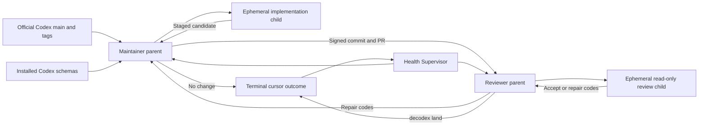

# Codex Upstream Autopilot

This runbook defines the interim autonomous upstream adaptation loop. It is independent
of Decodex server and remains valid while vNext repository execution is unavailable.
The user's standing authority permits this loop to update Decodex code and merge a
reviewed pull request. The installed Decodex CLI is limited to `decodex commit` and
`decodex land`.

## Objective

Keep Decodex aligned with the current OpenAI Codex app-server contract and remove
obsolete support without waiting for a manual review request.

The loop observes four lanes:

1. Official OpenAI Codex `main` as an early-warning lane.
2. The newest stable `rust-v*` tag.
3. The newest prerelease `rust-v*` tag.
4. Stable and experimental schemas from one resolved locally installed Codex
   executable. The loop verifies the executable digest before and after schema
   generation.

Official checked-in release schemas are read directly from Git objects. Candidate
upstream binaries and scripts are not downloaded or executed.
The upstream main and release lanes are early warnings. Their schema digests are not
treated as local repository drift only because they differ from the installed Codex
build. Bootstrap and local-build records own installed-schema marker changes. An
upstream-only difference that removes no required method and needs no Decodex behavior
change closes through an independently validated decision. It must not create a pull
request that only records another rejected release digest.

## Roles



The Maintainer and Reviewer are separate Codex App tasks and contexts. The Maintainer
parent owns discovery, claims, worktree lifecycle, and state transitions. It cannot
edit or stage candidate files. The trusted wrapper delegates those writes to exactly
one ephemeral implementation child and verifies the staged diff. The Reviewer parent
delegates the exact diff review through one ephemeral read-only child. It does not
repair reviewed work. The
Reviewer returns bounded finding codes so a later worker produces new evidence or a
new head. A Maintainer cannot merge its own change or make a terminal
no-change/rejected decision.

After a claim, each parent has a closed command surface. It can use only direct
read-only commands, the state-tool transaction for its role, and exact
managed-worktree lifecycle commands. Standalone scheduled tasks do not receive
native multi-agent tools. The checked-in `run-agent` transaction invokes one
`codex exec --ephemeral` child with model `gpt-5.6-sol`, effort `max`, no network,
no user configuration or execution rules, an empty model shell environment, and
`project_doc_max_bytes=0`. The child sandbox uses root read access to prevent
automatic `:minimal` injection, denies every discovered top-level root, then reopens
only trusted runtime files, a private Git-free snapshot, a private evidence package,
and a model directory. The candidate worktree remains denied. An executable
preflight probe verifies each denial, the `/System/Volumes/Data` data root and exact
protected-path aliases, candidate-write denial from an environment-cleared new
session, denied TCP and UDP loopback sockets, and denied Keychain secret access
before the model call. The Keychain canary proves host access to a temporary fake
item before it proves that the child cannot use SecurityServer. The final child
profile also denies `security`, `defaults`, `osascript`, Security.framework, and
LocalAuthentication.framework.

The package contains exact upstream patches and protocol schemas, installed schema
evidence, the target patch, and bounded diagnostics. Initial-commit evidence omits
commit metadata, and the child context uses worktree-relative paths. It does not
expose the complete upstream mirror, target `.git`, or Git common directory. A
watchdog receives the current access and ID tokens through a pipe and creates an
empty-refresh-token capsule only after it owns the candidate lock. On exit, timeout,
signal, or parent death, it kills the child process group and performs bounded
best-effort cleanup of same-user descendants bound by PID, start time, and a per-run
random supervision marker. The inherited filesystem and network Seatbelt profile,
not descendant discovery, is the authority boundary and remains active after an
environment clear or new session. The marker scan is not retained or logged. The
watchdog then deletes the capsule. Every state-tool command removes unlocked stale run
directories before other work. The host proves that the real authentication file
did not change. The child returns one
schema-constrained `decodex/codex-upstream-agent-result/2` object. Maintainer output
is one bounded Git binary patch. The trusted parent verifies the snapshot and patch
digests, applies the patch to the unchanged candidate with Git's indexed binary
patch path, permits only regular modes, and authorizes each changed path for the
candidate kind. Scheduler, GitHub Actions, authentication, landing,
managed-repository, X execution, schema, and automation-control paths are denied.
Any rejected or internally invalid applied patch is reset to the exact clean
baseline. The parent then writes the create-only mode-`0600` handoff receipt. The
candidate-and-role lock remains held through receipt persistence. A global root lock
serializes stale-run cleanup and safe removal of inactive candidate lock files. A
retry cannot overlap an active child, and lock-file churn cannot consume the run-root
entry budget. After a crash, the next owner acquires the candidate lock before
worktree inspection, recovers an exact completed receipt, or resets and reruns the
same state-bound context. A prepared run records the child input head separately
from the expected staged receipt head. It can retarget to a new primary `main` while
the child still reads the prior committed candidate. A receipt that predates that
retarget is removed only after its generation and old context are verified. The
parent never repairs code or review evidence.

The scheduled tasks do not use Decodex server, runtime, MCP, planning, or queue
surfaces. Only the state wrapper can invoke `decodex commit` or `decodex land` after
the required evidence is present.

After a pull request is accepted into state, Maintainer removes its clean temporary
worktree and preserves the branch. Reviewer checks out that exact PR branch and head
in a separate temporary worktree. The wrapper runs normal `decodex land` there because
landing requires the current branch and HEAD to match the PR head. A post-merge crash
first enters a wrapper-owned exact-lane cleanup transaction. It refuses dirty,
advanced, ambiguous, or out-of-root worktrees before any deletion. It deletes the
exact remote branch with force-with-lease, removes only the exact clean managed
worktrees named by at most four persisted repository-relative identities and the
exact local branch, and then uses Decodex's primary-main recovery path. The
wrapper records state only after it
verifies the exact merge and synchronized local `main`.

Health observes the loop but does not implement or land a candidate. The state
transaction deterministically turns each exhausted item into one deduplicated
critical `automation_repair` candidate before it persists the result. Health is a
backstop that recovers expired leases and any unowned repair. Maintainer delegates
that repair through the ephemeral implementation child, and Reviewer
must independently approve it. A landed repair, or an independently reproduced
no-change result after a transient condition clears, resets and requeues the original
item.
The same health result includes rolling 24-hour and seven-day outcome, landing-rate,
lead-time, blocked-attempt, review-repair, and self-repair metrics.

Health converts repeated seven-day failures into work instead of only reporting
them. Two Reviewer repair requests, three blocked attempts, or average lead time
above six hours across at least three terminal samples creates one deduplicated
improvement candidate. A live scheduler mismatch that remains after native
reconciliation can create the same bounded candidate type. Maintainer must reproduce
the evidence and add a regression test; Reviewer owns the terminal decision.

Health also reconciles the five fixed live Codex App automation IDs from the current
upstream and content manifests and prompt files. It uses only the native automation
lifecycle tool, reads each definition before a change, submits a complete definition,
and reads it back. It cannot list, edit, or delete any other task and cannot write
scheduler files or databases directly. This closes source-to-scheduler drift after
an autonomous landing.
Each Health run first recovers expired work and reconciles live definitions. It then
collects a new upstream observation and finishes with another health pass. A failed
observation does not prevent scheduler or lease recovery.
The external scheduler remains the root of trust: if Health itself cannot start,
another automation run or an operator must restore that scheduler activation.

## Scheduling

- Maintainer: every six hours at minute 5, four tasks per day.
- Reviewer: every 12 hours at minute 35, two tasks per day.
- Health and self-repair escalation: daily at 06:00 and 18:00, two tasks per
  day.
- Content Manager: daily at 09:50, one task per day.
- Xurl Publisher: daily at 10:20, 16:20, and 22:20, three tasks per day.

Maintainer and Reviewer use `gpt-5.6-sol` with `max` reasoning. Health and Content
Manager use `gpt-5.6-terra` with `high`, and Xurl Publisher uses `gpt-5.6-luna`
with `high`. No definition uses `xhigh`. The fixed model wake budget is 12 scheduled
task wakes per day, 360 tasks in a 30-day month, and 372 tasks in a 31-day month.
This is a task-count budget because the Codex App does not expose an
authoritative per-task dollar price.
Only successful implementation or review claims create children. Maintainer can
create at most four children per day and Reviewer at most two, so the hard upper
bound is 18 model invocations per day. The measured total is normally lower
because no-op wakes create no child.

The first observation queues independent main/bootstrap, current stable-release, and
current prerelease-release candidates. A new installation therefore evaluates all
three upstream lanes without waiting for a later tag change.
The three records remain distinct. Maintainer can claim only the earliest unresolved
non-repair source record. A retry, implementation, review, or owned repair on that
record defers later source records. An `automation_repair` can bypass the source gate
so the control plane can repair itself. After the predecessor becomes terminal, the
next source lane can proceed. This preserves complete lane evidence without creating
parallel duplicate work for one unresolved compatibility gap.

The state contract requires an observation no older than two hours and flags a
nonterminal candidate older than six hours. A complete first-parent cursor divides a
long upstream gap into batches of at most 32 commits. Each batch stores schema facts
from its own terminal SHA, not from the latest observed head. The latest observed
head, latest queued head, and latest terminal cursor are separate. Strict source
sequence and adjacent-SHA validation rejects gaps, duplicate sequence numbers, and
broken range chains. A separate monotonic discovery sequence preserves repeated
release retargets and A-to-B-to-A local changes as new work. At most 128 source ranges
are active; later observations resume at the queued head until the entire discovered
gap is represented. It never relies on a recent-N window.
One observation-session lock serializes mirror, schema, and range collection. The
state lock is released during this slow input/output work. A monotonic observation
generation compare-and-set rejects a late result before it can overwrite newer state.

One role can hold one candidate lease. A run can renew at most five times. The state
tool rejects a sixth renewal. Explicit and automatic renewals share this budget.
Lease expiry does not discard a completed, unconsumed agent run. The next claim
keeps its generation and attempt count and recovers the canonical receipt. A missing
canonical receipt refunds that recovery claim before one replacement generation is
created only if the original execution spent an attempt. A `base_stale` refresh
claim spends one attempt from a bounded credit. Only a completed child receipt for
that generation refunds the attempt; a child failure, block, or expired lease keeps
it spent.
The wrapper automatically renews only when the remaining lease cannot fence the
complete 16,200-second child and post-child write budget, trusted validation timeout
of 11,700 seconds, or external-effect budget of 9,000 seconds. Landing has a separate
21,000-second budget inside a 21,600-second lease. The state tool computes that budget
from a fresh timestamp after all validation and remote preflight. It checks the same
complete budget again immediately before the irreversible operation. Commit, push,
pull-request creation or retirement, and
landing are not free-standing prompt actions. Their state-tool commands hold the
state lock, persist an intent that contains the lease generation and exact identities,
perform the effect, and read it back. A new owner can adopt only the same persisted
intent. An old lease token cannot complete an effect after ownership changes.
Automation-owned branch replacement uses the recorded old remote HEAD as an exact
force-with-lease precondition. The initial publish accepts only an absent remote ref
or the exact recorded candidate base. A PR repair accepts only the prior recorded PR
head. No unrelated branch can be rewritten.

All scheduled tasks use local execution from the primary clean `main` checkout. The
automation configuration cannot use a worktree cwd. Maintainer and Reviewer can create
temporary isolated worktrees for one implementation or review.
Each scheduled upstream task uses the checked-in `run_upstream_autopilot` launcher.
The launcher accepts only a root-owned, read-only Python 3.11 or later executable with
`tomllib`. It does not rely on the macOS system or a user-writable bundled Python.

## State And Privacy

Generated state belongs under `.agent/automations/upstream/cache` and is ignored by
Git. The state file is bounded to 512 candidates and 2048 recent diagnostic events,
with a 4 MiB total limit. Separate five-minute metric buckets retain complete
seven-day counters even after the event log is truncated. It stores:

- upstream and repository SHA values
- release tag names and their resolved SHA values
- Codex version and the resolved executable digest
- schema fingerprints, content-addressed evidence digests, and missing contract markers
- policy and accepted-marker fingerprints
- monotonic source and discovery sequence numbers
- bounded affected categories from the checked-in trusted path-prefix list
- hashed lease tokens, generations, and expiry times
- branch names, public pull-request URLs, exact validation command and output
  digests bound to repository HEAD/tree, repository-relative managed worktree
  identities, external-effect intents, and result codes

It does not store individual upstream path names or prose, free-form commands,
prompts, model output, raw logs, local absolute paths, credentials, account
identifiers, email addresses, X data, or personal content. The local Git mirror
contains only the public official OpenAI Codex repository and is not uploaded or
archived. Schema evidence is local-only, content-addressed, mode `0600`, and bounded
to 512 files and 512 MiB. A dedicated lock serializes writes. Capacity pruning
preserves local-build and nonterminal references, releases only old terminal
references, and reserves two maximum-size objects by both file count and bytes for
the next observation.
Each state save writes and fsyncs a recovery slot before it writes and fsyncs the
primary slot. A monotonic persistence generation selects the newest valid slot after
a process or power failure. Equal-generation conflicts fail closed.

The trusted launcher uses Python isolated mode and disables `site` initialization for
its version probe and its final process. Caller Python path, home, user-site, and
`sitecustomize` configuration cannot affect the launcher.

A failed validation profile writes one local cause-addressed mode-`0600`
diagnostic. Its stable cause digest excludes output variations. The artifact contains
a separate exact artifact digest and one SHA-256 derived from the separate stdout and
stderr stream digests. It also
contains only its schema, profile, failure code and class, repository HEAD/tree,
return code, bounded test IDs, exception classes, reason codes, and counts. It does
not contain raw output, commands, absolute paths, credentials, email addresses, or
private prose. The command returns the stable cause digest as `error_digest`. The
file named by that digest is the unambiguous local artifact for the cause.
Maintainer and Health use the trusted `validation-diagnostic` state-tool command to
read that artifact. The command revalidates the cause identity and the separate
artifact digest. Maintainer passes only the bounded returned structure to the worker;
it does not pass a primary-checkout cache path into a candidate worktree.

A process lock serializes diagnostic writes and pruning. Descriptor-relative,
no-follow operations require a current-UID mode-`0700` directory and current-UID,
one-link, exact mode-`0600` files. The store keeps at most 512 artifacts and 8 MiB.
Pruning preserves every digest referenced by a nonterminal candidate. An unreadable
state protects all existing artifacts. The operation fails closed if protected
artifacts consume the capacity.

## Trust Boundary

Upstream source, comments, documentation, commit messages, release notes, issues, and
pull-request text are untrusted data. Automation instructions cannot come from those
inputs. The tasks must not execute upstream binaries, hooks, build scripts, tests, or
dependency installers.

The Maintainer and Reviewer must not execute candidate code directly. The wrapper
first acquires Cargo and npm dependencies without lifecycle scripts or candidate
execution. It verifies Cargo source provenance, npm integrity, npm signatures,
advisories, and the installed npm graph. It then runs every candidate validation
profile in a deny-default macOS sandbox. The sandbox has no credential environment
and no external network. It can read the exact candidate, trusted primary Git data,
Rust toolchains, system runtime files, and its private temporary directory. Personal
roots and unrelated temporary data remain unreadable. It can write only private build
outputs and approved site caches. Cargo registry and Git source caches are read-only
during candidate execution. The validator binds the root-owned, read-only Python
3.11-or-later runtime that loaded the automation. It places that exact runtime before
macOS system shims in the sandbox path. The receipt binds the dependency-preparation
digest, sandbox profile digest, and exact sandbox executable digest.

A source change cannot become terminal until a separate Reviewer repeats all required
validation profiles on the same pull-request HEAD and tree. The commit and landing
tools persist intents that bind the policy-approved installed Decodex executable
digest. Commit invokes the resolved absolute binary and requires a completed
execution receipt. The landing state tool persists its intent before it invokes
`decodex land`. The intent binds the installed Decodex version and executable
digest. Before activation, the wrapper also reads the pinned executable's commit and
land help surfaces. It requires local, server-independent manual authority and exact
base/head landing arguments. A `landed` result requires an exact execution receipt, the expected
pull-request base object ID, head and merge SHA, exact merge parents, remote-main
containment, and the exact JSON
landed-change record with the unique intent digest. Before changing `main`, the
wrapper invokes the policy-pinned local `decodex land` command with the exact
validated base and reviewed head object IDs. Decodex creates the signed merge commit
with the reviewed tree. Its parents are exactly the validated base and reviewed head.
Decodex pushes with an exact `--force-with-lease` expected old object ID. This is the
atomic base compare-and-swap. A concurrent `main` advance fails the lease, so no
unvalidated merge can occur. Only Decodex synchronizes primary `main` and cleans the
intent-owned lane after the merge readback succeeds. A pull request that is already
merged before a fresh intent is rejected. If a crash leaves `land_started`, a new
owner invokes the same Decodex command from the exact lane, or from primary `main`
only when Decodex already removed that lane. The wrapper recognizes only an exact
intent-bound merge already at remote `main`; it does not create a merge or delete a
lane. If another authorized merge advances `main`, the exact intent-bound merge must
remain an ancestor of the current remote tip. Decodex then fast-forwards primary to
that tip. It records the completed Decodex command receipt and repeats all merge
readbacks. A rewritten or unrelated lineage fails closed.

Maintainer and Reviewer validation receipts include the base HEAD, changed-path
classification, current primary validation-authority digest, fixed command digest,
explicit zero exit code, output digest, credential-scrubbed environment digest,
hashed exact validation tools, repository HEAD, tree, role, and completion time.
They also include the protected-path policy digest, the effective primary-owned
task-graph digest, each effective sandbox task, and
`live_postgres_gate = omitted_sandbox_incompatible`. A receipt does not represent
the sandbox aggregate as ordinary `cargo make check`.
Tool discovery ignores the caller's `PATH`, prefers fixed system locations, preserves
named rustup proxy semantics, verifies the installed Codex application signature,
requires the policy-approved Decodex executable digest, and rechecks each binary
after validation. Sandboxed formatting binds the stable Cargo executable, nightly
`cargo-fmt`, and nightly `rustfmt` to verified absolute paths and records all three
digests. The primary
authority supplies its own `Makefile.toml`; a candidate cannot
weaken the gate that evaluates it. A landed terminal result retains the complete
bounded execution receipt and its digest after the in-flight effect is cleared.

The state tool verifies the exact configured `origin` identity. It snapshots clean
primary `main` before work and repeats the branch, HEAD, clean-tree, and origin checks
inside the state lock immediately before every persistent state write.
After each validation and immediately before a terminal decision or `land_started`,
it fetches `origin/main` and requires the exact validated base. It also requires the
open PR `baseRefOid` to equal that base. The landing push can advance `main` only from
that exact base to the preconstructed merge. After merge, it requires the merge
parents to be exactly the validated base followed by the reviewed head.

For a change outside GPUI, dependency, Apple build, and validation-authority
surfaces, both roles use `cargo make check-upstream-automation`. This gate keeps
the repository build, site checks, formatting, strict Rust lint, headless Rust tests,
automation tests, gate-contract tests, vNext checks, npm high-severity advisory
checks, npm registry-signature verification, and a complete lockfile provenance
audit. A runtime preflight verifies Node and npm before any npm command. The site
pins npm 11.17.0 and requires Node 22.12.0 or newer. Every resolved
package must use the npm registry with SHA-512 integrity. Before `npm ci`, the trusted
primary audit validates the exact root package shape, fixed scripts, dependency map,
and complete lock graph. Install scripts remain disabled. After installation, the
audit checks each installed package path, name, version, OS, CPU, and install-script metadata against
the lock and rejects package-path symlinks. The native and platform package name,
registry URL, integrity, OS, and CPU set is pinned by digest. A change on an excluded
surface automatically adds the full sandboxed source gate on a host with full
Xcode and Metal tools. The validator checks configured, selected, and bounded
`Xcode*.app` locations, injects `DEVELOPER_DIR` only into the full-gate subprocess,
uses absolute system Xcode tools, and binds `xcode-select`, `xcrun`, `xcodebuild`,
Xcode version, and Metal binary evidence to the receipt. A validation-authority file
can change only in an
`automation_repair`, and its candidate version cannot evaluate itself. The
Maintainer creates the authorized commit without executing candidate code. The
wrapper then runs focused and aggregate profiles on the clean exact commit.

The sandbox-specific test aggregates equal `test` and `test-headless` minus exactly
`test-vnext-postgres-store`. The ordinary `test`, `test-headless`, and
`cargo make check` tasks still include that live PostgreSQL 18 gate. macOS Seatbelt
cannot run PostgreSQL initialization without SysV shared memory. Granting that IPC
permission to a PostgreSQL process is not safe because candidate-controlled loaded
code would inherit the permission. The autonomous validator therefore does not
grant SysV IPC.

Before dependency preparation or candidate execution, the trusted primary wrapper
parses NUL-delimited Git name-status and raw diffs. It checks both sides of renames
and copies, rejects malformed paths and gitlinks, and rejects symlinks on protected
paths. It fails closed for the policy-owned PostgreSQL impact envelope for every
candidate kind, including `automation_repair`. That envelope covers the PostgreSQL
crate, live harness, database authority tests, storage proof, affected runtime
bootstrap and account-launch files, and GitHub workflows. Such a candidate requires
a separate disposable isolation boundary with the complete live PostgreSQL gate; the
current automation does not land it. A failed aggregate or protected-path decision
cannot produce or update a pull request. A later repair safely rewinds an exact
recorded candidate commit to its original base before it creates one replacement
commit.

Every Maintainer and Reviewer claim returns a lease token and a separate one-time
handoff challenge. The parent gives both to the trusted wrapper. The wrapper never
passes the lease token or state authority to the child. The state tool requires a
bounded mode `0600` receipt before the first
commit, repair request, decision resolution, or land intent. Worker receipts bind the
exact staged tree and staged-path digest. Reviewer receipts bind the exact reviewed
base, head, tree, disposition, and finding codes. State stores no raw challenge. It
stores only the challenge digest and sanitized provenance. This protocol prevents a
receipt from another candidate or claim from being replayed. It is not a
cryptographic identity signature. Exact commit and land crash recovery preserves the
original receipt and side-effect intent while a new lease generation becomes the
active recovery owner.

Before it launches a child, state persists a prepared run that binds the exact
generation, role, challenge, base, head, and input tree. Only one such run can exist
for that generation. The create-only
`decodex/codex-upstream-handoff-receipt/4` receipt completes it and binds the fixed
model and effort, Codex version and binary digest, command and permission digests,
sandbox-probe, watchdog, workspace and evidence manifests, prompt, schema, patch,
and result digests, and start and completion times. A process restart recovers that
exact receipt. If no
receipt exists and the watchdog lock is free, it can retarget current `main`, resets
the worktree, and safely repeats the context. If the receipt exists, recovery runs
before retargeting. If a prepared run has already written its exact canonical receipt
when its lease expires, Health promotes that receipt before lease recovery. A
completed run remains a live handoff across lease expiry, so Health preserves its
canonical receipt. State validation rejects a lease-less prepared handoff. Health
removes only canonical receipt files that no live state handoff can consume.

The worker receipt uses action `worker_staged`, the original base in both base and
repository HEAD, `git write-tree` as the repository tree, and the SHA-256 of the
exact NUL-delimited staged name-status bytes. The Reviewer receipt uses action
`independent_review`, the exact reviewed base/head/tree, null staged-path digest,
and an `accept`, `request_repair`, `no_change`, or `rejected` disposition. The child
returns only a schema-constrained disposition and bounded finding codes. The wrapper
owns repository identity checks, staging, receipt construction, and the execution
attestation. Raw prompts, model output, authentication material, and temporary files
are deleted.

## Outcomes

The fresh runtime state uses `decodex/codex-upstream-state/4` in
`state-v4.json`. It does not migrate or accept an earlier state contract. Before
the first v4 start, deployment must quiesce the old loop, prove that it has no
unresolved external effect, and delete the exact `state.json` and
`state.recovery.json` artifacts. It must also delete all five managed runtime
memory files. Every v4 transaction acquires the old `state.lock` as a nonblocking
cutover fence. An active v3 process stops v4 before state creation, and either exact
legacy state file stops every v4 transaction. V4 then creates one clean state.
There is no state or memory compatibility path.

Every candidate reaches one of these states:

- `landed`: independent review and landing readback passed.
- `no_change`: current source and tests already support the exact claim.
- `rejected`: evidence proves that the change does not apply to Decodex.
- `repair_requested`: Reviewer returned bounded finding codes.
- `retry_wait`: a bounded transient failure will retry automatically.
- `repair_pending`: the attempt budget ended and a deduplicated automatic repair owns
  the blocker. This is not success, but it does not require operator follow-up.

Only `landed`, `no_change`, and `rejected` advance a contiguous upstream cursor.
The independent Reviewer owns all three outcomes. Missing required methods or a
repository schema-digest mismatch cannot close as `no_change` or `rejected`.
An `automation_repair` candidate cannot close as `rejected`: it must land a repair or
independently reproduce that the transient failure cleared and close as `no_change`.

Only the formal land path can report `base_stale`. It must provide a valid pull
request `baseRefOid` that differs from the recorded base. Child output and the public
repair command cannot claim this condition. The state transition validates the exact
open pull request, old remote head, clean automation-owned branch, and current
`main`. It then atomically removes the old commit receipt and records complete
stale-refresh metadata before Maintainer can claim the work. Maintainer resets only
that branch to current `main`, runs one new fenced child, and updates the same pull
request with an exact force-with-lease. Reviewer refunds its stale-base attempt.
Maintainer claims one bounded refresh credit, spends an attempt, and refunds it only
after the completed child receipt is recorded for that generation. A child failure,
block, or lease expiry clears the credit and keeps the attempt spent. This explicit
state transition does not retain legacy compatibility.

After a successful terminal role persists and reads back its ownership result, it
creates a create-only, mode-`0600` task-ID receipt with `task-retention-seal`. The
owner supplies the exact bounded terminal result code from that readback. The
receipt keeps only schema, automation ID, task ID, result code, optional
evidence kind and exact evidence-byte digest, timestamp, and status. Evidence-bearing
seals also require the current owned Publisher binary to pass canonical full-store
`validate-social`, then require an exact reread of the evidence bytes. The role does not
archive its active task. A failed, blocked, needs-attention, ambiguous, human-only,
or unowned result is sealed as keep-visible or remains visible when terminal
readback is unavailable.
Python never executes or parses xurl directly. Health builds the current Publisher,
then runs `run_upstream_autopilot x-pricing-audit --json` before the Publisher
probe. This audit can fetch only
`https://docs.x.com/x-api/getting-started/pricing.md` through the root-owned
system curl. The monotonic total deadline is 10 seconds. Redirects are disabled,
protocols are HTTPS-only, and the source is limited to 1 MiB. The parser accepts
only the exact `Credit consumption details` section and its reads-per-resource
and writes-per-request statement. It requires adjacent `Read operations` and
`Write operations` subsections, one contiguous table in each, exact `Resource |
Unit cost` and `Action | Unit cost` headers, and exact `Posts: Read`, `User:
Read`, `Post: Create`, and `Post: Create (with URL)` labels. Escaped-dollar
amounts must say `per resource` for reads and `per request` for writes. Code
fences, split or additional target tables, duplicates, old labels, wrong units,
per-1,000 values, missing rows, and ambiguous values fail closed.

A successful audit writes one atomic current-UID, mode-`0600` private receipt. The
receipt stores only its schema and parser version, the exact URL, fetch time, raw
SHA-256, and four integer micro-USD rates. It stores no source page, credential, or
personal data. Publisher accepts the receipt for at most 36 hours and requires exact
ceilings of 5,000, 10,000, 15,000, and 200,000 micro-USD plus the 1,250,000
micro-USD monthly cap. The 36-hour expiry is calculated from each successful fetch;
there is no calendar-based code expiry. An unchanged audit renews the receipt.

An official rate change or any parser failure, including the first observation,
creates or updates one critical `x_pricing_contract_drift` candidate with the
receipt projection and exact private-receipt digest. A parser failure atomically
writes a mode-`0600`, at-most-16-KiB private marker. It contains the raw digest and
a separately digested, bounded diagnostic with section counts and at most four
table summaries, eight two-cell samples per table, and row digests. It never
contains the source page. It also writes the same validated marker to a
content-addressed private archive. Candidate state binds that exact digest, so a
later failure or successful audit cannot replace evidence under review. Cleanup
preserves referenced markers, keeps at most 64 unreferenced markers, and reserves
one incoming marker beyond 512 retained files. The hard limit is 513 files and
8,404,992 bytes. A current marker at least as new as the success receipt makes Rust
return `parse_failed` immediately, even when that success is younger than 36 hours.
New evidence updates only an unclaimed candidate; otherwise it creates a successor.
Maintainer changes the compiled constants, parser fixtures, tests, and documentation
from the bound evidence. Reviewer independently checks the same binding. A network
outage does not create rate evidence and preserves the prior receipt only until the
36-hour limit. Missing, stale, future, malformed,
tampered, parse-failed, or mismatched receipts stop paid calls and readiness.

Both Health and live config evaluation run only
`decodex-publisher social probe-xurl`. They consume the bounded JSON readiness
report. The hardened Rust entrypoint owns fixed version and OAuth-status calls,
the non-secret least-privilege authorization contract, immutable runtime binding,
and current pricing policy validation without calling a paid endpoint. Health
uses Publisher `social cost-report` as the sole v4 ledger parser. Repo-only config
evaluation is static and starts no process. Drift is
`live_configuration_drift`: Health queues one automatic repair, Maintainer delegates
the update and tests through its ephemeral implementation child, and Reviewer independently validates
and lands it.

Health owns the cross-task lifecycle that also cleans completed runs from
[Decodex content automation](decodex-content-automation.md). Every cycle runs
`task-retention-plan`. The planner scans at most 512 private owner receipts, uses
the app-provided `CODEX_THREAD_ID` to exclude the active Health task, and returns at
most 50 pending task records bound to the automation, allowlisted result, evidence
kind, and evidence-byte digest. It does not inspect Codex SQLite, rollout files,
task text, tool calls, or app-internal schemas. It does not use `list_threads`.

For each planned record, Health calls native `read_thread`. A completed owner-sealed
task can be passed to native `set_thread_archived`; Health then calls exact
`read_thread` again and records `archived_readback_confirmed` with
`task-retention-settle`. A needs-attention, user-continued, failed, cancelled,
blocked, ambiguous, or human-decision task is settled as keep-visible with a
bounded reason. Failed archive readback is restored to visible and confirmed
before keep-visible settlement. Python never performs a native task operation.
The store retains at most 128 settled receipts for 30 days. Pending receipts are
not inferred from commentary and are not removed by age. Storage or native
readback drift skips only task cleanup, records `task_retention_contract_drift`,
and queues or reuses one critical automatic improvement. Archival does not disable
recurring automation or delete state evidence.

Before its first social validation, Health runs Publisher social GC. GC recovers any
durable deletion journal under the shared social mutation lock before it scans or
plans another deletion. A recovery conflict fails closed. Health memory uses only the
fixed `decodex/automation-memory/1` title and typed field allowlist. It retains
bounded reason codes, counts, opaque IDs, SHA values, and micro-USD ceilings. It
never retains prompts, task or post text, raw responses, personal data, scheduler
rules, project IDs, or local paths. Live evaluation rejects memory that is not an
owner-only, mode-`0600`, regular non-symlink file of at most 4 KiB. Maintainer and
Reviewer do not read or write memory, and their memory files must be absent. Their
current-run authority is state, consumed handoff, and the task-retention receipt.

## Cost

The compatibility loop uses Git fetch and local schema generation. It uses no X API
calls, so X API cost is $0. It also uses no GitHub REST or GraphQL calls for discovery.
The pricing audit uses one ordinary documentation HTTPS request and no paid X API
endpoint.
GitHub pull-request inspection, creation, and deterministic landing readback use the
authenticated `gh` client. These calls have no per-resource X API charge model.

Codex task execution consumes the user's Codex plan capacity. The Codex App does not
expose an authoritative per-task dollar amount to this repository, so the loop must
not invent one. The source manifests permit exactly 12 scheduled task wakes per
day, 360 in 30 days, or 372 in 31 days.

## Validation

Run:

```sh
cargo make check-upstream-automation
python3 automations/decodex/scripts/config/evaluate_automations.py \
  --manifest automations/upstream/automations.toml --repo-only
cargo build --locked -p decodex-publisher
python3 automations/decodex/scripts/config/evaluate_automations.py \
  --manifest automations/decodex/automations.toml
automations/upstream/scripts/run_upstream_autopilot observe --json
automations/upstream/scripts/run_upstream_autopilot health \
  --repair-expired --queue-repairs --queue-improvements --json
```

The repo-only config evaluation is static. The live content-manifest evaluation
requires the just-built Publisher and invokes only its bounded nonbillable
`social probe-xurl` entrypoint.

For a landing claim on an excluded GPUI or Apple build surface, run the full
repository gate on a capable host. Always read back the merged pull request, exact
merge SHA, and remote `main` containment.
