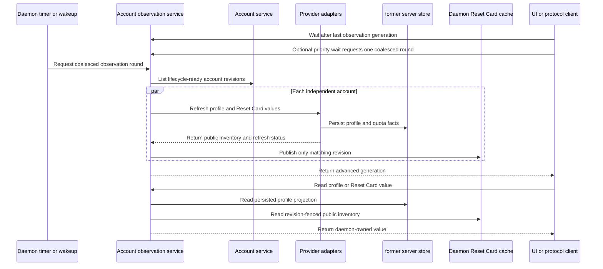

# Account Lifecycle Authority

Status: historical account-domain contract. Its durable lifecycle and exact-binding
invariants remain useful, but its former server store/redb ownership is superseded by the
[Local Product V1 contract](local-product-v1.md).

The immediate target is `MacDogfoodReady`. Final `AccountLifecycleReady` has more
requirements. A component-first global gate is not the delivery order.

There are no external or deployed users. The current local database is disposable.
Account lifecycle has no product account-migration mode. The one local database reset
may preserve only the complete credential-negative reset tuple defined below, including
each enabled state, the existing revisions and bindings, and exact routing
mode/fixed-target/order. Only the existing `HostCredentialStore` owner may read a
credential in process to recompute agreement. The operator action and its result never
expose, serialize, copy, log, persist, rotate, delete, or return token bytes.

## Fixed boundaries

The account system has exactly three owners:

1. The former server store Account Registry owns credential-negative product state.
2. One HostCredentialStore owns versioned secret bundles.
3. The `decodexd` Account Service coordinates account operations.

Keep one daemon, one shared normal `~/.codex`, the same-UID typed protocol, exact
identifiers, former server store outbox and leases, and finite per-account compare-and-swap
operations. Credentials do not enter former server store, the public protocol, process
arguments, logs, or a long-lived daemon or child environment.

This boundary adds no event sourcing, generic distributed transaction coordinator,
new process or provider-effect ledger, per-account daemon, or permanent per-account
or per-run Codex home. Managed-repository effect authority remains separate.
ProcessSupervisor remains the ProcessGeneration owner. ProviderAttemptService remains
the ProviderAttempt owner.

One Codex process has one immutable Account UUID and provider binding for its
complete lifetime. A refresh callback can return a newer credential for that same
binding. It cannot select another account.

## Account Registry

The Account Registry owns:

- stable Account UUID, derived alias, revision, tombstone, and provider identity;
- an administrative `enabled` boolean that is independent from observed state;
- observed account, authentication, capability, and health state;
- one versioned routing control with mode, fixed target, and complete account order;
- separate 300-minute and 10080-minute quota observations;
- current non-secret credential version, fingerprint, and provider binding;
- finite account-operation intents, phases, receipts, and reconciliation results;
- existing ProcessGeneration and ProviderAttempt references.

Observed state never encodes administrative enablement. Disabling an account does not
rewrite its last health or quota observation. Enabling an account does not make that
observation healthy. Eligibility requires both `enabled=true` and current positive
evidence for every applicable check.

former server store stores no credential, encrypted credential blob, retrieval locator, or
ambient Codex auth export. A fingerprint is equality evidence only.

The public alias is not mutable product state. Derive it from the canonical provider
binding:

```text
digest = SHA-256(
  "decodex/account-alias/v2\0"
  || canonical_provider_kind
  || "\0"
  || canonical_provider_account_id
)
selector = first 64 big-endian digest bits
alias = ACCOUNT_ALIAS_WORDS[selector mod 44]
```

`ACCOUNT_ALIAS_WORDS` is this fixed ordered list:

```text
Alex, Avery, Bailey, Blake, Casey, Charlie, Clara, Dana, Drew, Eden, Elliot,
Emery, Evan, Finley, Harper, Hayden, Iris, Jamie, Jordan, Kai, Kendall, Lane,
Liam, Logan, Mason, Maya, Mia, Morgan, Noah, Nora, Owen, Paige, Parker, Quinn,
Reese, Remy, Riley, Rowan, Sage, Sasha, Sidney, Taylor, Theo, Val
```

The alias is one name with no prefix or suffix. It is a privacy-preserving
presentation substitute for the email address, not an identifier, and two
accounts can have the same alias. Account UUID remains the only row identity. Do
not accept a user label or rename command, and do not add a random suffix,
collision table, or mutable reroll. The ChatGPT provider identity
`433463f7-74ae-4a7e-ab10-9667f9e4919e` has digest
`d6ac83189beb33b78f71052e9f0a2134605e8c67cebbadbbfabcf926a2222165` and alias
`Val`.

Wire and native-client boundaries accept only one 2–16-byte ASCII word with one
initial uppercase letter and lowercase remaining letters. They reject the v1
`Account ABCDE-FGHIJ` form rather than retaining a compatibility branch.

## HostCredentialStore

The store has one record per Account UUID:

| Field | Contract |
| --- | --- |
| `schema_version` | Closed bundle format. |
| `account_id` | Exact Account UUID. |
| `provider_kind` | Closed provider kind, initially ChatGPT. |
| `provider_account_id` | Canonical provider identity. |
| `credential_version` | Positive monotonic compare-and-swap version. |
| `writer_operation_id` | Account-operation UUID that wrote this version. |
| tokens | Complete access, refresh, and optional identity token bundle plus required expiry/type metadata. |

Metadata readback returns only Account UUID, provider binding, credential version,
writer operation, and a domain-separated fingerprint of the canonical complete bundle.
Create-if-absent, exact-version compare-and-swap, and exact-version delete are atomic
for one Account UUID. A stale version, wrong provider binding, duplicate provider
identity, missing item, or unavailable backend is a typed result.

For macOS, the accepted adapter is `RedbCredentialStore`. It owns one fixed database at
`~/.decodex/server/credentials.redb`. `decodex-core` opens the file through its typed,
descriptor-anchored path owner. The open procedure refuses symbolic-link traversal,
wrong ownership, a non-regular file, a link count other than one, or permissions other
than owner read/write. The file mode is `0600`. Runtime passes the already-open file to
the official `redb` crate so the storage engine does not re-resolve a checked path.

The vault uses one ACID write transaction for each store operation and immediate
durability before success. `redb` supplies restart recovery and one-writer exclusion.
The daemon is the only normal reader and writer. GPUI, the native app, the menu bar,
Swift, and the CLI remain credential-negative protocol clients. There is no normal
Keychain read, dual read, fallback, token export, or remote vault sync.

The application-layer vault is plaintext. Its v1 security boundary is the private
owner-only filesystem namespace plus host disk encryption. It does not claim protection
from root or a malicious process that already runs as the same user. Adding
application-layer encryption, key rotation, or a stronger same-user isolation boundary
requires a separate accepted design.

The normal macOS service starts `/Users/USER/.local/bin/decodexd` directly. The installer
verifies its owner, mode, single-link identity, digest, strict code signature, hardened
runtime, and signing team. Normal startup has no daemon app bundle, embedded development
provisioning profile, Keychain entitlement, or Python wrapper. The macOS
`security-framework` dependency remains only for canonical Codex executable and child
code-signing attestation; it is not a credential backend.

Linux host acceptance is a later `AccountLifecycleReady` obligation. It must select one
explicit persistent private adapter and prove the same path, atomicity, compare-and-swap,
delete, and restart contracts. It has no environment or ambient-auth fallback.

## Versioned account controls

Every mutation uses the same versioned protocol and supplies a client command ID,
idempotency key, and the applicable expected account or routing-control revision.
former server store stores the complete credential-negative request and exact public result.
Exact replay returns that result. Conflicting key reuse and stale revision fail before
mutation.

The commands are deterministic:

| Command | Compare-and-swap effect |
| --- | --- |
| `enable_account` | If the expected account revision is current, set `enabled=true`. Change only the account revision when the value changes. |
| `disable_account` | If the expected account revision is current, set `enabled=false`. Block new admission immediately. Do not terminate or rebind existing work. |
| `set_fixed_selection` | If the expected routing revision and target account revision are current, set mode `fixed` and the exact target Account UUID. Preserve account order. |
| `set_balanced_selection` | If the expected routing revision is current, set mode `balanced` and clear the fixed target. Preserve account order. |
| `set_account_order` | If the expected routing revision is current, replace the order with one complete duplicate-free permutation of all non-tombstoned Account UUIDs. Preserve mode and a valid fixed target. |

A fresh command whose desired value already matches returns a terminal no-change
receipt at the same revision. Any real change increments exactly one owning revision.
No command changes observed health, quota, credentials, ProcessGeneration, or
ProviderAttempt state as a side effect.

For a new task, `fixed` considers only its target. An ineligible fixed target returns a
typed no-route result. `balanced` selects the first fully eligible account in canonical
order after independent capability, credential, process, attempt, and two-window quota
checks. Manual recovery changes enablement, fixed/balanced mode, or order with these
commands and then submits a new task. It does not rebind or replay an existing thread.

Automatic cross-account same-thread fallback and all-depleted scheduler wake are not
Slice 1 requirements. An all-depleted result exposes the exact reset evidence and waits
for an explicit retry. Routing Snapshot remains the complete policy/evidence owner, and
Routing Decision remains the sole selection owner. Their broader automatic-routing
behavior is accepted later.

## Explicit Use in Codex

`UseAccountInCodex` projects one exact ready account to the normal shared
`~/.codex/auth.json`. It is independent from routing: projection does not change routing,
and routing does not project auth. The command checks the current Account revision and
the exact HostCredentialStore version, fingerprint, and provider binding. Tokens remain
inside the daemon.

The host write rejects an ambiguous `CODEX_HOME`, symbolic links, path drift, wrong
ownership, wrong link count, and group- or other-writable ancestors. It creates one
same-directory mode-`0600` temporary file, synchronizes it, atomically renames it over
the exact target, reads back the exact account binding, and synchronizes the parent.
Same-binding replay is successful without rewriting the file. The read-only result is
`current`, `unmanaged`, or `unavailable` and exposes only Account UUID, Account revision,
and a credential-negative projection digest.

The projection affects future Codex launches and new app-server processes. It does not
claim to hot-switch an already running Codex process. There is no watcher, backup,
per-account Codex home, token environment projection, legacy helper, or fallback.

The commands remain independent protocol authorities, but the Swift menu-bar `Route`
control composes them with credential refresh. Route must receive the committed successor
Account revision, project that exact latest credential, and only then set fixed routing.
Projection failure leaves fixed routing unchanged. Retry state retains the exact refresh
receipt or the proved prepared revision so a completed credential effect is not repeated.

## Account operations

Cross-store changes use one finite per-account operation journal:

| Phase | Meaning |
| --- | --- |
| `prepared` | former server store committed the intent and fenced conflicting account operations. |
| `provider_effect_pending` | A refresh request can have reached the provider. |
| `store_applied` | Exact store metadata proves the target version, fingerprint, binding, and writer. |
| `committed` | former server store committed the projection and public receipt. |
| `cancelled` | No store change is accepted and the operation is terminal. |
| `recovery_required` | Safe automatic continuation cannot be proved; the account is ineligible. |

An unsettled operation fences another credential mutation and new execution admission
for that account. Startup reconciles every nonterminal operation before the account can
be eligible.

Enrollment and explicit import commit `prepared` before a store write. Device login can
use one operation-scoped private temporary home. It is removed after verified import or
recovery and never becomes a runner home. Import accepts a daemon-opened owner-private
source descriptor, not credential bytes in the public protocol.

Refresh reads one exact credential version and records `provider_effect_pending` before
the provider call. Immediately before provider work, it can absorb only a valid shared
Codex bundle with the exact provider identity and a later expiry than the stored bundle.
It validates the returned or reconciled provider identity and writes the complete rotated
bundle with one compare-and-swap. Concurrent callers serialize on that operation. After
provider rejection, one bounded shared-auth read can still supply that exact newer bundle;
otherwise the operation is cancelled and the rejection remains terminal. After restart,
an exact store write can be committed. A provider request with no proved store write is
not replayed unless the provider has an accepted idempotent result-readback contract.
Otherwise, the account becomes `reauth_required`.

Every committed refresh reads the exact persisted successor bundle. When the current
shared-auth identity still names the same provider account, Account Service attempts to
re-project that bundle. An unreadable identity is not overwrite authority. Projection
failure does not undo or make the provider effect ambiguous, and the terminal refresh
receipt still completes. Explicit `UseAccountInCodex` owns retryable fail-closed projection
for menu-bar Route.

Logout disables new launch admission and rejects with `account_in_use` while an active
ProcessGeneration or unsettled ProviderAttempt is bound to the account. It then deletes
one exact store version through the same journal. Metadata deletion is allowed only
after logout and creates a tombstone. Historical UUIDs, receipts, and execution
references remain.

A later enrollment with the same exact provider binding restores that tombstoned Account
UUID. It does not create a second provider owner or reuse the client's provisional new UUID.
The daemon resolves the provider only after it reads the owner-private login file, fences the
current tombstone revision, restores the immediate successor credential version, clears the
tombstone, increments the Account revision, and appends the original UUID to routing order.
The typed result carries both the provisional request UUID and the resolved Account projection so
strict clients refresh the restored row. An active non-tombstoned provider owner still produces
the durable `provider_already_enrolled` rejection.

Startup recognizes only the exact pre-repair collision shape: a `StoreApplied` version-one
enrollment has no Account row, its exact credential provider belongs to one retained tombstone,
and the provisional identity has no routing, quota, profile, or fixed-selection reference. The
daemon deletes that exact orphan credential and journals the old enrollment as cancelled before
it accepts a fresh restoration login. Any mismatch remains manual recovery; this is not a general
credential cleanup or fallback.

## Runtime-negotiated account capability

`AccountLifecycle` readiness is positive runtime evidence, not a release allowlist or a
schema assumption. Before account-backed runner launch or a new Reset Card effect, the
currently installed protected Codex executable must prove all of these facts:

- generated schema supports process-scoped `account/login/start` with
  `chatgptAuthTokens`;
- a live probe accepts that projection and reads back the same provider account;
- generated schema and a live callback transcript support
  `account/chatgptAuthTokens/refresh`;
- the Account Service can bind that callback to the exact ProcessGeneration, serialize
  refresh, complete credential compare-and-swap, and reply for the same provider binding;
- the observed executable identity, generated-schema fingerprint, and callback capability
  profile are cached and bound to launch authority for that process lifetime.

The daemon does not pin or compare a Codex release/version or a pre-recorded executable
digest. It uses the user's installed executable and rejects only incompatible process
shapes, missing generated methods, malformed callback schemas, failed live probes, or
contradictory runtime evidence. This source capability can satisfy `AccountLifecycle`,
`MacDogfoodReady`, and runner readiness only when the runtime executable, generated schema,
and live callback preflights pass. Initial token projection alone is insufficient.

The supported macOS bridge runs one bounded source-derived login adapter in process. It offers
automatic browser redirect and structured device code without launching a Codex CLI or
app-server child. Both methods use one owner-private temporary home without changing ambient
`~/.codex`. Swift receives only the browser authorize URL, or the device verification URL and
one-time code, plus closed session state. On successful login, the daemon opens that private
`auth.json`, verifies the exact provider identity and current account revision, journals an
existing-account `Refresh`, and applies only the immediate next HostCredentialStore version by
compare-and-swap. The temporary home is removed on success, failure, cancellation, timeout, or
bridge destruction. Ambient `Use in Codex` remains a separate explicit projection command;
neither action implies the other.
Device polling reads one bounded structured error response. Only the closed pending-code set can
continue polling; another structured 403 or 404 is a terminal typed device-authorization
rejection, not permission to wait until the session timeout. The native failure tells the user to
check ChatGPT Security and retry without exposing provider text.
An acceptance-unknown install replays only the same operation and idempotency key while
the private source exists. Prepared-operation startup and command replay compare both the
expected and target bindings; only an exact expected binding can prove that cancellation
is safe, and ambiguous store state becomes `RecoveryRequired`.

A targetless `Refresh` in `RecoveryRequired` can be replaced only by another successful
source-level browser or device login that names that exact recovery operation. The new target-backed
`Refresh` must retain the same account revision, expected credential binding, and provider
identity. It can coexist with only that one ambiguity while it performs the ordinary
HostCredentialStore compare-and-swap. The old operation remains `RecoveryRequired`, keeps
its recovery code, and continues to fence admission until the new credential reaches
`StoreApplied` and the registry commit atomically records which new operation superseded
it. Cancellation or failure before that commit leaves the old ambiguity and fence intact.
This takeover is not evidence that the earlier provider effect did or did not occur.

## ProcessGeneration binding

The owning [ProcessGeneration authority](process-generation-authority.md) must extend
its intent, launch-manifest identity, prepare command, and strict readback
with the canonical initial account revision, credential version, credential fingerprint,
provider binding, and runtime-negotiated account-capability profile. These fields are immutable
launch facts. Same-account callback rotation does not rewrite them.

Immediately before spawn, the Account Service must read the exact HostCredentialStore
metadata and compare every field with the ProcessGeneration intent and Account Registry.
Any mismatch stops before spawn. The existing ProcessGeneration and ProviderAttempt
state machines own crash and effect ambiguity. No account-specific process or effect
ledger is added.

For Candidate-5 Quick Task, Account Service receives the account selected by the one
accepted Routing Decision. It repeats the exact account revision, `enabled` state,
AccountLifecycle and exact-build capability, provider binding, credential version and
fingerprint, and HostCredentialStore binding immediately before spawn. It cannot
preselect, substitute, fall back to, or wake another account. Drift fails closed without
a second route decision.

## Reset Card fencing

Reset Card keeps its existing exact provider-credit ID, provider key, durable receipt,
and authoritative readback. The operation uses the same direct ChatGPT backend API as
background account observation. New admission and the final pre-effect fence both require:

- the exact account revision and `enabled=true`;
- a present, exact account credential binding;
- no unsettled account operation other than reconciliation of this exact receipt;
- exact Account Registry and HostCredentialStore credential version, fingerprint, and
  provider-binding agreement; and
- the existing admissible observed state and exact public card descriptor.

No Codex executable, app-server capability, generated schema, or exact Codex version is
part of direct API admission. The app-server remains an execution transport for Quick Task
only.

The final fence repeats these checks in the effect-start transaction. A disable,
operation start, revision change, or store drift between discovery and effect prevents
the provider call.

Receipt handling is ordered differently from new admission. After same-UID transport
and exact request-fingerprint checks, a durable terminal receipt replays unconditionally
before current enabled, readiness, health, operation, store, or revision gates. A
terminal receipt never calls Codex or the provider again. Nonterminal status and required
reconciliation also remain readable after a gate changes. They cannot start a new effect.

## Daemon account observation

`decodexd` owns the provider-observation cadence through the lifecycle composition described
in [Runtime architecture](../architecture/runtime-architecture.md#account-lifecycle-and-credential-authority).
Its account observer starts immediately, repeats every 15 seconds, and wakes after a
successful account command or when a durable Reset Card worker claim settles. Each round
discovers every non-tombstoned account with a credential, including administratively disabled
accounts because observation is not new-work admission. It starts one independent async owner
for every account without a small global fan-out cap. Usage, profile, and Reset Card inventory
for different accounts run concurrently through one shared direct provider API runtime. Within
one account, a round uses one credential snapshot. It retries one incomplete or count-mismatched
Reset Card detail read after 250 milliseconds. The bounded API client may also retry once after
Account Service refreshes that credential. At most one observation owner is active for one
Account UUID; another lifecycle or effect wake becomes that account's pending successor round. A
periodic tick does not queue a hot-loop successor for an already slow account.

One slow account does not delay completion or later scheduling for another account.
Observation results publish progressively and only against the current Account revision.
An account change prunes old Reset Card and profile refresh state before a later result
can become current. Every accepted observation updates its per-account freshness metadata
and daemon-owned cache. The opaque daemon-lifetime observation generation advances only
when the semantic public cache value or its typed result changes; timestamp-only refreshes
do not invalidate the UI. `WaitForAccountObservation` returns when that generation differs
from the caller's last applied value, or after one 30-second heartbeat. Its optional
`request_refresh` flag asks the daemon to schedule one coalesced observation before waiting;
it does not make the query perform or await provider work directly. The macOS app keeps
one standing wait plus at most one bounded priority wait, and synchronizes the cache in
the background without entering the global loading gate. It has no independent 15-second
refresh clock; a disconnected wait reconnects with bounded backoff.

Normal `GetResetCards` and `GetAccountProfile` queries do not contact OpenAI or start an
app-server. They read daemon-owned values. former server store remains the persistence authority for
quota facts and bounded profile snapshots. Public Reset Card inventory is instead a
revision-fenced daemon-lifetime cache: restart discards it, immediately starts a new
observation round, and returns a typed retryable unavailable result only until that account is
warm. A transient direct API failure or incomplete detail response retains the last complete
snapshot for the same account revision. The daemon merges newer independent quota facts into
that snapshot and retries the detail read in the background. The public descriptor is not effect
authority. Before an effect, the Reset Card owner fetches a fresh complete provider inventory and
fences the selected descriptor. A Reset Card query reads only the memory value; it does not wait
for an account-registry or provider read. Every successful account or Reset Card command
invalidates the affected account value and advances its cache generation before requesting
observation. A result from an older in-flight generation cannot republish after that
invalidation. No credential or provider-private Reset Card ID enters this cache.

Normal value-query handling is isolated from refresh work. `GetResetCards` and
`GetAccountProfile` do not join, await, register with, or inject work into an observation
owner. The explicit priority form of `WaitForAccountObservation` is the only client
revalidation hook; it only signals the daemon scheduler and waits on the semantic
generation. Candidate-5 Quick Task work must preserve this cache-read and observation
boundary.



The observation round separates daemon-owned provider refresh from client query readback;
the generation signal carries no account value or credential. former server store retains profile and
quota durability while Reset Card descriptors live only for the daemon lifetime.

## Bounded account profile

The exact-current protocol provides one independent `GetAccountProfile` query per Account UUID. It does
not run as part of account listing or Reset Card inventory. The query reads the latest
persisted projection and the daemon observer's revision-scoped refresh status. One failed
background profile observation affects only that account row.

During a background observation, the daemon reads the exact current HostCredentialStore
binding and calls only the direct ChatGPT backend API routes used by the Codex backend
client: `/wham/usage`, `/wham/profiles/me`, and `/wham/rate-limit-reset-credits`.
Reset-card consumption uses `/wham/rate-limit-reset-credits/consume` with the exact selected
credit ID and one durable idempotency key. Requests have bounded connect and total timeouts,
no redirects, and bounded response bodies. The daemon sends the access token and provider
account ID only to these routes. It does not log or return the token, provider body, or raw
error. This path does not inspect or lock a Codex executable version or app-server schema.

The latest schema stores one latest non-secret profile snapshot and at most 36 unique
ascending daily usage facts. Persistence uses the exact account revision, provider
binding, tombstone state, and a monotonic observation time. The final former server store 18
profile-observation function zips the two bounded daily arrays through `ROWS FROM`. A
response is `current` only after persistence.
A previous exact snapshot can return as `cached` with one typed refresh error. Otherwise,
the row is `unavailable` with one typed error.

Email and the credential `plan_type` claim are not profile facts and are not persisted.
Email is explicitly `redacted` unless the local caller sets `include_email`. A client
that did not request email rejects a visible-email response. The plan claim can describe
the credential bundle, but it is not live capacity or quota evidence. Every `current`,
`cached`, or `unavailable` result carries the explicit email visibility and optional
plan claim. The runtime exact-reads them from the current registry and host-store binding
immediately before the response. It redacts and omits them if that final exact read
cannot be proved.

The profile snapshot always carries the Account UUID, a positive revision, a positive
Unix-microsecond observation time, explicit email visibility, and the daily array.
Credential email is at most 320 bytes, `plan_type` is at most 128 bytes, and provider
display name and username are each at most 256 bytes. Scalar token and duration metrics
fit non-negative former server store `bigint`; streak values fit non-negative `integer`. Optional
fields are absent when the provider or current credential does not supply them.

## Clean latest-architecture cutover

The product has no legacy-account or database migration mode. Normal startup and
installation do not read an old database, account pool, mapping, helper, environment
projection, migration manifest, or migration receipt. The one latest schema creates an
empty Account Registry on an empty former server store target.

The hidden `decodexd restore-local-account-authority` operator command is the only local
restore path. It has required `--root` and `--schema-owner-user` options and the optional
existing `--schema-owner-credential-env-var` option. It reads one document from stdin. It
does not accept token data, SQL, an old database path, or a reusable manifest directory.

The stdin document has schema identifier
`decodex/local-account-authority-restore/1`. It has only `schema`, `accounts`, and
`routing` at the top level. Each account has `account_id`, `enabled`, `revision`,
`provider_kind`, `provider_account_id`, `credential_store_schema_version`,
`credential_version`, `credential_fingerprint`, and
`credential_writer_operation_id`. Routing has `revision`, `mode`,
`fixed_account_id`, and `account_order`. All objects reject unknown, omitted, and
duplicate fields. The command accepts at most 512 accounts and 512 KiB. It derives the
stable one-word display alias from the provider binding. The account array is in the
same complete order as `account_order`.

For `fixed` mode, the fixed target is non-null and belongs to the retained account set
and complete order. For `balanced` mode, it is null. The order is one duplicate-free
permutation of all retained non-tombstoned accounts, including disabled accounts. Exact
readback proves every retained Account UUID and enabled value, every revision and
binding, and the routing mode, target, and order together. It rejects an omitted or
extra account, changed enabled value, invalid target nullability, or order mismatch.

For credential agreement only, the operator action may invoke the existing
`HostCredentialStore` owner. The owner performs a confined in-process exact record read,
recomputes the domain-separated fingerprint, compares the Account UUID, provider
binding, credential version, fingerprint, and host-store binding, and returns only a
typed credential-negative agreement result. The operator action and result never expose,
serialize, copy, log, persist, rotate, delete, or return token bytes.

The command binds and retains the existing same-UID local transport namespace. It refuses
an active daemon or a namespace that it cannot prove and retain. Before any former server store
account mutation, it calls `HostCredentialStore::read_exact` for every account. In the
schema-owner transaction, it accepts only the exact latest schema with zero accounts,
the initial empty routing authority, one initial active process execution epoch, empty
ordinary tables, and untouched identity sequences. It writes only current account rows,
account order, and routing control. It calls `HostCredentialStore::read_exact` again and
revalidates the retained local namespace before readback and commit. Any refusal rolls
back the transaction.

The command does not restore profiles, quotas, operations, conversations, sessions,
process generations, attempts, usage, or history. The stdin bytes and accepted tuple are
transient and are not persisted as a document, receipt, or log. Output is one bounded
JSON object with only `classification` and `account_count`. It does not include database,
vault, input, provider, account, or credential text. The command is not a public
account API, generic attestation framework, metadata sidecar, product importer, source
parser, bridge, bulk operation, backup/rollback mechanism, receipt/finalizer,
compatibility branch, or fallback.

Ordinary enrollment and explicit credential import remain account lifecycle operations
for credentials that a user deliberately adds. They are not used to move existing host
vault secrets during this local database reset and do not become a product migration
surface.

## Readiness levels

| Obligation | `MacDogfoodReady` | Final `AccountLifecycleReady` |
| --- | --- | --- |
| Host secret backend | daemon-owned macOS redb vault accepted | macOS plus an explicitly selected persistent Linux backend |
| Exact-build auth | Initial projection and refresh callback proved for each accepted macOS build | Proved for every supported platform/build |
| Account lifecycle | Enrollment/import, stable derived alias, list, enable/disable, logout, refresh/CAS, and startup reconciliation | Same contract across all supported hosts plus full fault acceptance |
| Routing | Initial eligible quota-aware fixed/balanced selection and explicit manual recovery | Automatic same-thread fallback and all-depleted wake after their later gate |
| Presentation | All-account Reset Card, quota, and bounded profile data | Full bounded usage and history presentation |
| Explicit Codex auth | `Use in Codex` projects one exact account to shared auth without changing routing | Same fail-closed explicit contract on every supported host |
| Legacy authority | No watcher, helper, or credential environment input on normal startup | Same, across every supported installation |
| Evidence | Two-account Mac flow with restart boundaries and package proof | Broader platform and adversarial matrix |

`CredentialStore` reports backend capability. `AccountLifecycle` reports the Account
Service, former server store authority, provider adapter, exact-build account capability, startup
reconciliation, and active host store. An environment-only projection is
`projection_only` and cannot satisfy either readiness result.

## Later obligations

The later readiness table in the [vNext gate manifest](vnext-gates.md) retains Linux,
full account presentation, automatic fallback and wake,
retained-title Desktop discovery, broad matrices, graph, automation, remote access, and
product polish. These obligations do not block the three Mac delivery slices unless a
slice explicitly names them.

Accepted historical receipts remain historical. A failure in this contract keeps the
affected account or readiness boundary unavailable. It does not restore a watcher,
environment projection, helper, dual write, or compatibility API.
