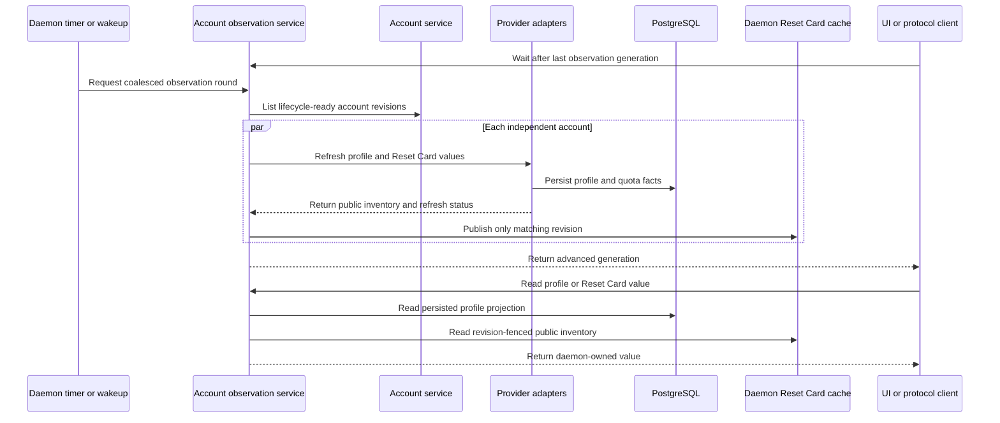

# Account Lifecycle Authority

Status: normative vNext account authority. This document defines the usable macOS
boundary and the later complete account lifecycle.

The immediate target is `MacDogfoodReady`. Final `AccountLifecycleReady` has more
requirements. A component-first global gate is not the delivery order.

## Fixed boundaries

The account system has exactly three owners:

1. The PostgreSQL Account Registry owns credential-negative product state.
2. One HostCredentialStore owns versioned secret bundles.
3. The `decodexd` Account Service coordinates account operations.

Keep one daemon, one shared normal `~/.codex`, the same-UID typed protocol, exact
identifiers, PostgreSQL outbox and leases, and finite per-account compare-and-swap
operations. Credentials do not enter PostgreSQL, the public protocol, process
arguments, logs, or a long-lived daemon or child environment.

This boundary adds no event sourcing, generic distributed transaction coordinator,
new process or provider-effect ledger, per-account daemon, or permanent per-account
or per-run Codex home. V13 remains the repository-effect saga. V23 remains the
ProcessGeneration owner. V24 remains the ProviderAttempt owner.

One Codex process has one immutable Account UUID and provider binding for its
complete lifetime. A refresh callback can return a newer credential for that same
binding. It cannot select another account.

## Account Registry

The Account Registry owns:

- stable Account UUID, derived alias, revision, tombstone, and provider identity;
- an administrative `enabled` boolean that is independent from observed state;
- observed account, authentication, capability, and health state;
- one versioned routing control with mode, fixed target, and complete account order;
- separate 300-minute and 10080-minute quota observations;
- current non-secret credential version, fingerprint, and provider binding;
- finite account-operation intents, phases, receipts, and reconciliation results;
- existing ProcessGeneration and ProviderAttempt references.

Observed state never encodes administrative enablement. Disabling an account does not
rewrite its last health or quota observation. Enabling an account does not make that
observation healthy. Eligibility requires both `enabled=true` and current positive
evidence for every applicable check.

PostgreSQL stores no credential, encrypted credential blob, retrieval locator, or
ambient Codex auth export. A fingerprint is equality evidence only.

The public alias is not mutable product state. Derive it from the canonical provider
binding:

```text
digest = SHA-256(
  "decodex/account-alias/v2\0"
  || canonical_provider_kind
  || "\0"
  || canonical_provider_account_id
)
selector = first 64 big-endian digest bits
alias = ACCOUNT_ALIAS_WORDS[selector mod 44]
```

`ACCOUNT_ALIAS_WORDS` is this fixed ordered list:

```text
Alex, Avery, Bailey, Blake, Casey, Charlie, Clara, Dana, Drew, Eden, Elliot,
Emery, Evan, Finley, Harper, Hayden, Iris, Jamie, Jordan, Kai, Kendall, Lane,
Liam, Logan, Mason, Maya, Mia, Morgan, Noah, Nora, Owen, Paige, Parker, Quinn,
Reese, Remy, Riley, Rowan, Sage, Sasha, Sidney, Taylor, Theo, Val
```

The alias is one name with no prefix or suffix. It is a privacy-preserving
presentation substitute for the email address, not an identifier, and two
accounts can have the same alias. Account UUID remains the only row identity. Do
not accept a user label or rename command, and do not add a random suffix,
collision table, or mutable reroll. The ChatGPT provider identity
`433463f7-74ae-4a7e-ab10-9667f9e4919e` has digest
`d6ac83189beb33b78f71052e9f0a2134605e8c67cebbadbbfabcf926a2222165` and alias
`Val`.

Wire and native-client boundaries accept only one 2–16-byte ASCII word with one
initial uppercase letter and lowercase remaining letters. They reject the v1
`Account ABCDE-FGHIJ` form rather than retaining a compatibility branch.

## HostCredentialStore

The store has one record per Account UUID:

| Field | Contract |
| --- | --- |
| `schema_version` | Closed bundle format. |
| `account_id` | Exact Account UUID. |
| `provider_kind` | Closed provider kind, initially ChatGPT. |
| `provider_account_id` | Canonical provider identity. |
| `credential_version` | Positive monotonic compare-and-swap version. |
| `writer_operation_id` | Account-operation UUID that wrote this version. |
| tokens | Complete access, refresh, and optional identity token bundle plus required expiry/type metadata. |

Metadata readback returns only Account UUID, provider binding, credential version,
writer operation, and a domain-separated fingerprint of the canonical complete bundle.
Create-if-absent, exact-version compare-and-swap, and exact-version delete are atomic
for one Account UUID. A stale version, wrong provider binding, duplicate provider
identity, missing item, or unavailable backend is a typed result.

For macOS, the adapter uses non-synchronizing Keychain generic-password items with
item label `box.acg.decodex` and service namespace
`box.acg.decodex.credentials.v1`. The Keychain account name is the canonical Account
UUID. Accessibility is after first unlock, this device only. The daemon identity
defined below is the only reader and writer. Locked, denied, malformed, or unsupported
Keychain state fails closed.

The daemon runs only as one no-UI app-like wrapper with bundle identifier
`box.acg.decodex.daemon` and main executable `Contents/MacOS/decodexd`. The selected
local dogfood identity is provisioned team `T54QFA7W2S`, application identifier
`T54QFA7W2S.box.acg.decodex.daemon`, and profile channel `development`. That
application identifier is the daemon's sole effective Keychain access group. Every
Keychain read, create, compare-and-swap, delete, and metadata query sets that exact
group. Metadata verification includes the returned `agrp` attribute. A raw workspace
binary, a raw helper in the outer app, or `~/.local/bin/decodexd` can be a build input
or retired artifact. It is never an Account Lifecycle execution entry.

The wrapper has one fixed `Info.plist`, a valid hardened-runtime signature, an embedded
provisioning profile, and exact signed entitlements. The profile, signature, and
entitlements must agree on bundle identifier, application identifier, and team. The
macOS provisioning profile must contain the single canonical team allowlist
`T54QFA7W2S.*`; the signed entitlement must narrow that allowlist to the sole effective
group `T54QFA7W2S.box.acg.decodex.daemon`. Both sets are closed: missing, extra, or
duplicate values refuse. The profile must contain at least one registered device and
must not be an all-device profile. This proves the `development` profile channel
without applying the non-macOS `get-task-allow` profile rule. It is not public
distribution or notarization evidence.
The wrapper composer and verifier are deterministic and daemon-specific. They do not
accept arbitrary identities, profiles, entitlements, groups, channels, or fallback
binaries. SwiftUI and the CLI remain clients and receive no Keychain authority.

The Linux backend is a later `AccountLifecycleReady` obligation. It must be selected
explicitly and must prove persistent private storage, atomic replace, exact-version
compare-and-swap, delete, and restart readback. It has no environment or plaintext
fallback.

## Versioned account controls

Every mutation uses the same versioned protocol and supplies a client command ID,
idempotency key, and the applicable expected account or routing-control revision.
PostgreSQL stores the complete credential-negative request and exact public result.
Exact replay returns that result. Conflicting key reuse and stale revision fail before
mutation.

The commands are deterministic:

| Command | Compare-and-swap effect |
| --- | --- |
| `enable_account` | If the expected account revision is current, set `enabled=true`. Change only the account revision when the value changes. |
| `disable_account` | If the expected account revision is current, set `enabled=false`. Block new admission immediately. Do not terminate or rebind existing work. |
| `set_fixed_selection` | If the expected routing revision and target account revision are current, set mode `fixed` and the exact target Account UUID. Preserve account order. |
| `set_balanced_selection` | If the expected routing revision is current, set mode `balanced` and clear the fixed target. Preserve account order. |
| `set_account_order` | If the expected routing revision is current, replace the order with one complete duplicate-free permutation of all non-tombstoned Account UUIDs. Preserve mode and a valid fixed target. |

A fresh command whose desired value already matches returns a terminal no-change
receipt at the same revision. Any real change increments exactly one owning revision.
No command changes observed health, quota, credentials, ProcessGeneration, or
ProviderAttempt state as a side effect.

For a new task, `fixed` considers only its target. An ineligible fixed target returns a
typed no-route result. `balanced` selects the first fully eligible account in canonical
order after independent capability, credential, process, attempt, and two-window quota
checks. Manual recovery changes enablement, fixed/balanced mode, or order with these
commands and then submits a new task. It does not rebind or replay an existing thread.

Automatic cross-account same-thread fallback and all-depleted scheduler wake are not
Slice 1 requirements. An all-depleted result exposes the exact reset evidence and waits
for an explicit retry. V14 and V16 remain the policy/snapshot and decision authorities;
their broader automatic-routing behavior is accepted later.

## Explicit Use in Codex

`UseAccountInCodex` projects one exact ready account to the normal shared
`~/.codex/auth.json`. It is independent from routing: projection does not change routing,
and routing does not project auth. The command checks the current Account revision and
the exact HostCredentialStore version, fingerprint, and provider binding. Tokens remain
inside the daemon.

The host write rejects an ambiguous `CODEX_HOME`, symbolic links, path drift, wrong
ownership, wrong link count, and group- or other-writable ancestors. It creates one
same-directory mode-`0600` temporary file, synchronizes it, atomically renames it over
the exact target, reads back the exact account binding, and synchronizes the parent.
Same-binding replay is successful without rewriting the file. The read-only result is
`current`, `unmanaged`, or `unavailable` and exposes only Account UUID, Account revision,
and a credential-negative projection digest.

The projection affects future Codex launches and new app-server processes. It does not
claim to hot-switch an already running Codex process. There is no watcher, backup,
per-account Codex home, token environment projection, legacy helper, or fallback.

## Account operations

Cross-store changes use one finite per-account operation journal:

| Phase | Meaning |
| --- | --- |
| `prepared` | PostgreSQL committed the intent and fenced conflicting account operations. |
| `provider_effect_pending` | A refresh request can have reached the provider. |
| `store_applied` | Exact store metadata proves the target version, fingerprint, binding, and writer. |
| `committed` | PostgreSQL committed the projection and public receipt. |
| `cancelled` | No store change is accepted and the operation is terminal. |
| `recovery_required` | Safe automatic continuation cannot be proved; the account is ineligible. |

An unsettled operation fences another credential mutation and new execution admission
for that account. Startup reconciles every nonterminal operation before the account can
be eligible.

Enrollment and explicit import commit `prepared` before a store write. Device login can
use one operation-scoped private temporary home. It is removed after verified import or
recovery and never becomes a runner home. Import accepts a daemon-opened owner-private
source descriptor, not credential bytes in the public protocol.

Refresh reads one exact credential version, records `provider_effect_pending` before
the provider call, validates the returned provider identity, and writes the complete
rotated bundle with one compare-and-swap. Concurrent callers serialize on that
operation. After restart, an exact store write can be committed. A provider request with
no proved store write is not replayed unless the provider has an accepted idempotent
result-readback contract. Otherwise, the account becomes `reauth_required`.

Logout disables new launch admission and rejects with `account_in_use` while an active
ProcessGeneration or unsettled ProviderAttempt is bound to the account. It then deletes
one exact store version through the same journal. Metadata deletion is allowed only
after logout and creates a tombstone. Historical UUIDs, receipts, and execution
references remain.

## Exact-build account capability

`AccountLifecycle` readiness for a build is positive evidence, not a schema assumption.
Before account-backed runner launch or a new Reset Card effect, the exact protected
Codex build must prove all of these facts:

- generated schema supports process-scoped `account/login/start` with
  `chatgptAuthTokens`;
- a live probe accepts that projection and reads back the same provider account;
- generated schema and a live callback transcript support
  `account/chatgptAuthTokens/refresh`;
- the Account Service can bind that callback to the exact ProcessGeneration, serialize
  refresh, complete credential compare-and-swap, and reply for the same provider binding;
- the exact build, schema fingerprint, and callback capability profile are cached and
  bound to launch authority.

Unsupported, unprobed, contradictory, or changed builds fail closed. The current exact
`codex-cli 0.146.0-alpha.9.2` adapter services the root refresh request through the Account
Service and returns the root refresh response. This source capability can satisfy
`AccountLifecycle`, `MacDogfoodReady`, and runner readiness only when the exact-image,
generated-schema, and live callback preflights also pass. Initial token projection alone is
insufficient.

The supported macOS bridge can launch one explicit official Codex device-login in an
owner-private temporary home without changing ambient `~/.codex`. It publishes only the
official URL, one-time code, and closed session state to Swift. On successful login, the
daemon opens that private `auth.json`, verifies the exact provider identity and current
account revision, journals an existing-account `Refresh`, and applies only the immediate
next HostCredentialStore version by compare-and-swap. The temporary home is removed on
success, failure, cancellation, timeout, or bridge destruction. Ambient `Use in Codex`
remains a separate explicit projection command; neither action implies the other.
An acceptance-unknown install replays only the same operation and idempotency key while
the private source exists. Prepared-operation startup and command replay compare both the
expected and target bindings; only an exact expected binding can prove that cancellation
is safe, and ambiguous store state becomes `RecoveryRequired`.

## ProcessGeneration binding

The owning [ProcessGeneration authority](process-generation-authority.md) must extend
its existing V23 intent, launch-manifest identity, prepare command, and strict readback
with the canonical initial account revision, credential version, credential fingerprint,
provider binding, and exact-build account-capability profile. These fields are immutable
launch facts. Same-account callback rotation does not rewrite them.

Immediately before spawn, the Account Service must read the exact HostCredentialStore
metadata and compare every field with the ProcessGeneration intent and Account Registry.
Any mismatch stops before spawn. The existing ProcessGeneration and ProviderAttempt
state machines own crash and effect ambiguity. No account-specific process or effect
ledger is added.

## Reset Card fencing

Reset Card keeps its existing exact provider-credit ID, provider key, durable receipt,
and authoritative readback. New admission and the final pre-effect fence both require:

- the exact account revision and `enabled=true`;
- `AccountLifecycle=ready` for the active platform and exact Codex build;
- no unsettled account operation other than reconciliation of this exact receipt;
- exact Account Registry and HostCredentialStore credential version, fingerprint, and
  provider-binding agreement; and
- the existing admissible observed state and exact public card descriptor.

The final fence repeats these checks in the effect-start transaction. A disable,
operation start, revision change, or store drift between discovery and effect prevents
the provider call.

Receipt handling is ordered differently from new admission. After same-UID transport
and exact request-fingerprint checks, a durable terminal receipt replays unconditionally
before current enabled, readiness, health, operation, store, or revision gates. A
terminal receipt never calls Codex or the provider again. Nonterminal status and required
reconciliation also remain readable after a gate changes. They cannot start a new effect.

## Daemon account observation

`decodexd` owns the provider-observation cadence through the lifecycle composition described
in [Runtime architecture](../architecture/runtime-architecture.md#account-lifecycle-and-credential-authority).
Its account observer starts immediately, repeats every 15 seconds, and wakes after a
successful account command or when a durable Reset Card worker claim settles. Each round
discovers every non-tombstoned AccountLifecycle-ready account, including administratively
disabled accounts because observation is not new-work admission. It starts one independent
async owner for every account without a small global fan-out cap. Reset Card and profile
provider work for different accounts runs concurrently. Within one account, the observer first
settles the Reset Card owner because it can rotate credentials, then observes the profile with
that exact successor. At most one observation owner is active for one Account UUID; another
lifecycle or effect wake becomes that account's pending successor round. A periodic tick does
not queue a hot-loop successor for an already slow account.

One slow account does not delay completion or later scheduling for another account.
Observation results publish progressively and only against the current Account revision.
An account change prunes old Reset Card and profile refresh state before a later result
can become current. Every accepted publication advances one opaque daemon-lifetime
observation generation. `WaitForAccountObservation` returns when that generation differs
from the caller's last applied value, or after one 30-second heartbeat. The macOS app keeps
one such wait open and reloads daemon values after the response. It has no independent
15-second refresh clock; a disconnected wait reconnects with bounded backoff.

Normal `GetResetCards` and `GetAccountProfile` queries do not contact OpenAI or start an
app-server. They read daemon-owned values. PostgreSQL remains the persistence authority for
quota facts and bounded profile snapshots. Public Reset Card inventory is instead a
revision-fenced daemon-lifetime cache: restart discards it, immediately starts a new
observation round, and returns a typed retryable unavailable result until that account is
warm. A Reset Card query reads only that memory value; it does not wait for an account-registry
or provider read. Every successful account or Reset Card command invalidates the affected
account value and advances its cache generation before requesting observation. A result from an
older in-flight generation cannot republish after that invalidation. No credential or
provider-private Reset Card ID enters this cache.



The observation round separates daemon-owned provider refresh from client query readback;
the generation signal carries no account value or credential. PostgreSQL retains profile and
quota durability while Reset Card descriptors live only for the daemon lifetime.

## Bounded account profile

Protocol V2.0 provides one independent `GetAccountProfile` query per Account UUID. It does
not run as part of account listing or Reset Card inventory. The query reads the latest
persisted projection and the daemon observer's revision-scoped refresh status. One failed
background profile observation affects only that account row.

During a background observation, the daemon reads the exact current HostCredentialStore
binding and calls only
`https://chatgpt.com/backend-api/wham/profiles/me`. The request has bounded connect and
total timeouts, no redirects, and a bounded response body. The daemon sends the access
token and provider account ID only to that endpoint. It does not log or return the token,
provider body, or raw error.

V28 stores one latest non-secret profile snapshot and at most 36 unique ascending daily
usage facts. Persistence uses the exact account revision, provider binding, tombstone
state, and a monotonic observation time. A response is `current` only after persistence.
V29 replaces only the profile observation function so PostgreSQL 18 zips the two bounded
daily arrays through `ROWS FROM`; it adds no relation, authority, or compatibility path.
A previous exact snapshot can return as `cached` with one typed refresh error. Otherwise,
the row is `unavailable` with one typed error.

Email and the credential `plan_type` claim are not profile facts and are not persisted.
Email is explicitly `redacted` unless the local caller sets `include_email`. A client
that did not request email rejects a visible-email response. The plan claim can describe
the credential bundle, but it is not live capacity or quota evidence. Every `current`,
`cached`, or `unavailable` result carries the explicit email visibility and optional
plan claim. The runtime exact-reads them from the current registry and host-store binding
immediately before the response. It redacts and omits them if that final exact read
cannot be proved.

The profile snapshot always carries the Account UUID, a positive revision, a positive
Unix-microsecond observation time, explicit email visibility, and the daily array.
Credential email is at most 320 bytes, `plan_type` is at most 128 bytes, and provider
display name and username are each at most 256 bytes. Scalar token and duration metrics
fit non-negative PostgreSQL `bigint`; streak values fit non-negative `integer`. Optional
fields are absent when the provider or current credential does not supply them.

## Clean latest-architecture cutover

The product has no legacy-account migration mode. Normal startup and installation do
not read an old account pool, mapping, helper, environment projection, migration
manifest, or migration receipt. V27 is the landed clean-break account schema in the
current V1–V32 migration ledger and accepts only an empty Account Registry. A populated
older registry requires a fresh local product database.

An operator can move credentials once by creating owner-private
`decodex/account-credential-import/1` files and calling the ordinary versioned account
import command for each account. Each successful command writes the same PostgreSQL
Account Registry, HostCredentialStore, account-operation journal, and routing order
used by every later import. The product contains no source parser, bridge, bulk
importer, finalizer, migration state machine, receipt, or compatibility fallback.

After every imported account and routing control is verified through the public
protocol, the operator deletes each temporary import file and the old local account
pool. That finite local procedure is not an installed product capability. Failure
before verification leaves the old source untouched; success has no rollback or
legacy-runtime path.

## Readiness levels

| Obligation | `MacDogfoodReady` | Final `AccountLifecycleReady` |
| --- | --- | --- |
| Host secret backend | macOS Keychain adapter accepted | macOS plus an explicitly selected persistent Linux backend |
| Exact-build auth | Initial projection and refresh callback proved for each accepted macOS build | Proved for every supported platform/build |
| Account lifecycle | Enrollment/import, stable derived alias, list, enable/disable, logout, refresh/CAS, and startup reconciliation | Same contract across all supported hosts plus full fault acceptance |
| Routing | Initial eligible quota-aware fixed/balanced selection and explicit manual recovery | Automatic same-thread fallback and all-depleted wake after their later gate |
| Presentation | All-account Reset Card, quota, and bounded profile data | Full bounded usage and history presentation |
| Explicit Codex auth | `Use in Codex` projects one exact account to shared auth without changing routing | Same fail-closed explicit contract on every supported host |
| Legacy authority | No watcher, helper, or credential environment input on normal startup | Same, across every supported installation |
| Evidence | Two-account Mac flow with restart boundaries and package proof | Broader platform and adversarial matrix |

`CredentialStore` reports backend capability. `AccountLifecycle` reports the Account
Service, PostgreSQL authority, provider adapter, exact-build account capability, startup
reconciliation, and active host store. An environment-only projection is
`projection_only` and cannot satisfy either readiness result.

## Later obligations

The later readiness table in the [vNext gate manifest](vnext-gates.md) retains Linux,
full account presentation, automatic fallback and wake,
retained-title Desktop discovery, broad matrices, graph, automation, remote access, and
product polish. These obligations do not block the three Mac delivery slices unless a
slice explicitly names them.

Accepted historical receipts remain historical. A failure in this contract keeps the
affected account or readiness boundary unavailable. It does not restore a watcher,
environment projection, helper, dual write, or compatibility API.
