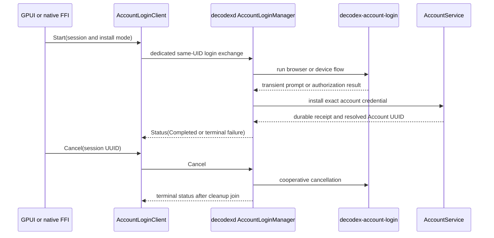

# Daemon-Owned Account Login Authority

This page is the canonical guide for changing account login. Consult it when changing provider authorization, account enrollment or reauthentication, the local protocol, native FFI, GPUI presentation, daemon startup/shutdown, or credential-file handling.

## Ownership and boundaries

`decodexd` is the single runtime owner. During bootstrap, `crates/decodex-runtime/src/bootstrap.rs` constructs one `AccountLoginManager` beside `AccountService`; the manager is installed into the runtime application and is shut down with the daemon. No client owns provider HTTP, PKCE, device polling, callback listeners, temporary auth homes, or credential installation.

`crates/decodex-account-login` is a private plain Rust provider engine. It is a normal library rather than an FFI or public client surface, and `decodex-runtime` is its only consumer. It contains the source-derived browser/device flow, bounded HTTP and callback parsing, cancellation, and owner-private temporary-home lifecycle. It does not launch a browser, terminal, executable, or child process and does not log authorization material.

The provider engine writes its exact temporary auth document below a private session home. The daemon validates and consumes that document through `LoginHome`; the UI never receives a credential path or credential bytes. Stale session homes are cleaned at manager construction, and successful or failed sessions clean their own home before becoming terminal.



This sequence shows ownership and the terminal cleanup boundary; authorization values and credentials are intentionally not represented as durable data.

## Dedicated protocol service

The login service is a dedicated non-retained exchange in `crates/decodex-protocol/src/account_login.rs`. It accepts exactly three operations addressed by a canonical ephemeral session UUID:

| Operation | Meaning |
| --- | --- |
| `Start` | Start one immutable request or idempotently read the same request and session. |
| `Status` | Read the current in-memory status for that session. |
| `Cancel` | Request cooperative cancellation and wait for terminal cleanup. |

The manager permits one global session. A different active session is `Busy`; repeating the same session with different input is also rejected. A session can report opening/requesting, waiting, installing, completed, failed, or cancelled. Only the transient status projection carries a prompt, authorization URL, device code, failure, or resolved account UUID; these values do not enter durable snapshots, events, command payloads, fixtures, or examples.

`AccountLoginUrl` enforces an 8 KiB UTF-8 bound for authorization and verification URLs during construction and deserialization. Device prompts and authorization URLs are bounded wire values, not persisted credentials. Keep authorization URLs, device codes, tokens, auth documents, and transient statuses out of OpenWiki fixtures and durable examples.

The client implementation is `AccountLoginClient` in `crates/decodex-protocol/src/client.rs`. It opens the dedicated one-shot local exchange, uses the normal same-UID transport authority, and closes the socket after the response. `crates/decodex-protocol/src/wire.rs` routes the exchange as `ClientMessage::AccountLogin`; it is not a database command or retained-session item.

## Protocol negotiation

The current wire contract is protocol `2.6` exactly:

- `CURRENT_VERSION` is `{ major: 2, minor: 6 }`.
- `CURRENT_ARTIFACT_COHORT` remains `2` and must match between daemon and every local consumer.
- Negotiation accepts only the exact current version. A major mismatch and an unsupported minor are distinct refusals; the nominal `PREVIOUS_MINOR_VERSION` is intentionally equal to the current version for the clean break.
- A welcome with a missing or different artifact cohort is refused. Do not reintroduce pre-2.6 compatibility when documenting or changing the current protocol.

The version and cohort definitions live in `crates/decodex-protocol/src/lib.rs`; handshake and cohort checks are exercised by `crates/decodex-protocol/src/client.rs`, `retained_session.rs`, and `wire.rs` tests. Account-login additions must preserve both the exact negotiation rule and unchanged cohort 2.

## AccountService installation

Provider completion is not account enrollment by itself. `AccountLoginInstallAuthority` in `crates/decodex-runtime/src/account_login.rs` installs the validated provider result through daemon-internal `AccountService`, with the operation, account, revision, recovery, and idempotency fences from `AccountLoginInstallMode`:

- `Enroll` creates the requested provisional Account UUID or restores the original tombstoned UUID for the provider binding, and applies the requested enabled state.
- `Reauthenticate` replaces the exact existing account credential under its expected revision and optional recovery-operation fence.
- Installation is retried only within the bounded dispatch policy and maps ambiguous durable outcomes to `OutcomeUnknown`; it does not guess.
- A successful status returns the exact account UUID resolved by the daemon. Tombstone restoration returns the original UUID even when it differs from the provisional request UUID.

The runtime is the only layer allowed to resolve the provider auth document and invoke account installation. `AccountService` remains the durable account authority; the login manager only coordinates the transient provider flow and its installation receipt.

## Cancellation and lifecycle

`AccountLoginManager` serializes operations, holds one optional session, and runs provider work on a named worker thread so the blocking provider engine cannot occupy the async request task. `Cancellation` is cooperative: it signals the provider engine and wakes its waiters. `Cancel` removes the worker handle from the session, waits for `join_worker`, then returns a terminal status. Starting a replacement session also joins a previous terminal worker; daemon shutdown calls `begin_shutdown` and `wait_for_shutdown`, cancels the active flow, and joins it before teardown completes.

The provider engine's `LoginHome::cleanup` verifies owner, device, inode, and directory identity before removal and proves absence afterward. Cleanup failure is surfaced as service failure rather than silently abandoning a credential-bearing temporary home. This ordering is the lifecycle invariant to preserve when changing timeout, cancellation, replacement, or shutdown behavior.

## Protocol-only desktop seams

The native bridge in `crates/decodex-app-client-ffi/src/lib.rs` and the presentation-neutral GPUI controller in `apps/decodex-gpui/src/account_login.rs` both call `AccountLoginClient`. They translate user-facing start/status/cancel operations and retain at most the active session UUID needed to address the transient exchange.

These are protocol-only FFI and GPUI seams. They must not depend on `decodex-account-login`, `reqwest`, callback listeners, `LoginHome`, `auth.json`, provider constants, or credential paths. The former public `EnrollAccountFromCredentialFile` and `ReauthenticateAccountFromCredentialFile` ingress and FFI credential-path handoff are removed; do not restore them as compatibility wrappers. The old FFI provider adapter modules and their source-login architecture test are retired. The current architecture gate is `tests/scripts/test_account_login_architecture.py`.

## Change recipes and validation

**Changing provider behavior:** edit `crates/decodex-account-login/src/lib.rs` and its focused tests. Preserve bounded response/callback parsing, no process execution, no logging, cancellation checks, and private-home cleanup. Then validate the runtime consumer and architecture gate; do not add provider dependencies to FFI or GPUI.

**Changing the wire contract:** edit `crates/decodex-protocol/src/account_login.rs`, `client.rs`, and `wire.rs` together. Preserve exact 2.6 negotiation, cohort 2, 8 KiB URL bounds, `deny_unknown_fields`, canonical UUID validation, and exclusion from durable wire types. Run protocol account-login tests and the architecture gate before any broader package check.

**Changing installation or lifecycle:** start at `AccountLoginManager`, `AccountLoginInstallAuthority`, and `AccountService`. Update focused runtime tests for initial, completed, failed, same-session, busy, cancellation, replacement, shutdown, revision mismatch, and exact UUID restoration behavior. Escalate to runtime bootstrap and websocket tests only when composition or transport wiring changes.

**Changing a client presentation:** update the FFI or GPUI protocol seam only. Verify that the consumer import path resolves to `AccountLoginClient` and that no credential-path or provider-engine symbol crosses the boundary. The package-facing architecture test is the narrowest check.

Minimal checks:

```sh
python3 -m unittest tests/scripts/test_account_login_architecture.py
cargo test -p decodex-protocol account_login
cargo test -p decodex-runtime account_login
```

Run workspace checks or package builds conditionally when changing public exports, Cargo dependencies, bootstrap composition, or generated/published artifacts. There is no generated login artifact to hand-edit; the canonical sources are the Rust modules named above.
